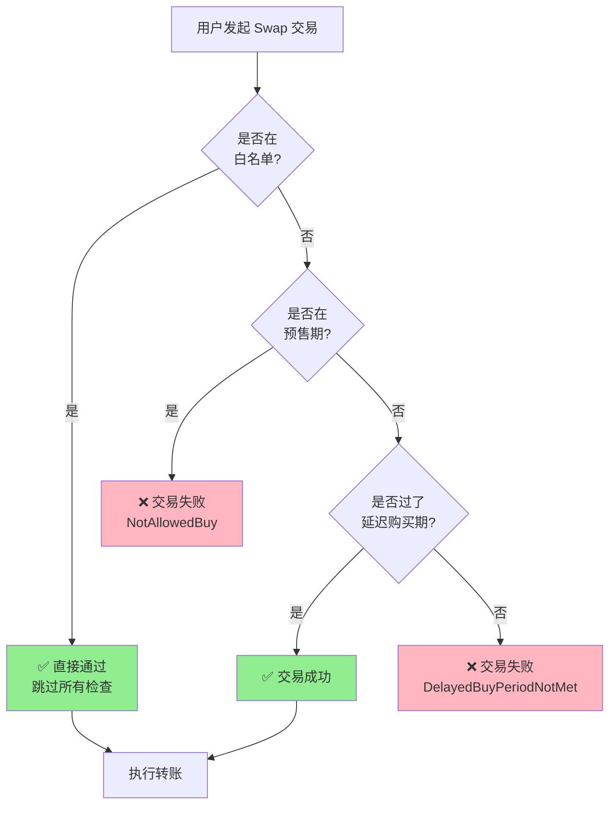
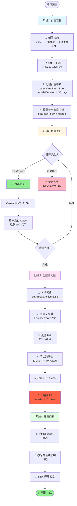

# SYI 代币预售操作流程

## 📋 目录

- [概述](#概述)
- [白名单交易机制](#白名单交易机制)
- [预售流程图](#预售流程图)
- [阶段一：预售准备](#阶段一预售准备)
- [阶段二：预售进行](#阶段二预售进行)
- [阶段三：创建流动性](#阶段三创建流动性)
- [阶段四：开启交易](#阶段四开启交易)
- [代币分配方案](#代币分配方案)
- [安全检查清单](#安全检查清单)
- [常见问题](#常见问题)

---

## 概述

SYI 代币预售是一个多阶段流程，确保公平分配和流动性安全。整个流程分为 4 个主要阶段：

1. **预售准备** - 合约部署和配置
2. **预售进行** - 白名单用户参与
3. **创建流动性** - 添加初始 LP 并永久锁定
4. **开启交易** - DEX 公开交易

### 核心参数

| 参数 | 值 | 说明 |
|------|-----|------|
| 总发行量 | 100,000,000 SYI | 1 亿代币 |
| 预售期限 | 30 天 | 主网配置 |
| 初始流动性 | 40M SYI + 4W USDT | 40% 代币用于 LP |
| 初始价格 | 0.001 USDT/SYI | 根据 LP 比例计算 |
| LP 锁定 | 永久销毁 | 发送到 0xdead 地址 |

---

## 白名单交易机制

### 核心原理

SYI 合约实现了 **预售期白名单交易限制**，确保只有白名单用户能在预售期间通过 DEX 购买代币。



### 代码实现

合约中的关键检查逻辑：

```solidity
// contracts/SYI/abstract/SYIBase.sol

function _update(address from, address to, uint256 value) internal override {
    // 1️⃣ 白名单优先检查
    bool isWhitelisted = feeWhitelisted[from] || feeWhitelisted[to];

    if (isWhitelisted) {
        super._update(from, to, value);  // ✅ 白名单直接通过
        return;
    }

    // 2️⃣ 判断是买入还是卖出
    bool isBuy = _isBuyOperation(from, to);
    bool isSell = _isSellOperation(from, to);

    if (isBuy) {
        _handleBuy(from, to, value);  // 进入买入检查
    } else if (isSell) {
        _handleSell(from, to, value);  // 进入卖出检查
    } else {
        super._update(from, to, value);
    }
}

function _handleBuy(address from, address to, uint256 amount) private {
    // 3️⃣ 预售期检查
    if (presaleActive && block.timestamp < presaleStartTime + presaleDuration) {
        revert NotAllowedBuy();  // ❌ 预售期间非白名单禁止买入
    }

    // 4️⃣ 延迟购买检查（通过 modifier）
    // delayedBuyCheck(to)

    super._update(from, to, amount);
}
```

### 三种状态对比

| 时期 | 白名单用户 | 非白名单用户 | 控制参数 |
|------|-----------|-------------|---------|
| **预售期** | ✅ 可以买入<br/>✅ 可以卖出<br/>✅ 可以转账 | ❌ 禁止买入<br/>✅ 可以卖出<br/>✅ 可以转账 | `presaleActive = true` |
| **延迟购买期** | ✅ 可以买入<br/>✅ 可以卖出<br/>✅ 可以转账 | ❌ 禁止买入（需等30天）<br/>✅ 可以卖出<br/>✅ 可以转账 | `delayedBuyEnabled = true` |
| **公开交易期** | ✅ 可以买入<br/>✅ 可以卖出<br/>✅ 可以转账 | ✅ 可以买入<br/>✅ 可以卖出<br/>✅ 可以转账 | 两者都为 `false` |

### 配置示例

#### 场景 1: 严格预售（推荐）

```javascript
// 预售期间：只有白名单可以买入
await syi.setPresaleActive(true);       // 开启预售限制
await syi.setDelayedBuyEnabled(true);   // 开启延迟购买

// 添加白名单
await syi.setBatchFeeWhitelisted([
    "0xEarlyInvestor1...",
    "0xEarlyInvestor2...",
    "0xPartner1...",
], true);

// 预售结束后
await syi.setPresaleActive(false);      // 关闭预售限制
// delayedBuyEnabled 保持 true，继续保护 30 天

// 30 天后完全开放
await syi.setDelayedBuyEnabled(false);  // 关闭延迟购买
```

#### 场景 2: 软启动（较宽松）

```javascript
// 预售期间：白名单优先
await syi.setPresaleActive(true);
await syi.setDelayedBuyEnabled(false);  // 不启用延迟购买

// 预售结束立即开放
await syi.setPresaleActive(false);
// 所有人都可以立即交易
```

#### 场景 3: 测试网快速测试

```javascript
// 关闭所有限制
await syi.setPresaleActive(false);
await syi.setDelayedBuyEnabled(false);
// 立即开放交易
```

### 白名单管理

#### 查询白名单状态

```javascript
// 检查单个地址
const isWhitelisted = await syi.feeWhitelisted("0xUserAddress...");
console.log("白名单状态:", isWhitelisted);

// 批量检查
const addresses = [
    "0xUser1...",
    "0xUser2...",
    "0xUser3..."
];

for (const addr of addresses) {
    const status = await syi.feeWhitelisted(addr);
    console.log(`${addr}: ${status ? "✅ 白名单" : "❌ 非白名单"}`);
}
```

#### 添加白名单

```javascript
// 单个添加
await syi.setFeeWhitelisted("0xNewUser...", true);

// 批量添加（推荐）
await syi.setBatchFeeWhitelisted([
    "0xUser1...",
    "0xUser2...",
    "0xUser3..."
], true);
```

#### 移除白名单

```javascript
// 单个移除
await syi.setFeeWhitelisted("0xOldUser...", false);

// 批量移除
await syi.setBatchFeeWhitelisted([
    "0xUser1...",
    "0xUser2..."
], false);
```

### 实际测试

#### 测试脚本

```javascript
// scripts/testWhitelistTrading.js

async function testWhitelistTrading() {
    const [owner, whitelistUser, normalUser] = await ethers.getSigners();

    const syi = await ethers.getContractAt("SYI", SYI_ADDRESS);
    const router = await ethers.getContractAt("IPancakeRouter02", ROUTER_ADDRESS);
    const usdt = await ethers.getContractAt("IERC20", USDT_ADDRESS);

    console.log("🧪 测试白名单交易机制\n");

    // 1. 开启预售模式
    await syi.setPresaleActive(true);
    console.log("✅ 预售模式已开启");

    // 2. 添加白名单
    await syi.setFeeWhitelisted(whitelistUser.address, true);
    console.log("✅ 白名单用户:", whitelistUser.address);

    // 3. 准备测试
    const buyAmount = ethers.utils.parseEther("100"); // 100 USDT
    const path = [usdt.address, syi.address];
    const deadline = Math.floor(Date.now() / 1000) + 600;

    // 4. 测试白名单用户买入
    console.log("\n--- 测试 1: 白名单用户买入 ---");
    try {
        await usdt.connect(whitelistUser).approve(router.address, buyAmount);
        const tx = await router.connect(whitelistUser).swapExactTokensForTokens(
            buyAmount,
            0,
            path,
            whitelistUser.address,
            deadline
        );
        await tx.wait();
        console.log("✅ 白名单用户买入成功");
    } catch (error) {
        console.log("❌ 白名单用户买入失败:", error.reason);
    }

    // 5. 测试普通用户买入
    console.log("\n--- 测试 2: 普通用户买入 ---");
    try {
        await usdt.connect(normalUser).approve(router.address, buyAmount);
        const tx = await router.connect(normalUser).swapExactTokensForTokens(
            buyAmount,
            0,
            path,
            normalUser.address,
            deadline
        );
        await tx.wait();
        console.log("✅ 普通用户买入成功（不应该发生！）");
    } catch (error) {
        console.log("✅ 普通用户买入被正确拒绝:", error.reason);
    }

    // 6. 关闭预售，再次测试
    console.log("\n--- 测试 3: 关闭预售后 ---");
    await syi.setPresaleActive(false);
    console.log("✅ 预售已关闭");

    try {
        await usdt.connect(normalUser).approve(router.address, buyAmount);
        const tx = await router.connect(normalUser).swapExactTokensForTokens(
            buyAmount,
            0,
            path,
            normalUser.address,
            deadline
        );
        await tx.wait();
        console.log("✅ 普通用户现在可以买入了");
    } catch (error) {
        console.log("❌ 普通用户买入失败:", error.reason);
    }
}

testWhitelistTrading()
    .then(() => process.exit(0))
    .catch(error => {
        console.error(error);
        process.exit(1);
    });
```

#### 运行测试

```bash
npx hardhat run scripts/testWhitelistTrading.js --network localhost
```

#### 预期输出

```
🧪 测试白名单交易机制

✅ 预售模式已开启
✅ 白名单用户: 0x70997970C51812dc3A010C7d01b50e0d17dc79C8

--- 测试 1: 白名单用户买入 ---
✅ 白名单用户买入成功

--- 测试 2: 普通用户买入 ---
✅ 普通用户买入被正确拒绝: NotAllowedBuy()

--- 测试 3: 关闭预售后 ---
✅ 预售已关闭
✅ 普通用户现在可以买入了
```

### 安全注意事项

#### ⚠️ 重要提醒

1. **系统白名单不可移除**
   ```javascript
   // initializeWhitelist() 会自动添加：
   // - Owner
   // - SYI 合约自身
   // - Staking 合约
   // - Router 合约
   // 这些地址不应该被移除
   ```

2. **Pair 地址不在白名单中**
   ```javascript
   // Pair 地址不应该加入白名单
   // 否则会绕过买卖检查，破坏机制
   ```

3. **预售结束前不要忘记关闭**
   ```javascript
   // 预售结束后必须调用：
   await syi.setPresaleActive(false);
   // 否则非白名单用户永远无法买入
   ```

4. **黑名单优先级更高**
   ```javascript
   // 即使在白名单中，黑名单用户也无法交易
   // 检查顺序：黑名单 > 白名单 > 预售限制
   ```

### 典型应用场景

#### 场景 A: 私募 + 公募

```javascript
// 阶段1: 私募（7天）
await syi.setPresaleActive(true);
await syi.setBatchFeeWhitelisted(privateSaleAddresses, true);
// 只有私募投资者可以买入

// 阶段2: 公募（23天）
await syi.setBatchFeeWhitelisted(publicSaleAddresses, true);
// 私募 + 公募投资者都可以买入

// 阶段3: 公开交易
await syi.setPresaleActive(false);
// 所有人都可以买入
```

#### 场景 B: 分层释放

```javascript
// VIP 用户立即可交易
await syi.setBatchFeeWhitelisted(vipAddresses, true);
await syi.setPresaleActive(false);  // 立即开放
await syi.setDelayedBuyEnabled(true);  // 但有 30 天延迟

// VIP: 立即可买入（白名单跳过延迟检查）
// 普通用户: 30 天后才能买入
```

#### 场景 C: 合作伙伴优先

```javascript
// 合作伙伴和早期支持者白名单
await syi.setBatchFeeWhitelisted([
    ...partnerAddresses,
    ...earlySupporterAddresses,
    ...teamAddresses
], true);

// 预售期间只有他们可以买入
await syi.setPresaleActive(true);

// 1 周后对公众开放
setTimeout(async () => {
    await syi.setPresaleActive(false);
}, 7 * 24 * 60 * 60 * 1000);
```

---

## 预售流程图



---

## 阶段一：预售准备

### 1.1 部署合约（按顺序）

```javascript
// 部署脚本: scripts/deploySYIPresale.js

const { ethers } = require("hardhat");

async function main() {
    const [deployer] = await ethers.getSigners();
    console.log("部署账户:", deployer.address);

    // 1. 部署 USDT（测试网使用，主网使用现有地址）
    const USDT = await ethers.getContractFactory("USDT");
    const usdt = await USDT.deploy();
    await usdt.deployed();
    console.log("✅ USDT 部署:", usdt.address);

    // 2. 部署 PancakeSwap Factory
    const PancakeFactory = await ethers.getContractFactory("PancakeFactory");
    const factory = await PancakeFactory.deploy(deployer.address);
    await factory.deployed();
    console.log("✅ Factory 部署:", factory.address);

    // 3. 部署 WBNB
    const WBNB = await ethers.getContractFactory("WBNB");
    const wbnb = await WBNB.deploy();
    await wbnb.deployed();
    console.log("✅ WBNB 部署:", wbnb.address);

    // 4. 部署 PancakeSwap Router
    const PancakeRouter = await ethers.getContractFactory("PancakeRouter");
    const router = await PancakeRouter.deploy(factory.address, wbnb.address);
    await router.deployed();
    console.log("✅ Router 部署:", router.address);

    // 5. 部署 Staking 合约
    const rootAddress = deployer.address; // 或指定其他地址
    const feeRecipient = deployer.address; // 手续费接收地址

    const Staking = await ethers.getContractFactory("Staking");
    const staking = await Staking.deploy(
        usdt.address,
        router.address,
        rootAddress,
        feeRecipient
    );
    await staking.deployed();
    console.log("✅ Staking 部署:", staking.address);

    // 6. 部署 SYI 代币（自动铸造 100M）
    const SYI = await ethers.getContractFactory("SYI");
    const syi = await SYI.deploy(
        usdt.address,
        router.address,
        staking.address
    );
    await syi.deployed();
    console.log("✅ SYI 部署:", syi.address);
    console.log("   Owner 余额:", ethers.utils.formatEther(
        await syi.balanceOf(deployer.address)
    ), "SYI");

    // 7. 配置 Staking 合约
    await staking.setSYI(syi.address);
    console.log("✅ Staking 已配置 SYI");

    // 保存部署地址
    const addresses = {
        usdt: usdt.address,
        wbnb: wbnb.address,
        factory: factory.address,
        router: router.address,
        staking: staking.address,
        syi: syi.address,
        deployer: deployer.address
    };

    const fs = require("fs");
    fs.writeFileSync(
        "deployed-presale-addresses.json",
        JSON.stringify(addresses, null, 2)
    );
    console.log("✅ 部署地址已保存到 deployed-presale-addresses.json");
}

main()
    .then(() => process.exit(0))
    .catch((error) => {
        console.error(error);
        process.exit(1);
    });
```

### 1.2 初始化白名单

```javascript
// 初始化系统白名单
const tx1 = await syi.initializeWhitelist();
await tx1.wait();
console.log("✅ 系统白名单已初始化");

// 验证白名单
const isOwnerWhitelisted = await syi.feeWhitelisted(deployer.address);
const isStakingWhitelisted = await syi.feeWhitelisted(staking.address);
console.log("Owner 白名单:", isOwnerWhitelisted);
console.log("Staking 白名单:", isStakingWhitelisted);
```

### 1.3 验证预售状态

```javascript
// 检查预售配置
const presaleStatus = await syi.getPresaleStatus();
console.log("预售状态:", {
    active: presaleStatus.active,
    startTime: new Date(presaleStatus.startTime * 1000).toLocaleString(),
    duration: presaleStatus.duration / 86400, // 转换为天
    remainingTime: presaleStatus.remainingTime / 3600, // 转换为小时
    isInPresale: presaleStatus.isInPresale
});

// 检查延迟购买配置
const delayedBuyInfo = await syi.getDelayedBuyInfo();
console.log("延迟购买:", {
    enabled: delayedBuyInfo.enabled,
    requiredDelay: delayedBuyInfo.requiredDelay / 86400, // 天
    remainingDelay: delayedBuyInfo.remainingDelay / 86400
});
```

### 1.4 设置预售参与者白名单

```javascript
// 方式1: 单个添加
await syi.setFeeWhitelisted("0xUserAddress1", true);

// 方式2: 批量添加（推荐）
const whitelistAddresses = [
    "0x1234567890123456789012345678901234567890",
    "0x2345678901234567890123456789012345678901",
    "0x3456789012345678901234567890123456789012",
    // ... 更多地址
];

const tx = await syi.setBatchFeeWhitelisted(whitelistAddresses, true);
await tx.wait();
console.log(`✅ 已添加 ${whitelistAddresses.length} 个白名单地址`);

// 验证白名单
for (const addr of whitelistAddresses) {
    const isWhitelisted = await syi.feeWhitelisted(addr);
    console.log(`${addr}: ${isWhitelisted ? "✅" : "❌"}`);
}
```

---

## 阶段二：预售进行

### 2.1 预售方案 A：手动分配（简单）

适合小规模预售，Owner 手动控制分配。

```javascript
// 脚本: scripts/distributePresale.js

const presaleData = [
    { address: "0xUser1...", usdtPaid: 1000, syiAmount: 1_400_000 }, // 30% 折扣
    { address: "0xUser2...", usdtPaid: 5000, syiAmount: 7_000_000 },
    { address: "0xUser3...", usdtPaid: 10000, syiAmount: 14_000_000 }
];

async function distributePresale() {
    const syi = await ethers.getContractAt("SYI", SYI_ADDRESS);

    for (const sale of presaleData) {
        const amount = ethers.utils.parseEther(sale.syiAmount.toString());

        // Owner 直接转账 SYI
        const tx = await syi.transfer(sale.address, amount);
        await tx.wait();

        console.log(`✅ 已分配 ${sale.syiAmount} SYI 给 ${sale.address}`);
        console.log(`   支付: ${sale.usdtPaid} USDT`);
    }
}

// 执行
distributePresale().then(() => {
    console.log("✅ 预售分配完成");
});
```

### 2.2 预售方案 B：预售合约（自动化）

适合大规模预售，自动化处理。

```solidity
// contracts/SYIPresale.sol

// SPDX-License-Identifier: UNLICENSED
pragma solidity ^0.8.20;

import {IERC20} from "@openzeppelin/contracts/token/ERC20/IERC20.sol";
import {Ownable} from "@openzeppelin/contracts/access/Ownable.sol";

/**
 * @title SYIPresale
 * @notice 自动化预售合约
 */
contract SYIPresale is Ownable {
    IERC20 public immutable SYI;
    IERC20 public immutable USDT;

    uint256 public constant PRICE = 0.0007 ether; // 1 SYI = 0.0007 USDT (30% 折扣)
    uint256 public constant MIN_BUY = 100 ether;   // 最小购买 100 USDT
    uint256 public constant MAX_BUY = 50000 ether; // 最大购买 50,000 USDT

    uint256 public totalSold;
    uint256 public totalRaised;
    mapping(address => bool) public whitelist;
    mapping(address => uint256) public userPurchased;

    bool public presaleActive = true;

    event TokensPurchased(
        address indexed buyer,
        uint256 usdtAmount,
        uint256 syiAmount,
        uint256 timestamp
    );

    constructor(address _syi, address _usdt) Ownable(msg.sender) {
        SYI = IERC20(_syi);
        USDT = IERC20(_usdt);
    }

    /**
     * @notice 用户购买 SYI 代币
     * @param usdtAmount 支付的 USDT 数量
     */
    function buy(uint256 usdtAmount) external {
        require(presaleActive, "Presale not active");
        require(whitelist[msg.sender], "Not whitelisted");
        require(usdtAmount >= MIN_BUY, "Below minimum");
        require(usdtAmount <= MAX_BUY, "Exceeds maximum");

        // 计算可获得的 SYI 数量
        uint256 syiAmount = (usdtAmount * 1 ether) / PRICE;

        // 检查合约 SYI 余额
        require(SYI.balanceOf(address(this)) >= syiAmount, "Insufficient SYI");

        // 接收 USDT
        USDT.transferFrom(msg.sender, owner(), usdtAmount);

        // 发送 SYI
        SYI.transfer(msg.sender, syiAmount);

        // 更新统计
        totalSold += syiAmount;
        totalRaised += usdtAmount;
        userPurchased[msg.sender] += syiAmount;

        emit TokensPurchased(msg.sender, usdtAmount, syiAmount, block.timestamp);
    }

    /**
     * @notice 批量添加白名单
     */
    function addWhitelist(address[] calldata users) external onlyOwner {
        for (uint256 i = 0; i < users.length; i++) {
            whitelist[users[i]] = true;
        }
    }

    /**
     * @notice 移除白名单
     */
    function removeWhitelist(address[] calldata users) external onlyOwner {
        for (uint256 i = 0; i < users.length; i++) {
            whitelist[users[i]] = false;
        }
    }

    /**
     * @notice 结束预售
     */
    function endPresale() external onlyOwner {
        presaleActive = false;
    }

    /**
     * @notice 提取剩余 SYI
     */
    function withdrawSYI() external onlyOwner {
        uint256 balance = SYI.balanceOf(address(this));
        SYI.transfer(owner(), balance);
    }
}
```

**部署预售合约：**

```javascript
// 部署
const SYIPresale = await ethers.getContractFactory("SYIPresale");
const presale = await SYIPresale.deploy(syi.address, usdt.address);
await presale.deployed();

// Owner 转入 15M SYI 到预售合约
const presaleAmount = ethers.utils.parseEther("15000000");
await syi.transfer(presale.address, presaleAmount);

// 添加白名单
await presale.addWhitelist(whitelistAddresses);

console.log("✅ 预售合约已部署:", presale.address);
```

**用户参与预售：**

```javascript
// 用户端代码
const usdtAmount = ethers.utils.parseEther("1000"); // 购买 1000 USDT 的 SYI

// 批准 USDT
await usdt.approve(presale.address, usdtAmount);

// 购买
const tx = await presale.buy(usdtAmount);
await tx.wait();

// 将获得约 1,428,571 SYI (1000 / 0.0007)
```

### 2.3 监控预售进度

```javascript
// 监控脚本: scripts/monitorPresale.js

async function monitorPresale() {
    const presale = await ethers.getContractAt("SYIPresale", PRESALE_ADDRESS);

    const totalSold = await presale.totalSold();
    const totalRaised = await presale.totalRaised();
    const presaleActive = await presale.presaleActive();

    console.log("📊 预售进度报告");
    console.log("================");
    console.log("已售出:", ethers.utils.formatEther(totalSold), "SYI");
    console.log("已筹集:", ethers.utils.formatEther(totalRaised), "USDT");
    console.log("预售状态:", presaleActive ? "进行中" : "已结束");
    console.log("完成度:",
        (parseFloat(ethers.utils.formatEther(totalSold)) / 15000000 * 100).toFixed(2),
        "%"
    );
}

// 定时监控
setInterval(monitorPresale, 60000); // 每分钟检查一次
```

---

## 阶段三：创建流动性

这是最关键的阶段，确保操作正确。

### 3.1 结束预售

```javascript
// 1. 关闭预售状态
const tx1 = await syi.setPresaleActive(false);
await tx1.wait();
console.log("✅ 预售已关闭");

// 2. 如果使用了预售合约，也要关闭
if (presaleContract) {
    const tx2 = await presaleContract.endPresale();
    await tx2.wait();
    console.log("✅ 预售合约已关闭");
}

// 3. 验证状态
const status = await syi.getPresaleStatus();
console.log("预售激活:", status.active); // 应该是 false
```

### 3.2 创建 SYI/USDT 交易对

```javascript
const factory = await ethers.getContractAt("IPancakeFactory", FACTORY_ADDRESS);

// 创建交易对
const tx = await factory.createPair(syi.address, usdt.address);
const receipt = await tx.wait();

// 获取 Pair 地址
const pairAddress = await factory.getPair(syi.address, usdt.address);
console.log("✅ 交易对已创建:", pairAddress);

// 在 SYI 合约中设置 Pair
const tx2 = await syi.setPair(pairAddress);
await tx2.wait();
console.log("✅ SYI 已配置 Pair");
```

### 3.3 添加初始流动性

```javascript
const router = await ethers.getContractAt("IPancakeRouter02", ROUTER_ADDRESS);

// 准备流动性数量
const syiAmount = ethers.utils.parseEther("40000000");  // 40M SYI
const usdtAmount = ethers.utils.parseEther("40000");    // 4W USDT

console.log("准备添加流动性:");
console.log("- SYI:", ethers.utils.formatEther(syiAmount));
console.log("- USDT:", ethers.utils.formatEther(usdtAmount));
console.log("- 初始价格: 1 SYI =",
    parseFloat(ethers.utils.formatEther(usdtAmount)) /
    parseFloat(ethers.utils.formatEther(syiAmount)),
    "USDT"
);

// 批准代币
console.log("批准代币...");
const tx1 = await syi.approve(router.address, syiAmount);
await tx1.wait();
const tx2 = await usdt.approve(router.address, usdtAmount);
await tx2.wait();
console.log("✅ 代币已批准");

// 添加流动性
console.log("添加流动性...");
const deadline = Math.floor(Date.now() / 1000) + 600; // 10 分钟后过期

const tx3 = await router.addLiquidity(
    syi.address,
    usdt.address,
    syiAmount,
    usdtAmount,
    0, // slippage 保护（首次添加可设为 0）
    0,
    deployer.address, // LP token 接收地址（先发给 owner）
    deadline
);

const receipt = await tx3.wait();
console.log("✅ 流动性已添加");
console.log("   交易哈希:", receipt.transactionHash);

// 查询 LP token 余额
const pair = await ethers.getContractAt("IPancakeV2Pair", pairAddress);
const lpBalance = await pair.balanceOf(deployer.address);
console.log("   LP Token 余额:", ethers.utils.formatEther(lpBalance));
```

### 3.4 验证流动性

```javascript
const pair = await ethers.getContractAt("IPancakeV2Pair", pairAddress);

// 获取储备量
const reserves = await pair.getReserves();
const token0 = await pair.token0();

let syiReserve, usdtReserve;
if (token0.toLowerCase() === syi.address.toLowerCase()) {
    syiReserve = reserves.reserve0;
    usdtReserve = reserves.reserve1;
} else {
    syiReserve = reserves.reserve1;
    usdtReserve = reserves.reserve0;
}

console.log("📊 流动性池状态:");
console.log("- SYI 储备:", ethers.utils.formatEther(syiReserve));
console.log("- USDT 储备:", ethers.utils.formatEther(usdtReserve));
console.log("- 当前价格: 1 SYI =",
    parseFloat(ethers.utils.formatEther(usdtReserve)) /
    parseFloat(ethers.utils.formatEther(syiReserve)),
    "USDT"
);
```

### 3.5 永久销毁 LP Token

```javascript
const pair = await ethers.getContractAt("IPancakeV2Pair", pairAddress);

// 获取 LP 余额
const lpBalance = await pair.balanceOf(deployer.address);
console.log("当前 LP Token 余额:", ethers.utils.formatEther(lpBalance));

// 黑洞地址（以太坊标准）
const DEAD_ADDRESS = "0x000000000000000000000000000000000000dEaD";

// ⚠️ 重要：这是不可逆操作！
console.log("⚠️  准备销毁 LP Token...");
console.log("   这将永久锁定流动性，无法撤销！");

// 转账到黑洞地址
const tx = await pair.transfer(DEAD_ADDRESS, lpBalance);
const receipt = await tx.wait();

console.log("🔥 LP Token 已永久销毁！");
console.log("   交易哈希:", receipt.transactionHash);
console.log("   黑洞地址:", DEAD_ADDRESS);

// 验证销毁
const newBalance = await pair.balanceOf(deployer.address);
const deadBalance = await pair.balanceOf(DEAD_ADDRESS);
console.log("✅ Owner LP 余额:", ethers.utils.formatEther(newBalance)); // 应该是 0
console.log("✅ 黑洞 LP 余额:", ethers.utils.formatEther(deadBalance));  // 应该是全部
```

### 3.6 在区块链浏览器验证

```javascript
console.log("\n📋 验证信息:");
console.log("=================");
console.log("SYI 代币:", syi.address);
console.log("USDT 代币:", usdt.address);
console.log("交易对 Pair:", pairAddress);
console.log("黑洞地址:", DEAD_ADDRESS);
console.log("\n在 BSCScan 上验证:");
console.log(`https://bscscan.com/address/${pairAddress}`);
console.log(`查看黑洞地址持有的 LP: https://bscscan.com/token/${pairAddress}?a=${DEAD_ADDRESS}`);
```

---

## 阶段四：开启交易

### 4.1 关闭延迟购买（可选）

```javascript
// 如果希望立即开放交易，关闭延迟购买
const tx = await syi.setDelayedBuyEnabled(false);
await tx.wait();
console.log("✅ 延迟购买已关闭，用户可立即交易");

// 如果希望保护期（防止机器人），保持开启 30 天
// 不执行上述操作即可
```

### 4.2 移除预售白名单（可选）

```javascript
// 移除预售参与者的白名单状态（可选）
// 注意：移除后他们交易时也不会被收取费用（SYI 无交易费）
const tx = await syi.setBatchFeeWhitelisted(whitelistAddresses, false);
await tx.wait();
console.log("✅ 预售白名单已移除");
```

### 4.3 验证交易开放

```javascript
// 测试买入
console.log("测试 DEX 交易...");

const router = await ethers.getContractAt("IPancakeRouter02", ROUTER_ADDRESS);
const testAmount = ethers.utils.parseEther("10"); // 10 USDT

// 批准 USDT
await usdt.approve(router.address, testAmount);

// 买入路径
const path = [usdt.address, syi.address];
const deadline = Math.floor(Date.now() / 1000) + 600;

try {
    const tx = await router.swapExactTokensForTokens(
        testAmount,
        0, // 接受任何数量
        path,
        testAccount.address,
        deadline
    );
    await tx.wait();
    console.log("✅ 交易成功！DEX 已开放");
} catch (error) {
    console.error("❌ 交易失败:", error.message);

    // 检查是否还在预售期
    const status = await syi.getPresaleStatus();
    if (status.isInPresale) {
        console.log("原因: 仍在预售期内");
    }
}
```

### 4.4 公告和推广

```markdown
# 📢 SYI 正式上线公告

我们很高兴地宣布，SYI 代币预售已成功完成，现已在 PancakeSwap 上线交易！

## 📊 项目数据
- 总发行量: 100,000,000 SYI
- 初始流动性: 40M SYI + 4W USDT
- 初始价格: 0.001 USDT/SYI
- LP 状态: **永久锁定** 🔒

## 🔗 合约地址
- SYI Token: `0x...`
- SYI/USDT Pair: `0x...`
- Staking 合约: `0x...`

## 💱 如何购买
1. 访问 [PancakeSwap](https://pancakeswap.finance/swap)
2. 连接钱包
3. 输入合约地址或搜索 SYI
4. 兑换 USDT → SYI

## 💎 质押收益
- 1天档: 0.3% 日收益
- 30天档: 0.6% 日收益
- 90天档: 0.9% 日收益
- 180天档: 1.5% 日收益

立即访问 [staking.syi.io](https://staking.syi.io) 开始质押！
```

---

## 代币分配方案

### 总量分配

```
总发行量: 100,000,000 SYI
├─ 40% (40M) - 流动性池 [已永久锁定]
├─ 30% (30M) - 质押奖励池
├─ 15% (15M) - 预售分配
├─ 10% (10M) - 团队锁仓
└─  5% (5M)  - 营销/生态
```

### 详细说明

| 用途 | 数量 | 比例 | 释放方式 | 说明 |
|------|------|------|---------|------|
| **流动性池** | 40,000,000 SYI | 40% | 永久锁定 | LP Token 已发送至 0xdead，无法撤回 |
| **质押奖励** | 30,000,000 SYI | 30% | 按质押释放 | 转入 Staking 合约，用户质押获得 |
| **预售分配** | 15,000,000 SYI | 15% | 预售完成后立即解锁 | 白名单用户参与，30% 折扣 |
| **团队锁仓** | 10,000,000 SYI | 10% | 线性释放 12 个月 | 激励核心团队，每月解锁 8.33% |
| **营销生态** | 5,000,000 SYI | 5% | 按需使用 | 空投、合作、市场推广 |

### 预售定价

```
流动性池定价: 1 SYI = 0.001 USDT (40M SYI + 4W USDT)
预售折扣: 30%
预售价格: 1 SYI = 0.0007 USDT

举例:
- 投入 1,000 USDT → 获得 1,428,571 SYI
- 投入 10,000 USDT → 获得 14,285,714 SYI

上线后立即盈利:
上线价 0.001 USDT / 预售价 0.0007 USDT = 43% 账面收益
```

### 资金用途

预售筹集的 USDT 用途分配：

```
筹集资金: ~10,500 USDT (假设 15M SYI × 0.0007)
├─ 38% - 添加流动性 (4,000 USDT)
├─ 30% - 营销推广 (3,150 USDT)
├─ 20% - 开发运营 (2,100 USDT)
└─ 12% - 储备金 (1,250 USDT)
```

---

## 安全检查清单

在执行预售流程前，请确认以下检查项：

### ✅ 部署前检查

- [ ] 所有合约代码已审计
- [ ] 测试网完整测试通过
- [ ] Solidity 版本正确 (0.8.20+)
- [ ] 编译器优化已启用
- [ ] 部署账户有足够 BNB 作为 Gas

### ✅ 预售准备检查

- [ ] SYI 合约已部署，Owner 持有 100M
- [ ] Staking 合约已部署并配置
- [ ] PancakeSwap Router/Factory 已部署
- [ ] initializeWhitelist() 已调用
- [ ] 预售状态 presaleActive = true
- [ ] 白名单地址已添加

### ✅ 预售进行检查

- [ ] 预售合约（如使用）已部署
- [ ] SYI 已转入预售合约
- [ ] 白名单用户可以正常购买
- [ ] 非白名单用户被正确拒绝
- [ ] 预售数据正确记录
- [ ] 资金安全收集

### ✅ 流动性添加检查

- [ ] 预售已结束 (setPresaleActive(false))
- [ ] 交易对已创建 (Factory.createPair)
- [ ] SYI.setPair() 已调用
- [ ] 40M SYI + 4W USDT 已准备
- [ ] 代币已批准给 Router
- [ ] addLiquidity 交易成功
- [ ] LP Token 已收到

### ✅ LP 销毁检查

- [ ] 确认 LP Token 余额
- [ ] 黑洞地址正确: 0x000...dEaD
- [ ] ⚠️ **最后确认：这是不可逆操作！**
- [ ] LP Token 已转账到黑洞
- [ ] 黑洞地址 LP 余额 = 总 LP
- [ ] Owner LP 余额 = 0

### ✅ 交易开放检查

- [ ] presaleActive = false (已确认)
- [ ] delayedBuyEnabled 状态已确认
- [ ] 储备量正确 (getReserves)
- [ ] 价格正确 (~0.001 USDT/SYI)
- [ ] 测试交易成功
- [ ] 无错误或 revert

### ✅ 上线后检查

- [ ] 合约已在 BSCScan 验证
- [ ] PancakeSwap 可以正常交易
- [ ] 价格显示正确
- [ ] 质押功能正常
- [ ] 团队代币已锁仓
- [ ] 社区公告已发布

---

## 常见问题

### Q1: 预售期间普通用户能买到币吗？

**A:** 不能。预售期间（30天），只有白名单用户可以购买。这是通过 `_handleBuy` 函数中的检查实现的：

```solidity
if (presaleActive && block.timestamp < presaleStartTime + presaleDuration) {
    revert NotAllowedBuy();
}
```

非白名单用户尝试购买会触发 `NotAllowedBuy` 错误。

---

### Q2: 白名单用户为什么可以在预售期买入？

**A:** 白名单检查在预售检查之前执行。关键代码逻辑：

```solidity
function _update(address from, address to, uint256 value) internal override {
    // 第一步：检查是否在白名单
    bool isWhitelisted = feeWhitelisted[from] || feeWhitelisted[to];

    if (isWhitelisted) {
        super._update(from, to, value);  // ✅ 白名单直接通过，不进入后续检查
        return;  // 🔑 关键：这里就返回了！
    }

    // 第二步：非白名单才会进入买卖检查
    bool isBuy = _isBuyOperation(from, to);
    if (isBuy) {
        _handleBuy(from, to, value);  // 这里才会检查 presaleActive
    }
}
```

**执行流程对比：**

| 用户类型 | 步骤1：白名单检查 | 步骤2：预售检查 | 结果 |
|---------|----------------|---------------|------|
| **白名单用户** | ✅ 在白名单 | ⏭️ 跳过（已返回） | ✅ 交易成功 |
| **普通用户** | ❌ 不在白名单 | ❌ presaleActive=true | ❌ NotAllowedBuy |

**实际案例：**

```javascript
// 预售期间
await syi.setPresaleActive(true);

// 添加白名单
await syi.setFeeWhitelisted("0xAlice...", true);

// Alice（白名单）通过 DEX 买入
// → 检查白名单 ✅ → 直接执行 → 成功

// Bob（普通用户）通过 DEX 买入
// → 检查白名单 ❌ → 进入 _handleBuy → 检查预售 ❌ → 失败
```

**重要提示：** 这也是为什么不能把 Pair 地址加入白名单，否则所有人都能绕过限制买入。

---

### Q3: 如何验证 LP 真的被永久锁定了？

**A:** 在 BSCScan 上验证：

1. 访问 Pair 合约地址: `https://bscscan.com/address/[PAIR_ADDRESS]`
2. 点击 "Token Holders" 标签
3. 查找 `0x000000000000000000000000000000000000dEaD` 地址
4. 确认该地址持有 100% 的 LP Token

黑洞地址的特点：
- 私钥未知，无法转出
- 以太坊官方认可的销毁地址
- Vitalik Buterin 也使用此地址销毁代币

---

### Q4: 延迟购买 (delayedBuy) 有什么作用？

**A:** 防止机器人抢跑：

- 开启后，非白名单用户需要等待 30 天才能买入
- 给真实用户充足时间了解项目
- 防止上线瞬间价格被机器人拉高
- 白名单用户不受影响

建议策略：
- 预售期：`delayedBuyEnabled = true`
- 上线后：根据社区反馈决定是否关闭

---

### Q5: 为什么要 setPair？

**A:** setPair 是关键配置步骤：

1. **SYI 合约需要知道 Pair 地址** 才能：
   - 识别买入/卖出操作
   - 调用 `recycle()` 时知道从哪里回收代币
   - 获取 USDT 储备量

2. **在 setPair 时会触发**：
   ```solidity
   function setPair(address _pair) external onlyOwner {
       if (_pair == address(0)) revert ZeroAddress();
       if (address(uniswapV2Pair) != address(0)) revert AlreadySet();
       uniswapV2Pair = IUniswapV2Pair(_pair);
       _updatePresaleDurationFromStaking(); // 同步预售时间
   }
   ```

---

### Q6: 预售折扣怎么计算？

**A:** 基于流动性池定价计算：

```
流动性池价格: 40M SYI ÷ 4W USDT = 0.001 USDT/SYI
预售价格 (30% 折扣): 0.001 × (1 - 0.30) = 0.0007 USDT/SYI

投入 1000 USDT:
- 流动性池价格: 1000 ÷ 0.001 = 1,000,000 SYI
- 预售价格: 1000 ÷ 0.0007 = 1,428,571 SYI
- 多获得: 428,571 SYI (42.86% 额外)

上线后立即账面收益:
(0.001 - 0.0007) ÷ 0.0007 × 100% = 42.86%
```

---

### Q7: 如果预售失败怎么办？

**A:** 可以实现退款机制：

```solidity
// 在预售合约中添加
function refund() external {
    require(!presaleActive, "Presale still active");
    require(!liquidityAdded, "Liquidity already added");

    uint256 purchased = userPurchased[msg.sender];
    require(purchased > 0, "No purchase");

    // 退还 SYI
    SYI.transfer(msg.sender, purchased);

    // 退还 USDT
    uint256 usdtAmount = (purchased * PRICE) / 1 ether;
    USDT.transfer(msg.sender, usdtAmount);

    userPurchased[msg.sender] = 0;
}
```

---

### Q8: 团队代币锁仓如何实现？

**A:** 可以使用 TokenVesting 合约：

```solidity
// contracts/TokenVesting.sol

contract TokenVesting {
    address public beneficiary;
    uint256 public start;
    uint256 public duration = 365 days; // 12 个月
    uint256 public totalAmount;
    uint256 public released;

    function release() external {
        uint256 releasable = _releasableAmount();
        require(releasable > 0, "No tokens to release");

        released += releasable;
        SYI.transfer(beneficiary, releasable);
    }

    function _releasableAmount() private view returns (uint256) {
        if (block.timestamp < start) return 0;

        uint256 elapsed = block.timestamp - start;
        if (elapsed >= duration) {
            return totalAmount - released;
        }

        return (totalAmount * elapsed / duration) - released;
    }
}
```

部署时：
```javascript
// 转入 10M SYI 到 Vesting 合约
const vestingAmount = ethers.utils.parseEther("10000000");
await syi.transfer(vesting.address, vestingAmount);
```

---

### Q9: 如何监控 LP 安全？

**A:** 定期检查：

```javascript
// 监控脚本
async function checkLPSafety() {
    const pair = await ethers.getContractAt("IPancakePair", PAIR_ADDRESS);
    const deadAddress = "0x000000000000000000000000000000000000dEaD";

    const totalSupply = await pair.totalSupply();
    const deadBalance = await pair.balanceOf(deadAddress);
    const percentage = deadBalance * 100n / totalSupply;

    console.log("LP 安全检查:");
    console.log("- 总 LP:", ethers.utils.formatEther(totalSupply));
    console.log("- 黑洞持有:", ethers.utils.formatEther(deadBalance));
    console.log("- 锁定比例:", percentage.toString(), "%");

    if (percentage < 90n) {
        console.warn("⚠️  警告: LP 锁定比例低于 90%!");
    } else {
        console.log("✅ LP 安全");
    }
}
```

---

### Q10: Gas 费用估算

**A:** 预估的 BSC Gas 费用（BNB @ $600）：

| 操作 | Gas Limit | BNB | USD |
|------|-----------|-----|-----|
| 部署 SYI | ~3,000,000 | 0.009 | ~$5.4 |
| 部署 Staking | ~4,500,000 | 0.014 | ~$8.4 |
| 创建 Pair | ~2,500,000 | 0.008 | ~$4.8 |
| 添加流动性 | ~300,000 | 0.001 | ~$0.6 |
| 销毁 LP | ~50,000 | 0.0002 | ~$0.12 |
| **总计** | ~10,350,000 | ~0.032 | ~$19.32 |

建议准备 0.05 BNB 以确保 Gas 充足。

---

### Q11: 如何与 PancakeSwap 前端集成？

**A:** PancakeSwap 会自动识别交易对，但可以：

1. **生成直达链接**:
```
https://pancakeswap.finance/swap?outputCurrency=0xYOUR_SYI_ADDRESS
```

2. **申请白名单**:
   - 访问 [PancakeSwap Token Lists](https://github.com/pancakeswap/token-list)
   - 提交 PR 添加代币信息
   - 包含: logo, symbol, decimals, address

3. **提供流动性信息**:
```json
{
  "name": "SYI Token",
  "address": "0x...",
  "symbol": "SYI",
  "decimals": 18,
  "chainId": 56,
  "logoURI": "https://yourdomain.com/logo.png"
}
```

---

## 🎯 总结

完整预售流程总结：

```
📋 准备 (1-2 天)
   ├─ 部署合约
   ├─ 配置参数
   └─ 设置白名单

💰 预售 (30 天)
   ├─ 用户参与
   ├─ 代币分配
   └─ 监控进度

🔒 上线 (1 天)
   ├─ 创建 LP
   ├─ 永久锁定
   └─ 开放交易

📈 运营 (持续)
   ├─ 社区管理
   ├─ 质押奖励
   └─ 生态发展
```

**关键原则**：
1. ✅ 代码已审计
2. ✅ 测试网验证
3. ✅ LP 永久锁定
4. ✅ 透明公开
5. ✅ 社区优先

---

## 📞 联系方式

- 官网: https://syi.io
- 文档: https://docs.syi.io
- Twitter: @SYIToken
- Telegram: t.me/syitoken
- Discord: discord.gg/syi

---

**最后更新**: 2025-10-14
**版本**: v1.0.0
