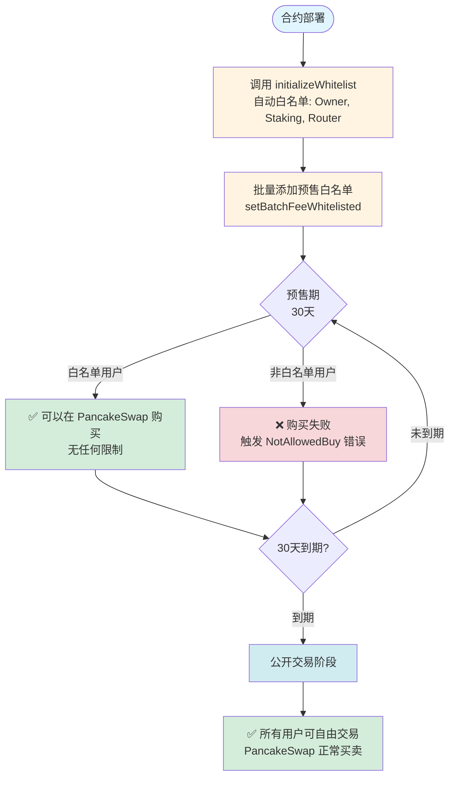
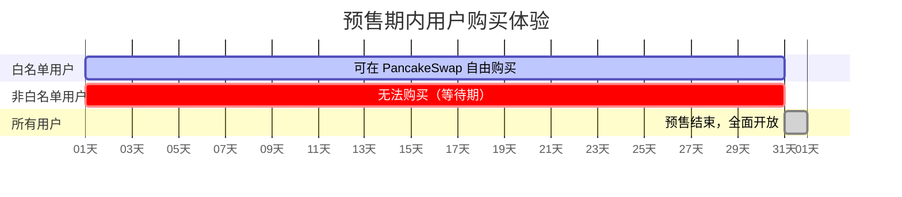
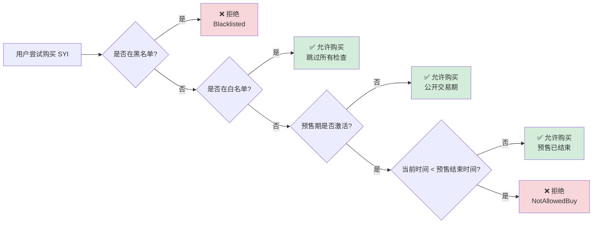

# SYI 预售方案

## 一、预售机制概述

SYI 代币通过**白名单 + 预售期**的组合机制实现公平的预售分发，确保只有符合条件的早期投资者能够在预售期参与购买。

### 1.1 预售流程图



### 1.2 用户体验对比



### 1.3 预售期决策逻辑



## 二、技术实现原理

### 2.1 核心机制

| 用户类型 | 预售期内（30天） | 预售期后 |
|---------|----------------|---------|
| **白名单用户** | ✅ 可以购买 | ✅ 可以购买 |
| **普通用户** | ❌ 无法购买（触发 `NotAllowedBuy()` 错误）| ✅ 可以购买 |

### 2.2 代码逻辑

**预售期检查**（SYIBase.sol:568-574）：
```solidity
function _handleBuy(address from, address to, uint256 amount) private {
    // 预售期检查
    if (presaleActive && block.timestamp < presaleStartTime + presaleDuration) {
        revert NotAllowedBuy();  // 非白名单用户购买失败
    }
    ...
}
```

**白名单豁免**（SYIBase.sol:512-519）：
```solidity
bool isWhitelisted = feeWhitelisted[from] || feeWhitelisted[to];

if (isWhitelisted) {
    super._update(from, to, value);
    return;  // 白名单用户跳过所有检查，直接执行转账
}
```

### 2.3 关键参数

| 参数 | 主网值 | 说明 |
|-----|-------|-----|
| `presaleDuration` | 30 天 | 预售期时长 |
| `presaleActive` | 初始为 `true` | 预售激活状态 |
| `presaleStartTime` | 合约部署时间 | 预售开始时间 |

## 三、预售流程

### 阶段 1: 预售准备（合约部署前）

1. **确定白名单用户**
   - 早期投资者地址
   - 合作伙伴地址
   - 项目方核心成员

2. **部署合约**
   ```bash
   npx hardhat compile
   npx hardhat run scripts/deploySYI.js --network bsc
   ```

3. **初始化白名单**
   ```solidity
   // 自动白名单地址（deploySYI.js 中会调用）
   SYI.initializeWhitelist();
   // 自动加入: Owner, SYI合约, Staking合约, Router
   ```

### 阶段 2: 添加预售白名单（部署后立即执行）

**方法 1: 单个地址添加**
```solidity
SYI.setFeeWhitelisted(预售用户地址, true);
```

**方法 2: 批量添加（推荐）**
```solidity
address[] memory presaleUsers = [
    0x1234...5678,
    0xabcd...ef00,
    ...
];
SYI.setBatchFeeWhitelisted(presaleUsers, true);
```

**脚本示例**：
```javascript
// scripts/addPresaleWhitelist.js
const presaleAddresses = [
    "0x...",  // 早期投资者 1
    "0x...",  // 早期投资者 2
    // ...
];

const syi = await ethers.getContractAt("SYI", SYI_ADDRESS);
const tx = await syi.setBatchFeeWhitelisted(presaleAddresses, true);
await tx.wait();
console.log("预售白名单添加成功");
```

### 阶段 3: 预售期（0-30天）

**用户体验**：

1. **白名单用户**：
   - 在 PancakeSwap 正常购买 SYI
   - 无任何限制，享受早期价格

2. **非白名单用户**：
   - 尝试购买 → 交易失败
   - 错误提示: `NotAllowedBuy()`
   - 需要等待预售期结束（30天后）

### 阶段 4: 预售期结束后（30天后）

**自动开放**：
- 合约自动检测 `block.timestamp >= presaleStartTime + 30 days`
- 所有用户均可自由购买
- 无需管理员操作

**或手动关闭**（可选）：
```solidity
SYI.setPresaleActive(false);  // 立即结束预售期
```

## 四、预售期管理接口

### 4.1 查询预售状态

```solidity
function getPresaleStatus() external view returns (
    bool active,          // 是否激活
    uint256 startTime,    // 开始时间
    uint256 duration,     // 持续时长（秒）
    uint256 remainingTime,// 剩余时间（秒）
    bool isInPresale      // 当前是否在预售期内
);
```

**前端调用示例**：
```javascript
const status = await syi.getPresaleStatus();
console.log(`预售激活: ${status.active}`);
console.log(`剩余时间: ${status.remainingTime / 86400} 天`);
console.log(`当前在预售期: ${status.isInPresale}`);
```

### 4.2 管理操作（仅 Owner）

| 函数 | 功能 | 使用场景 |
|-----|------|---------|
| `setPresaleActive(bool)` | 手动启停预售 | 紧急情况或提前结束 |
| `setFeeWhitelisted(address, bool)` | 添加/移除单个白名单 | 补充遗漏地址 |
| `setBatchFeeWhitelisted(address[], bool)` | 批量添加/移除 | 预售名单管理 |

### 4.3 重启预售（可选功能）

```solidity
// 重新激活预售，重置开始时间
SYI.setPresaleActive(true);
// 新的预售期: 当前时间 + 30 天
```

## 五、安全机制

### 5.1 黑名单保护

即使在白名单中，被加入黑名单的地址也无法购买：
```solidity
modifier notBlacklisted(address account) {
    if (blacklisted[account]) revert Blacklisted();
    _;
}
```

**优先级**: 黑名单 > 白名单

### 5.2 延迟购买保护

可选启用 30 天延迟购买期（与预售期配合）：
```solidity
SYI.setDelayedBuyEnabled(true);
// 非白名单用户需等待 30 天才能购买（额外保护）
```

**双重保护**：
- 预售期: 只允许白名单购买
- 延迟购买期: 即使预售结束，非白名单还需再等 30 天

### 5.3 冷却时间

防止机器人快速交易：
```solidity
uint256 public coldTime = 10 seconds;  // 买入后 10 秒内不能卖出
```

## 六、预售场景示例

### 场景 1: 标准 30 天预售

```
T0 (部署)
├─ 添加白名单: 100 个早期投资者
│
├─ 预售期（0-30天）
│  ├─ 白名单用户: 在 PancakeSwap 购买
│  └─ 普通用户: 无法购买
│
└─ T30 (自动开放)
   └─ 所有用户可自由交易
```

### 场景 2: 提前结束预售

```
T0 (部署)
├─ 添加白名单: 50 个用户
│
├─ 预售期（0-15天）
│  └─ 白名单用户购买
│
├─ T15: 手动关闭预售
│  └─ SYI.setPresaleActive(false)
│
└─ T15+ (立即开放)
   └─ 所有用户可交易
```

### 场景 3: 分阶段预售

```
T0 (部署)
├─ 第一轮白名单: 30 个种子用户
│
├─ T7: 添加第二轮白名单
│  └─ 额外 70 个用户
│
├─ T15: 添加第三轮白名单
│  └─ 额外 100 个用户
│
└─ T30 (自动开放)
   └─ 所有用户可交易
```

## 七、前端集成建议

### 7.1 预售倒计时组件

```javascript
async function getPresaleCountdown() {
    const status = await syi.getPresaleStatus();

    if (!status.isInPresale) {
        return "预售已结束，可自由购买";
    }

    const days = Math.floor(status.remainingTime / 86400);
    const hours = Math.floor((status.remainingTime % 86400) / 3600);

    return `预售剩余: ${days}天 ${hours}小时`;
}
```

### 7.2 购买前检查

```javascript
async function checkCanBuy(userAddress) {
    const status = await syi.getPresaleStatus();

    if (!status.isInPresale) {
        return { canBuy: true, reason: "" };
    }

    const isWhitelisted = await syi.feeWhitelisted(userAddress);

    if (isWhitelisted) {
        return { canBuy: true, reason: "白名单用户" };
    } else {
        return {
            canBuy: false,
            reason: `预售期内，请等待 ${Math.ceil(status.remainingTime / 86400)} 天`
        };
    }
}
```

### 7.3 错误处理

```javascript
try {
    await buyTokens();
} catch (error) {
    if (error.message.includes("NotAllowedBuy")) {
        alert("预售期内仅限白名单用户购买，请等待预售结束");
    } else if (error.message.includes("Blacklisted")) {
        alert("您的地址已被列入黑名单");
    } else if (error.message.includes("DelayedBuyPeriodNotMet")) {
        alert("延迟购买期未结束，请稍后再试");
    }
}
```

## 八、FAQ

### Q1: 白名单用户有购买数量限制吗？
A: 白名单只控制"能否购买"，不限制购买数量。但受限于：
- PancakeSwap 流动性池深度
- 滑点设置

### Q2: 预售期能否延长？
A: 可以重启预售（调用 `setPresaleActive(true)`），但会重置开始时间。
建议在原定时间内完成，避免影响用户预期。

### Q3: 白名单用户能否卖出？
A: 可以。白名单用户在预售期内可以自由买卖，无任何限制。

### Q4: 预售期能否缩短？
A: 可以手动关闭预售（`setPresaleActive(false)`），立即开放给所有用户。

### Q5: 如何验证白名单是否生效？
A: 调用 `syi.feeWhitelisted(用户地址)` 返回 `true` 即为已加入白名单。

### Q6: 黑名单优先级如何？
A: 黑名单 > 白名单。即使在白名单中，黑名单用户仍无法购买。

## 九、部署检查清单

- [ ] 合约编译成功
- [ ] 部署到 BSC 主网
- [ ] 调用 `initializeWhitelist()` 初始化
- [ ] 批量添加预售白名单地址
- [ ] 验证白名单地址（随机抽查 `feeWhitelisted()`）
- [ ] 检查预售状态（`getPresaleStatus()`）
- [ ] 测试白名单用户购买（少量测试）
- [ ] 测试非白名单用户购买失败（预期报错）
- [ ] 添加流动性（确保有池子可交易）
- [ ] 前端集成预售倒计时和提示

## 十、相关代码文件

| 文件 | 说明 |
|-----|------|
| `contracts/SYI/abstract/SYIBase.sol:568-574` | 预售期检查逻辑 |
| `contracts/SYI/abstract/SYIBase.sol:512-519` | 白名单豁免逻辑 |
| `contracts/SYI/mainnet/SYI.sol:30-33` | 预售时长配置（30天）|
| `contracts/SYI/abstract/SYIBase.sol:140-150` | `initializeWhitelist()` 函数 |
| `contracts/SYI/abstract/SYIBase.sol:164-178` | 白名单管理函数 |
| `scripts/deploySYI.js` | 部署脚本参考 |

---

**结论**：通过白名单 + 预售期机制，可以完美实现"只有白名单用户能在预售期购买"的效果，无需额外开发预售合约。
