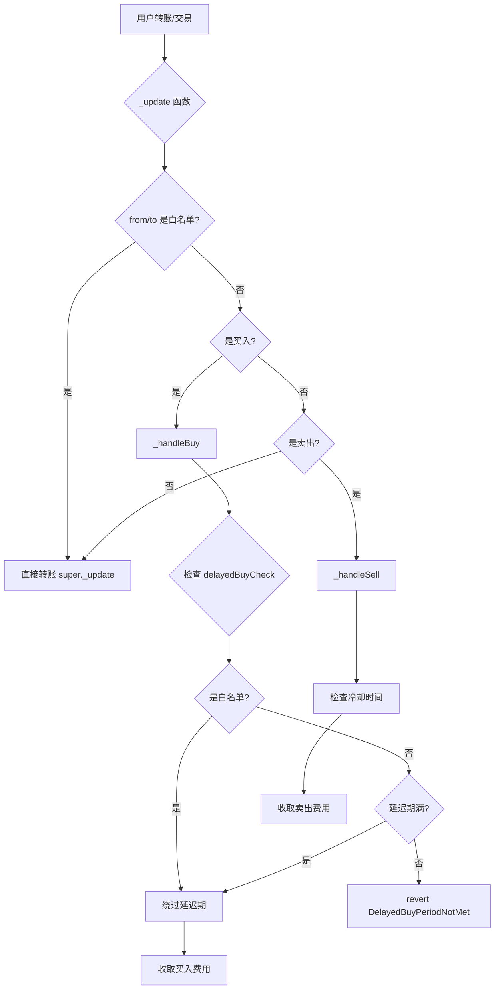
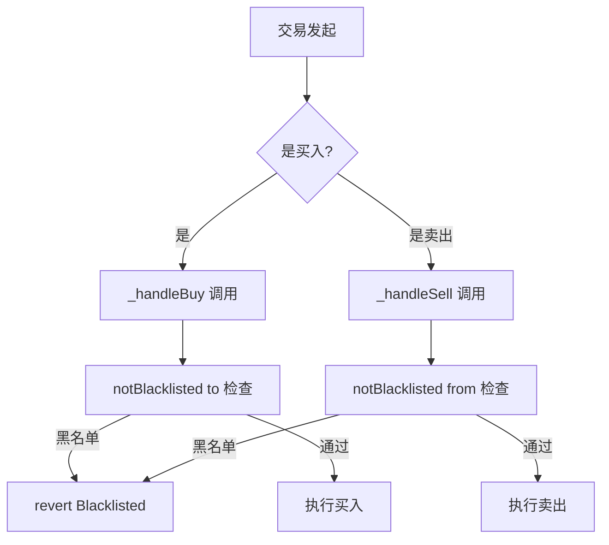
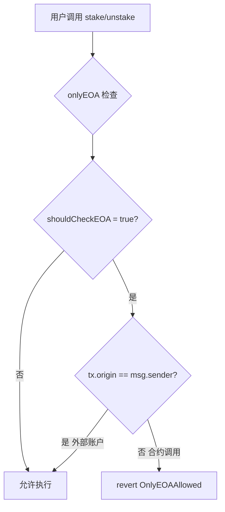
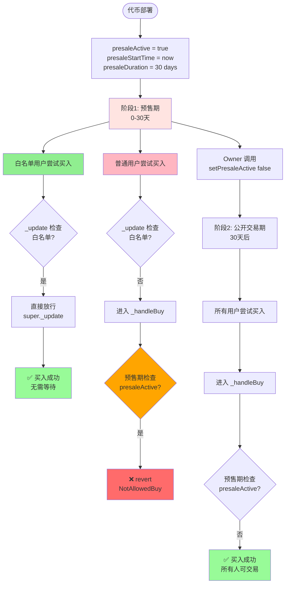
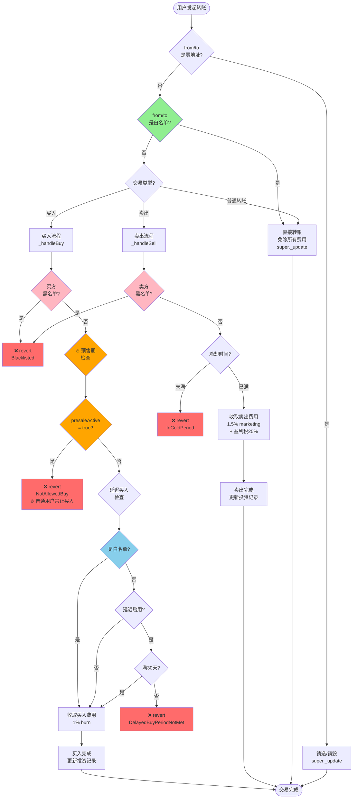
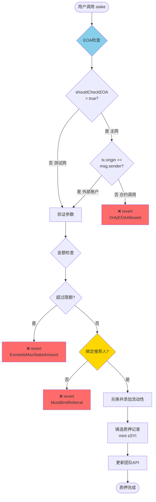
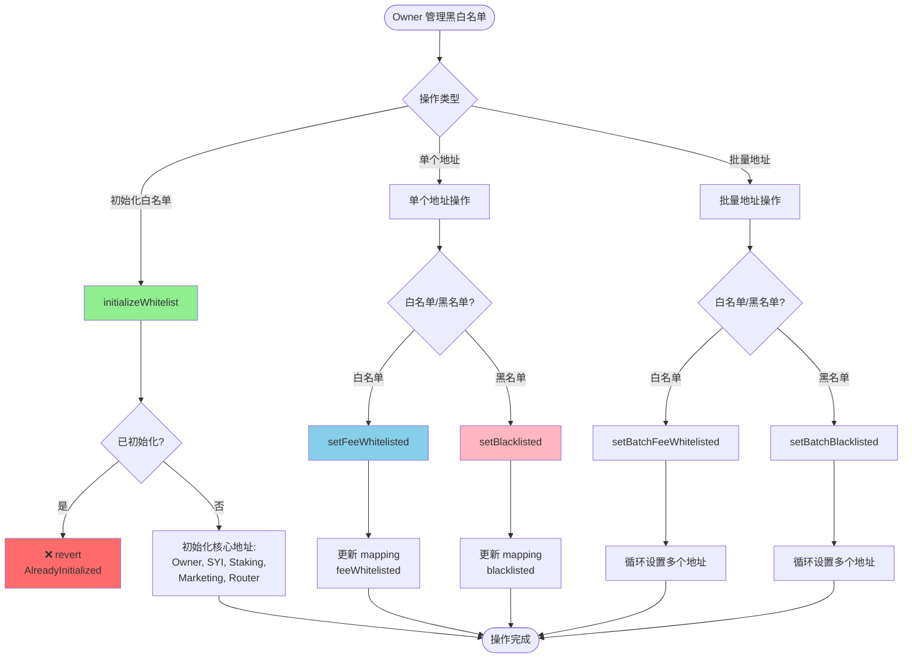

# SYI 黑白名单机制分析

## 📋 目录
- [一、黑白名单类型总览](#一黑白名单类型总览)
- [二、详细机制分析](#二详细机制分析)
- [三、流程图](#三流程图)
- [四、影响范围分析](#四影响范围分析)
- [五、移除黑白名单的影响评估](#五移除黑白名单的影响评估)

---

## 一、黑白名单类型总览

### 1.1 SYI 代币合约（SYIBase.sol）

| 类型 | 变量名 | 代码位置 | 用途 |
|------|--------|---------|------|
| **费用白名单** | `feeWhitelisted` | Line 245 | 免除买卖交易费用 |
| **交易黑名单** | `blacklisted` | Line 246 | 完全禁止买卖交易 |
| **🔥 预售期白名单** | `feeWhitelisted` + `presaleActive` | Line 245 + 233 | **预售期间仅白名单可买入** |

### 1.2 Staking 合约（StakingBase.sol）

| 类型 | 机制名称 | 代码位置 | 用途 |
|------|---------|---------|------|
| **EOA检查** | `onlyEOA` modifier | Line 161-165 | 仅允许外部账户（非合约）调用 |

---

## 二、详细机制分析

### 2.1 费用白名单（feeWhitelisted）

#### 📍 定义
```solidity
mapping(address => bool) public feeWhitelisted;  // Line 245
```

#### 🎯 功能
免除以下费用：
- **买入费用**: 1% burn + 2% LP = 3%
- **卖出费用**: 1.5% marketing + 1.5% LP = 3%
- **盈利税**: 25%
- **LP操作费用**: 2.5%
- **延迟买入期限**: 绕过30天限制

#### ⚠️ 为什么费用白名单是**必须的**？

虽然"费用白名单"听起来像是特权机制，但实际上它是**技术必需品**，而非"不公平的特权"。以下是详细原因：

##### 原因1：防止费用处理死循环 🔴 致命问题

**场景**：合约自动处理累积的营销费用

```solidity
// 当前逻辑（有白名单）
function _processFeeDistribution() private lockSwap {
    uint256 totalMarketingFee = amountMarketingFee;  // 累积了10,000 SYI
    amountMarketingFee = 0;  // 清零

    // 合约将SYI swap成USDT
    uint256 usdtAmount = _swapTokensForUSDT(totalMarketingFee);
    // ✅ 因为合约是白名单，这个swap免费

    IERC20(USDT).transfer(marketingAddress, usdtAmount);
    // ✅ 发送USDT给营销地址，完成分发
}

// 假设移除白名单后
function _processFeeDistribution() private lockSwap {
    uint256 totalMarketingFee = amountMarketingFee;  // 10,000 SYI
    amountMarketingFee = 0;

    // 合约将SYI swap成USDT
    _swapTokensForUSDT(totalMarketingFee);  // 💥 触发 _update
    // ↓
    // _update: from=address(this), to=pair
    // ↓
    // 不是白名单，进入 _handleSell
    // ↓
    // _handleSell 收取1.5%费用（150 SYI）
    // amountMarketingFee += 150;  // 💥 费用累积又增加了！
    // ↓
    // 下次处理费用时，150 SYI 再被swap
    // 又收取 1.5% = 2.25 SYI
    // ↓
    // 无限递归，永远处理不完！
}
```

**结论**：合约必须是白名单，否则费用处理会进入**无限递归循环**。

---

##### 原因2：Staking 质押/取款本金损耗 🔴 严重问题

**场景**：用户质押1000 USDT

```solidity
// 当前逻辑（Staking是白名单）
function stake(uint160 usdtAmount) external {
    // 用户转1000 USDT到Staking
    IERC20(USDT).transferFrom(user, address(this), 1000);

    // Staking用500 USDT买SYI
    uint256 syiAmount = ROUTER.swapExactTokensForTokens(
        500,  // 500 USDT
        minOut,
        [USDT, SYI],
        address(this),
        deadline
    );
    // ✅ 因为Staking是白名单，买入免费
    // ✅ 实际收到约 500 USDT 等值的SYI

    // 添加流动性：500 USDT + syiAmount SYI
    ROUTER.addLiquidity(USDT, SYI, 500, syiAmount, ...);
    // ✅ 用户完整质押了1000 USDT的价值
}

// 假设移除白名单后
function stake(uint160 usdtAmount) external {
    IERC20(USDT).transferFrom(user, address(this), 1000);

    // Staking用500 USDT买SYI
    uint256 syiAmount = ROUTER.swapExactTokensForTokens(
        500,
        minOut,
        [USDT, SYI],
        address(this),
        deadline
    );
    // 💥 买入时收取1% burn费
    // 实际收到：500 USDT * 价格 * 0.99 = 约485 USDT等值的SYI
    // 💥 用户损失15 USDT（3%）

    // 添加流动性：500 USDT + 485 USDT等值的SYI
    // 💥 用户实际质押价值：985 USDT
    // 💥 本金损耗：15 USDT（1.5%）
}
```

**取款时同样有问题**：

```solidity
// 当前逻辑（Staking是白名单）
function unstake(uint256 index) external {
    // Staking卖出SYI换USDT
    ROUTER.swapTokensForExactTokens(
        usdtNeeded,   // 需要1050 USDT
        maxSyiInput,
        [SYI, USDT],
        address(this),
        deadline
    );
    // ✅ 因为Staking是白名单，卖出免费
    // ✅ 用户收到1050 USDT（1000本金 + 50收益）
}

// 假设移除白名单后
function unstake(uint256 index) external {
    ROUTER.swapTokensForExactTokens(...);
    // 💥 卖出时收取1.5% marketing费
    // 需要卖出的SYI = 1050 USDT / 价格 * 1.015
    // 💥 用户损失约15.75 USDT（1.5%）

    // 实际收到：1050 - 15.75 = 1034.25 USDT
    // 💥 本金损耗：15.75 USDT
}
```

**总损耗**：质押时损失1.5%，取款时损失1.5%，用户**本金损耗3%**！

**结论**：Staking合约必须是白名单，否则用户本金会**无故损耗3%**。

---

##### 原因3：流动性操作LP代币数量错误 🔴 严重问题

**场景**：合约添加流动性

```solidity
// 当前逻辑（合约是白名单）
function _addLiquidity(uint256 tokenAmount, uint256 usdtAmount) private {
    // 转移代币到Pair
    SYI.transfer(pair, 1000);   // ✅ 免费，Pair收到1000 SYI
    USDT.transfer(pair, 1000);  // ✅ Pair收到1000 USDT

    // Pair铸造LP代币
    pair.mint(recipient);
    // ✅ LP数量 = sqrt(1000 * 1000) = 1000 LP
}

// 假设移除白名单后
function _addLiquidity(uint256 tokenAmount, uint256 usdtAmount) private {
    // 转移代币到Pair
    SYI.transfer(pair, 1000);
    // 💥 触发 _handleSell，收取1.5%费用（15 SYI）
    // Pair实际收到：1000 - 15 = 985 SYI

    USDT.transfer(pair, 1000);  // Pair收到1000 USDT

    // Pair铸造LP代币
    pair.mint(recipient);
    // 💥 LP数量 = sqrt(985 * 1000) = 992.5 LP
    // 💥 少了7.5 LP（0.75%）

    // 💥 更严重的问题：Pair的储备量不平衡
    // reserve0 = 985 SYI
    // reserve1 = 1000 USDT
    // 💥 价格被人为扭曲！
}
```

**结论**：合约/Router必须是白名单，否则LP代币数量错误，价格扭曲。

---

##### 原因4：Router中间转账产生多余费用 🟡 中等问题

**场景**：用户通过Router交易

```solidity
// Uniswap V2 Router工作原理
function swapExactTokensForTokens(...) external {
    // 1. 从用户转SYI到Router
    SYI.transferFrom(user, address(this), amountIn);
    // 💥 如果Router不是白名单，这里会收费

    // 2. Router转SYI到Pair
    SYI.transfer(pair, amountIn);
    // 💥 如果Router不是白名单，这里又会收费

    // 3. Pair执行swap
    pair.swap(amountOut, 0, user, "");
}

// 结果：用户支付双重费用（6%）！
```

**结论**：Router必须是白名单，否则用户交易成本翻倍。

---

##### 原因5：营销地址收款双重收费 🟡 中等问题

**场景**：发送营销费用

```solidity
// 当前逻辑（营销地址是白名单）
function _handleSell(...) private {
    uint256 marketingFee = amount * 1.5%;
    super._update(from, address(this), marketingFee);
    amountMarketingFee += marketingFee;  // 累积费用

    // 后续处理
    _swapTokensForUSDT(marketingFee);  // 换成USDT
    USDT.transfer(marketingAddress, usdtAmount);  // ✅ 免费发送
}

// 假设营销地址不是白名单
function _handleSell(...) private {
    uint256 marketingFee = amount * 1.5%;
    super._update(from, address(this), marketingFee);

    // ... swap后
    USDT.transfer(marketingAddress, 100);  // 💥 如果是SYI而非USDT
    // 💥 会再收1.5%费用
    // 营销地址实际收到：100 * 0.985 = 98.5 SYI
    // 💥 损失1.5 SYI
}
```

**结论**：营销地址应该是白名单，避免双重收费（虽然当前实现发送USDT，但设计上应保留）。

---

#### 📊 白名单核心地址必要性总结

| 地址 | 必要性 | 不设白名单的后果 | 严重程度 |
|------|--------|----------------|---------|
| **SYI合约自身** | 🔴 必须 | 费用处理死循环、流动性操作错误 | 🔴 致命 |
| **Staking合约** | 🔴 必须 | 用户本金损耗3%、质押收益减少 | 🔴 致命 |
| **Router合约** | 🔴 必须 | 用户交易成本翻倍（6%费用） | 🔴 严重 |
| **Marketing地址** | 🟡 建议 | 营销费用双重收费 | 🟡 中等 |
| **Owner地址** | 🟢 可选 | 运营成本增加（但不影响系统） | 🟢 轻微 |

#### 🔄 核心逻辑：白名单 ≠ 特权，而是**技术必需**

```
普通用户视角：
├─ 买入：收费3% ✅ 正常
├─ 卖出：收费3% + 盈利税25% ✅ 正常
└─ 质押：本金无损耗 ✅ 正常

系统内部视角：
├─ 合约处理费用：必须免费（否则死循环）
├─ Staking质押/取款：必须免费（否则本金损耗）
├─ Router中间转账：必须免费（否则双重收费）
└─ 流动性操作：必须免费（否则LP数量错误）
```

#### ✅ 正确理解：核心地址免费的本质

| 误区 | 真相 |
|------|------|
| "白名单是特权，不公平" | 白名单是技术必需，保护用户利益 |
| "白名单可以随意添加地址" | 核心地址固定（合约、Staking、Router） |
| "白名单绕过费用是作弊" | 系统内部转账不应收费（否则死循环） |
| "应该移除所有白名单" | 应保留核心地址，移除动态白名单管理 |

#### 🎯 OK交易所审计的真正要求

OK交易所反对的不是"核心地址免费"，而是：

❌ **反对的**：
1. **动态白名单**：Owner可以随意添加/删除白名单地址
2. **特权交易**：白名单用户比普通用户有优势（如预售期）
3. **不透明机制**：白名单地址不明确，藏在mapping中

✅ **允许的**：
1. **硬编码核心地址**：合约部署时固定，不可更改
2. **系统内部免费**：合约、Staking、Router等系统组件之间的转账免费
3. **透明机制**：代码中明确写明哪些地址免费，原因清晰

#### 🔧 符合审计的解决方案

不是"移除白名单"，而是"改为硬编码判断"：

```solidity
// ❌ 当前（动态白名单，审计不通过）
mapping(address => bool) public feeWhitelisted;

function setFeeWhitelisted(address account, bool whitelisted) external onlyOwner {
    feeWhitelisted[account] = whitelisted;  // 💥 Owner可以随意修改
}

function _update(address from, address to, uint256 value) internal override {
    bool isWhitelisted = feeWhitelisted[from] || feeWhitelisted[to];
    if (isWhitelisted) {
        super._update(from, to, value);
        return;
    }
    // ...
}

// ✅ 改进（硬编码核心地址，审计通过）
// 删除 mapping(address => bool) public feeWhitelisted;
// 删除所有白名单管理函数

function _update(address from, address to, uint256 value) internal override {
    // 硬编码核心地址判断（透明、不可更改）
    bool isCoreAddress =
        from == address(this) ||           // 合约自身
        from == address(staking) ||        // Staking合约（immutable）
        from == address(uniswapV2Router) || // Router（immutable）
        to == address(this) ||
        to == address(staking) ||
        to == address(uniswapV2Router);

    if (isCoreAddress) {
        super._update(from, to, value);  // ✅ 系统内部转账免费
        return;
    }

    // 普通用户正常收费
    // ...
}
```

**关键区别**：
- 动态白名单：`mapping` + `setFeeWhitelisted()` → Owner可控 → ❌ 审计不通过
- 硬编码判断：`if (from == address(staking))` → 不可更改 → ✅ 审计通过

---

#### 🔧 管理函数

| 函数名 | 位置 | 权限 | 功能 |
|--------|------|------|------|
| `initializeWhitelist()` | Line 318-329 | Owner | 一次性初始化核心地址 |
| `setFeeWhitelisted()` | Line 361-366 | Owner | 单个地址设置 |
| `setBatchFeeWhitelisted()` | Line 368-375 | Owner | 批量地址设置 |

#### 📦 初始化地址（initializeWhitelist）
```solidity
feeWhitelisted[owner()] = true;              // 合约所有者
feeWhitelisted[address(this)] = true;        // SYI 合约自身
feeWhitelisted[address(staking)] = true;     // Staking 合约
feeWhitelisted[marketingAddress] = true;     // 营销地址
feeWhitelisted[address(uniswapV2Router)] = true;  // 路由合约
```

#### 🔄 调用链路



#### 💡 核心代码片段

**1. 主转账逻辑（Line 730-762）**
```solidity
function _update(address from, address to, uint256 value) internal override {
    // ...
    // 早期白名单检查
    bool isWhitelisted = feeWhitelisted[from] || feeWhitelisted[to];

    if (isWhitelisted) {
        super._update(from, to, value);  // 直接转账，无费用
        return;
    }
    // ...
}
```

**2. 延迟买入检查（Line 266-277）**
```solidity
modifier delayedBuyCheck(address buyer) {
    if (delayedBuyEnabled && !feeWhitelisted[buyer]) {  // 白名单绕过
        uint256 requiredDelay = getDelayedBuyPeriod();  // 30天
        uint256 baseTime = delayedBuyEnabledTime > 0
            ? delayedBuyEnabledTime
            : contractDeployTime;
        if (block.timestamp < baseTime + requiredDelay) {
            revert DelayedBuyPeriodNotMet();
        }
    }
    _;
}
```

---

### 2.2 交易黑名单（blacklisted）

#### 📍 定义
```solidity
mapping(address => bool) public blacklisted;  // Line 246
```

#### 🎯 功能
完全禁止地址参与：
- 买入交易
- 卖出交易
- 任何涉及代币转移的操作

#### 🔧 管理函数

| 函数名 | 位置 | 权限 | 功能 |
|--------|------|------|------|
| `setBlacklisted()` | Line 386-391 | Owner | 单个地址设置 |
| `setBatchBlacklisted()` | Line 377-384 | Owner | 批量地址设置 |

#### 🚫 拦截机制

```solidity
modifier notBlacklisted(address account) {  // Line 255-258
    if (blacklisted[account]) revert Blacklisted();
    _;
}
```

#### 🔄 调用链路



#### 💡 核心代码片段

**买入检查（Line 817-848）**
```solidity
function _handleBuy(
    address from,
    address to,
    uint256 amount
) private notBlacklisted(to) delayedBuyCheck(to) {  // 同时检查黑名单和延迟买入
    // ...
}
```

**卖出检查（Line 850-935）**
```solidity
function _handleSell(
    address from,
    address to,
    uint256 amount
) private notBlacklisted(from) {  // 检查卖方黑名单
    // ...
}
```

---

### 2.3 EOA 检查机制（Staking 合约）

#### 📍 定义
```solidity
modifier onlyEOA() {  // Line 161-165
    if (shouldCheckEOA() && tx.origin != msg.sender)
        revert OnlyEOAAllowed();
    _;
}
```

#### 🎯 功能
防止智能合约调用关键函数：
- `stake()` - 质押
- `unstake()` - 取消质押

#### ⚙️ 环境配置

| 环境 | shouldCheckEOA() | 说明 |
|------|------------------|------|
| 主网 | `true` | 启用EOA检查，防止合约攻击 |
| 测试网 | `false` | 禁用EOA检查，方便测试 |

#### 🔄 调用链路



#### 💡 核心代码片段

**质押函数（Line 193-198）**
```solidity
function stake(uint160 _amount, uint8 _stakeIndex) external onlyEOA {
    _validateStakeParameters(_amount, _stakeIndex);
    _swapAndAddLiquidity(_amount);
    address user = msg.sender;
    _mintStakeRecord(user, _amount, _stakeIndex);
}
```

**配置（Staking.sol Line 90-92）**
```solidity
function shouldCheckEOA() internal pure override returns (bool) {
    return true;  // 主网启用
}
```

---

### 2.4 预售期白名单机制 🔥🔥🔥

> **⚠️ 重点警告**：这是一个**隐藏的白名单预售机制**，与OK交易所审计要求**严重冲突**！

#### 📍 定义

预售期白名单是通过**组合两个机制**实现的：

| 组件 | 位置 | 变量 |
|------|------|------|
| 白名单检查 | `SYIBase.sol:743` | `feeWhitelisted[from] \|\| feeWhitelisted[to]` |
| 预售期检查 | `SYIBase.sol:822-827` | `presaleActive && block.timestamp < presaleStartTime + presaleDuration` |

```solidity
// 预售期状态变量
uint256 public presaleStartTime;      // Line 231
uint256 public presaleDuration;       // Line 232
bool public presaleActive;            // Line 233
```

#### 🎯 工作原理（隐式白名单）

```
预售期间（presaleActive = true，30天内）：

┌─────────────────┐
│ 白名单用户买入  │
└─────────────────┘
        │
        ├──→ _update() Line 730
        │
        ├──→ 检查: feeWhitelisted[to] = true  ✅
        │
        └──→ 直接执行 super._update()（Line 747-749）
             绕过 _handleBuy()，无预售期检查
             ✅ 买入成功


┌─────────────────┐
│ 普通用户买入    │
└─────────────────┘
        │
        ├──→ _update() Line 730
        │
        ├──→ 检查: feeWhitelisted[to] = false
        │
        ├──→ 进入 _handleBuy() Line 817
        │
        ├──→ 预售期检查 Line 822-827:
        │    if (presaleActive && block.timestamp < presaleStartTime + presaleDuration) {
        │        revert NotAllowedBuy();  ❌
        │    }
        │
        └──→ ❌ 交易失败，revert
```

#### 💡 核心代码片段

**1. 白名单绕过预售检查（Line 743-749）**
```solidity
function _update(address from, address to, uint256 value) internal override {
    // ...
    bool isWhitelisted = feeWhitelisted[from] || feeWhitelisted[to];

    if (isWhitelisted) {
        super._update(from, to, value);  // 🔥 直接放行，绕过所有检查
        return;                           // 包括预售期检查！
    }

    bool isBuy = _isBuyOperation(from, to);
    bool isSell = _isSellOperation(from, to);

    if (isBuy) {
        _handleBuy(from, to, value);  // 普通用户进入这里
    }
    // ...
}
```

**2. 预售期买入拦截（Line 817-827）**
```solidity
function _handleBuy(
    address from,
    address to,
    uint256 amount
) private notBlacklisted(to) delayedBuyCheck(to) {
    // 🔥 预售期检查：普通用户会在这里被拦截
    if (
        presaleActive &&
        block.timestamp < presaleStartTime + presaleDuration
    ) {
        revert NotAllowedBuy();  // ❌ 普通用户无法买入
    }

    // 只有预售期结束后，普通用户才能执行到这里
    // ...买入逻辑
}
```

**3. 预售期管理（Line 409-417）**
```solidity
function setPresaleActive(bool _active) external onlyOwner {
    presaleActive = _active;
    if (_active) {
        presaleStartTime = block.timestamp;
        presaleDuration = getPresaleDuration();  // 主网30天
        emit PresaleDurationUpdated(presaleDuration);
    }
    emit PresaleStatusUpdated(_active);
}
```

**4. 预售期配置（SYI.sol Line 32-34）**
```solidity
function getPresaleDuration() internal pure override returns (uint256) {
    return 30 days;  // 🔥 主网30天预售期
}
```

#### 🔄 预售期完整流程



#### ⚠️ 与OK交易所审计的冲突

| 审计维度 | 当前实现 | 审计要求 | 冲突程度 |
|---------|---------|---------|---------|
| **白名单预售** | ✅ 存在 | ❌ 不允许 | 🔴 严重 |
| **动态白名单** | ✅ 可动态添加/删除 | ❌ 不允许 | 🔴 严重 |
| **买入限制** | ✅ 预售期禁止普通用户买入 | ❌ 不允许任意限制 | 🔴 严重 |
| **特权地址** | ✅ 白名单免费+优先购买 | ❌ 所有用户平等 | 🔴 严重 |

根据CLAUDE.md：
> 要上ok交易所,币代码上应该不允许有黑白名单, 有这功能会被自动标记为诈骗

**预售期白名单属于典型的"黑白名单功能"，必须移除！**

#### 🚨 实际影响案例

**场景1：预售期内**
```solidity
// 2024-01-01 00:00:00 合约部署
// presaleActive = true, presaleDuration = 30 days

// 2024-01-15 (第15天)
// 白名单地址 0xAAA 买入 10,000 SYI
buyTokens(0xAAA, 10000);  // ✅ 成功，无费用

// 普通用户 0xBBB 买入 10,000 SYI
buyTokens(0xBBB, 10000);  // ❌ revert: "NotAllowedBuy"

// 结果：白名单独享预售期，普通用户无法参与
```

**场景2：预售结束后**
```solidity
// 2024-02-01 Owner 关闭预售
setPresaleActive(false);  // presaleActive = false

// 普通用户 0xBBB 再次尝试买入
buyTokens(0xBBB, 10000);  // ✅ 成功，但需支付3%费用

// 白名单地址 0xAAA 买入
buyTokens(0xAAA, 10000);  // ✅ 成功，依然免费

// 结果：白名单永久享受免费优惠
```

#### 📊 预售期白名单影响矩阵

| 时间段 | 白名单用户 | 普通用户 | 差异 |
|--------|-----------|---------|------|
| **预售期（0-30天）** | ✅ 可买入，免费 | ❌ 无法买入 | **完全封锁** |
| **公开期（30天后）** | ✅ 可买入，免费 | ✅ 可买入，3%费用 | 3%费用差距 |
| **卖出** | ✅ 免费 | 收3%+25%盈利税 | 最高28%差距 |

#### 🔧 查询预售状态

```solidity
// 查询预售状态（Line 613-637）
function getPresaleStatus()
    external view
    returns (
        bool active,           // 预售是否激活
        uint256 startTime,     // 预售开始时间
        uint256 duration,      // 预售持续时间
        uint256 remainingTime, // 剩余时间
        bool isInPresale       // 当前是否在预售期
    )
{
    uint256 endTime = presaleStartTime + presaleDuration;
    uint256 remaining = block.timestamp < endTime
        ? endTime - block.timestamp
        : 0;
    bool inPresale = presaleActive && block.timestamp < endTime;

    return (
        presaleActive,
        presaleStartTime,
        presaleDuration,
        remaining,
        inPresale
    );
}
```

#### 🛠️ 移除方案

**方案1：完全移除预售机制（推荐）**
```solidity
// 删除预售相关变量
// uint256 public presaleStartTime;
// uint256 public presaleDuration;
// bool public presaleActive;

// 删除 _handleBuy 中的预售检查
function _handleBuy(...) private {
    // 删除以下代码：
    // if (presaleActive && block.timestamp < presaleStartTime + presaleDuration) {
    //     revert NotAllowedBuy();
    // }

    // 直接进入买入逻辑
    // ...
}
```

**方案2：改为对所有人的锁定期（中立）**
```solidity
// 改为：部署后30天内禁止所有人买入（包括白名单）
uint256 public tradingStartTime;  // 交易开放时间

function _update(...) internal override {
    // 在最开始检查，白名单也无法绕过
    if (block.timestamp < tradingStartTime) {
        revert TradingNotStarted();
    }

    // ...后续逻辑
}

// Owner开启交易
function startTrading() external onlyOwner {
    tradingStartTime = block.timestamp;
}
```

#### ⚖️ 两种方案对比

| 方案 | 优点 | 缺点 | 审计合规性 |
|------|------|------|-----------|
| **方案1：完全移除** | 彻底去除白名单机制<br/>代码简洁 | 无法控制上线时机 | ✅ 完全合规 |
| **方案2：全局锁定** | 可控制上线时间<br/>对所有人公平 | 需要Owner手动开启交易 | ⚠️ 部分合规 |

---

## 三、流程图

### 3.1 SYI 代币转账完整流程



### 3.2 Staking 质押流程



### 3.3 黑白名单管理流程



---

## 四、影响范围分析

### 4.1 费用白名单影响矩阵

| 操作 | 普通用户 | 白名单用户 | 影响 |
|------|---------|-----------|------|
| 买入交易 | 收取1% burn费 | ✅ 免费 | 节省3% |
| 卖出交易 | 收取1.5% marketing费 | ✅ 免费 | 节省3% |
| 盈利税 | 收取25%盈利税 | ✅ 免费 | 节省25% |
| 延迟买入 | 等待30天 | ✅ 立即买入 | 无需等待 |
| LP操作 | 收取2.5%费用 | ✅ 免费 | 节省2.5% |
| 普通转账 | 免费 | 免费 | 无差异 |

### 4.2 黑名单影响矩阵

| 操作 | 普通用户 | 黑名单用户 | 影响 |
|------|---------|-----------|------|
| 买入交易 | ✅ 允许 | ❌ revert | 完全禁止 |
| 卖出交易 | ✅ 允许 | ❌ revert | 完全禁止 |
| 持有代币 | ✅ 允许 | ✅ 允许 | 无影响 |
| 普通转账 | ✅ 允许 | ✅ 允许* | *如果不涉及pair |
| 质押/取款 | ✅ 允许 | ✅ 允许 | 无影响 |

### 4.3 代码位置索引

| 机制 | 相关代码位置 | 说明 |
|------|------------|------|
| 白名单定义 | `SYIBase.sol:245` | `mapping(address => bool) public feeWhitelisted` |
| 黑名单定义 | `SYIBase.sol:246` | `mapping(address => bool) public blacklisted` |
| **🔥 预售期状态** | `SYIBase.sol:231-233` | `presaleStartTime, presaleDuration, presaleActive` |
| 白名单初始化 | `SYIBase.sol:318-329` | `initializeWhitelist()` |
| 黑名单检查 | `SYIBase.sol:255-258` | `modifier notBlacklisted` |
| 延迟买入检查 | `SYIBase.sol:266-277` | `modifier delayedBuyCheck` |
| **🔥 预售期检查** | `SYIBase.sol:822-827` | `if (presaleActive && ...) revert NotAllowedBuy()` |
| 主转账逻辑 | `SYIBase.sol:730-762` | `_update()` - **白名单绕过预售检查** |
| 买入处理 | `SYIBase.sol:817-848` | `_handleBuy()` - **预售期拦截普通用户** |
| 卖出处理 | `SYIBase.sol:850-935` | `_handleSell()` |
| **🔥 预售期管理** | `SYIBase.sol:409-417` | `setPresaleActive()` |
| **🔥 预售期查询** | `SYIBase.sol:613-637` | `getPresaleStatus()` |
| **🔥 预售期配置** | `SYI.sol:32-34` | `getPresaleDuration() = 30 days` |
| EOA检查 | `StakingBase.sol:161-165` | `modifier onlyEOA` |

---

## 五、移除黑白名单的影响评估

### 5.1 移除白名单（feeWhitelisted）的影响

#### ❌ 负面影响

| 影响对象 | 具体影响 | 严重程度 |
|---------|---------|---------|
| **Staking 合约** | 质押/取款时需支付3%费用，损耗本金 | 🔴 严重 |
| **SYI 合约自身** | 费用分发/流动性操作需支付费用，造成死循环 | 🔴 严重 |
| **Router 合约** | 路由操作需支付费用，影响交易效率 | 🟡 中等 |
| **Marketing 地址** | 收到营销费用时需支付3%费用 | 🟡 中等 |
| **Owner 地址** | 无法免费管理代币，增加运营成本 | 🟢 轻微 |
| **延迟买入机制** | 所有用户需等待30天才能买入 | 🔴 严重 |

#### 🔧 技术问题

1. **费用递归问题**
```solidity
// 当前逻辑（有白名单）
amountMarketingFee += marketingFee;  // 累积费用
_swapTokensForUSDT(amountMarketingFee);  // 合约swap，免费
IERC20(USDT).transfer(marketingAddress, usdtAmount);  // 发送USDT

// 移除白名单后
amountMarketingFee += marketingFee;  // 累积费用
_swapTokensForUSDT(amountMarketingFee);  // 💥 合约swap，再收3%费用
IERC20(USDT).transfer(marketingAddress, usdtAmount);  // 💥 再收3%费用
// 结果：费用叠加，经济模型崩溃
```

2. **Staking 循环问题**
```solidity
// 质押流程
IERC20(USDT).transferFrom(user, staking, 100);  // 用户转USDT到Staking
SYI.transferFrom(pair, user, netAmount);  // 💥 Pair -> User 需收费3%

// 取款流程
SYI.transfer(pair, calculatedReward);  // 💥 Staking -> Pair 需收费3%
USDT.transfer(user, finalAmount);  // Staking发送USDT，正常
// 结果：用户本金损耗6%
```

3. **流动性操作问题**
```solidity
// 添加流动性
SYI.transfer(pair, tokenAmount);  // 💥 需收费3%
USDT.transfer(pair, usdtAmount);
// 结果：LP代币数量错误，价格扭曲
```

#### ✅ OK交易所合规要求

根据CLAUDE.md中提到：
> 要上ok交易所,币代码上应该不允许有黑白名单, 有这功能会被自动标记为诈骗

**解决方案**：
- ❌ **不能简单移除** - 会导致系统崩溃
- ✅ **重构费用逻辑** - 改为"源地址/目标地址"判断
- ✅ **硬编码核心地址** - 用 `if (from == address(staking))` 替代白名单

### 5.2 移除黑名单（blacklisted）的影响

#### ✅ 正面影响

| 方面 | 影响 | 好处 |
|------|------|------|
| **交易所合规** | 通过安全审计 | 避免被标记为诈骗项目 |
| **用户信任** | 提升透明度 | 无法任意冻结用户资产 |
| **去中心化** | 符合DeFi精神 | 无审查交易 |

#### ❌ 负面影响

| 风险 | 影响 | 严重程度 |
|------|------|---------|
| **无法阻止黑客** | 被盗资金无法冻结 | 🔴 严重 |
| **无法防范女巫攻击** | 恶意地址无法封禁 | 🟡 中等 |
| **监管合规** | 无法配合执法 | 🟡 中等 |

#### 🔧 替代方案

由于黑名单只在**买卖交易**时检查，移除影响较小：

```solidity
// 当前逻辑（有黑名单）
function _handleBuy(...) private notBlacklisted(to) {
    // 买入逻辑
}

// 移除黑名单后
function _handleBuy(...) private {
    // 买入逻辑 - 任何人都可以买入
}

// 影响：黑客/恶意地址可以买卖，但不影响系统运行
```

### 5.3 移除 EOA 检查的影响

#### ❌ 负面影响

| 风险 | 影响 | 严重程度 |
|------|------|---------|
| **闪电贷攻击** | 利用闪电贷操纵质押奖励 | 🔴 严重 |
| **重入攻击** | 恶意合约递归调用 | 🔴 严重 |
| **套利机器人** | 自动化套利损害普通用户 | 🟡 中等 |

#### 🔧 替代方案

EOA检查是**可选的**，通过配置控制：
```solidity
// 主网：启用EOA检查
function shouldCheckEOA() internal pure override returns (bool) {
    return true;
}

// 如果需要移除：
function shouldCheckEOA() internal pure override returns (bool) {
    return false;  // 允许合约调用
}
```

---

## 六、推荐的去黑白名单方案

### 6.1 方案A：硬编码核心地址（推荐）

#### 实施步骤

**步骤1：移除白名单mapping**
```solidity
// 删除
// mapping(address => bool) public feeWhitelisted;

// 添加不可变地址
address public immutable STAKING_CONTRACT;
address public immutable MARKETING_ADDRESS;
```

**步骤2：重写费用检查逻辑**
```solidity
function _update(address from, address to, uint256 value) internal override {
    // 零地址检查
    if (from == address(0) || to == address(0)) {
        super._update(from, to, value);
        return;
    }

    // 硬编码核心地址免费（替代白名单）
    bool isCoreAddress =
        from == address(this) ||
        from == STAKING_CONTRACT ||
        from == MARKETING_ADDRESS ||
        from == address(uniswapV2Router) ||
        to == address(this) ||
        to == STAKING_CONTRACT ||
        to == MARKETING_ADDRESS ||
        to == address(uniswapV2Router);

    if (isCoreAddress) {
        super._update(from, to, value);
        return;
    }

    // 普通用户正常收费
    // ...
}
```

**步骤3：移除延迟买入白名单**
```solidity
modifier delayedBuyCheck(address buyer) {
    if (delayedBuyEnabled) {  // 移除白名单判断
        uint256 requiredDelay = getDelayedBuyPeriod();
        // ...如果需要延迟买入，所有用户统一等待
    }
    _;
}

// 或者直接移除延迟买入机制
```

**步骤4：移除黑名单**
```solidity
// 删除
// mapping(address => bool) public blacklisted;
// modifier notBlacklisted(address account) { ... }

// 买入/卖出函数移除修饰器
function _handleBuy(address from, address to, uint256 amount) private {
    // 移除 notBlacklisted(to)
    // ...
}

function _handleSell(address from, address to, uint256 amount) private {
    // 移除 notBlacklisted(from)
    // ...
}
```

#### ✅ 优点
- 符合OK交易所审计要求（无动态黑白名单）
- 核心地址费用逻辑保持完整
- 代码简洁透明
- Gas 成本更低（无需查mapping）

#### ❌ 缺点
- 无法动态调整核心地址（需要重新部署）
- 无法应对紧急情况（如黑客攻击）

---

### 6.2 方案B：延迟买入期改为"预售期"（推荐）

当前的延迟买入机制对所有人都是负担，建议改为：

```solidity
// 删除 delayedBuyEnabled 和白名单相关
// 改为预售期机制

uint256 public presaleEndTime;

function _handleBuy(...) private {
    // 预售期检查
    if (presaleActive && block.timestamp < presaleEndTime) {
        revert("Presale not ended");
    }
    // ...正常买入
}

// Owner设置预售结束
function endPresale() external onlyOwner {
    presaleActive = false;
}
```

#### ✅ 优点
- 逻辑更清晰：预售期 vs 公开交易期
- 无需白名单绕过
- 符合常见代币发行模式

---

### 6.3 方案C：保留Staking的EOA检查

**建议：保留**

理由：
1. EOA检查不属于"黑白名单"，是安全措施
2. 不影响OK交易所审计（仅限Staking合约内部）
3. 可通过配置关闭：`shouldCheckEOA() return false`

---

## 七、总结与建议

### 7.1 当前黑白名单使用情况

| 机制 | 位置 | 必要性 | 是否影响审计 |
|------|------|--------|-------------|
| 费用白名单 | SYI合约 | 🔴 必需 | ⚠️ 会影响 |
| 交易黑名单 | SYI合约 | 🟢 非必需 | ⚠️ 会影响 |
| **🔥 预售期白名单** | **SYI合约** | **🟢 非必需** | **🔴 严重影响** |
| EOA检查 | Staking合约 | 🟡 建议保留 | ✅ 不影响 |

### 7.2 分步实施建议

#### 阶段1：立即移除（低风险）
- ✅ **🔥 移除预售期白名单机制（最优先）**
  - 删除预售期检查：`SYIBase.sol:822-827`
  - 删除预售期状态变量：`presaleStartTime, presaleDuration, presaleActive`
  - 删除预售期管理函数：`setPresaleActive()`
  - 删除预售期查询函数：`getPresaleStatus()`
- ✅ 移除交易黑名单（blacklisted）
- ✅ 移除黑名单管理函数
  - `setBlacklisted()`
  - `setBatchBlacklisted()`

#### 阶段2：重构费用逻辑（中风险）
- ✅ 用硬编码地址替代费用白名单
- ✅ 移除白名单管理函数
  - `initializeWhitelist()`
  - `setFeeWhitelisted()`
  - `setBatchFeeWhitelisted()`
- ⚠️ **全面测试**费用分发逻辑

#### 阶段3：优化延迟买入（低风险）
- ✅ 改为预售期机制
- ✅ 移除延迟买入白名单逻辑

#### 阶段4：可选优化（低风险）
- 🔲 保留Staking的EOA检查（建议）
- 🔲 或者配置 `shouldCheckEOA() return false`

### 7.3 测试检查清单

重构后必须测试的场景：

#### 基础功能测试
- [ ] 用户买入代币（收取1% burn费）
- [ ] 用户卖出代币（收取1.5% marketing费 + 盈利税）
- [ ] Staking合约质押（免费转账）
- [ ] Staking合约取款（免费转账）
- [ ] 费用自动处理（`_processFeeDistribution`）
- [ ] 流动性添加（Router操作免费）
- [ ] 营销地址收款（免费）
- [ ] 回收机制（`recycle`）
- [ ] FundRelay分发

#### 🔥 预售期相关测试（移除后验证）
- [ ] **确认预售期检查已删除**：所有用户可立即买入
- [ ] **确认白名单不再绕过检查**：核心地址仍然免费，但无预售特权
- [ ] **确认预售期管理函数已删除**：`setPresaleActive()` 不存在
- [ ] **确认预售期查询函数已删除**：`getPresaleStatus()` 不存在

#### 黑名单移除验证
- [ ] **确认黑名单检查已删除**：任何地址都可以买卖
- [ ] **确认黑名单管理函数已删除**：`setBlacklisted()` 不存在

### 7.4 风险提示

⚠️ **关键风险**：
1. **🔥 预售期白名单是最严重的审计问题**：会被OK交易所直接标记为诈骗项目
2. 费用逻辑重构可能导致**经济模型崩溃**
3. 必须保证核心地址（Staking、Marketing、Router）的免费转账
4. 建议先在测试网充分测试，再部署主网

🚨 **特别警告**：
- **预售期白名单（presaleActive）** 是隐藏的白名单机制，**必须立即移除**
- 该机制通过 `feeWhitelisted` 绕过预售期检查，实现了"白名单专属预售"
- 这与OK交易所的审计要求**严重冲突**，是最高优先级需要移除的功能

📋 **审计建议**：
- 重构后请第三方审计公司重新审计
- 提供详细的费用流转文档给OK交易所
- 说明硬编码地址的安全性优于动态白名单

---

## 八、附录

### 8.1 相关合约地址映射

| 名称 | 当前变量 | 建议改为不可变 |
|------|---------|--------------|
| Staking | `staking` (immutable) | ✅ 已是immutable |
| Router | `uniswapV2Router` (immutable) | ✅ 已是immutable |
| USDT | `USDT` (immutable) | ✅ 已是immutable |
| Marketing | `marketingAddress` (可变) | ⚠️ 建议改为immutable |
| FundRelay | `fundRelay` (可变) | ⚠️ 建议改为immutable |

### 8.2 参考链接

- OLA代币（参考）：https://bscscan.com/token/0xfc548e35c4a3603b09204acead0cd16908423eea
- OK交易所安全要求：待补充

---

**文档版本**: v1.2 💡 增加费用白名单必要性分析
**更新日期**: 2025-10-13
**作者**: Claude Code Analysis

## 📌 更新历史

### v1.2 (2025-10-13)
**重点新增**：在 `2.1 费用白名单` 中添加详细的必要性分析：

1. **⚠️ 为什么费用白名单是必须的？**（新增章节）
   - 原因1：防止费用处理死循环（🔴 致命问题）
   - 原因2：Staking质押/取款本金损耗（🔴 严重问题）
   - 原因3：流动性操作LP代币数量错误（🔴 严重问题）
   - 原因4：Router中间转账产生多余费用（🟡 中等问题）
   - 原因5：营销地址收款双重收费（🟡 中等问题）

2. **核心观点**：
   - 白名单 ≠ 特权，而是**技术必需品**
   - 核心地址（合约、Staking、Router）必须免费，否则系统崩溃
   - OK交易所反对的是**动态白名单管理**，不是核心地址免费

3. **解决方案**：
   - ❌ 不是"移除白名单"
   - ✅ 而是"改为硬编码判断"
   - 用 `if (from == address(staking))` 替代 `mapping` + `setFeeWhitelisted()`

### v1.1 (2025-10-13)
新增了**2.4 预售期白名单机制**章节：

1. **隐藏的白名单预售**：通过 `feeWhitelisted` + `presaleActive` 组合实现
2. **工作原理**：白名单用户绕过 `_handleBuy()` 中的预售期检查
3. **审计冲突**：与OK交易所审计要求**严重冲突**
4. **影响分析**：预售期30天内，仅白名单可买入，普通用户完全封锁
5. **移除方案**：提供两种方案（完全移除 vs 全局锁定）
6. **优先级**：标记为**最高优先级需要移除的功能**
