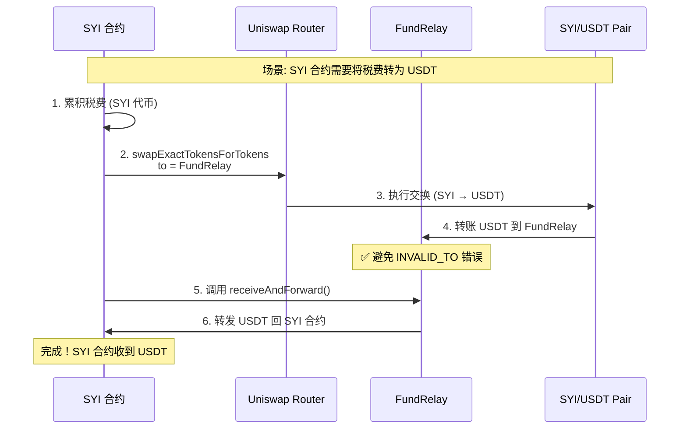
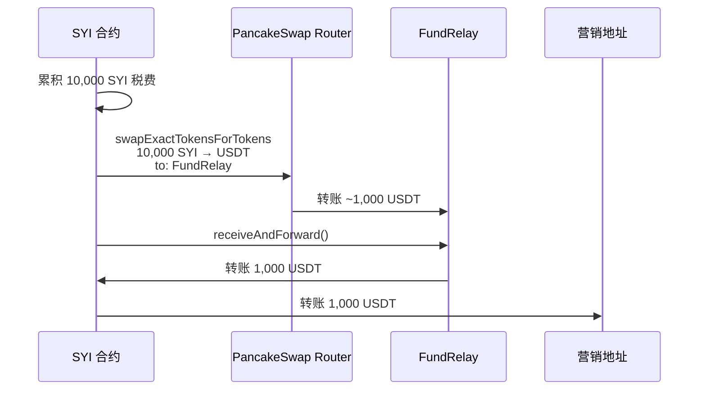
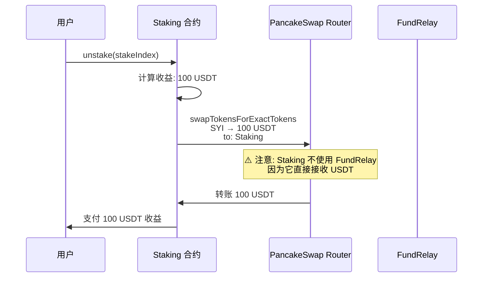
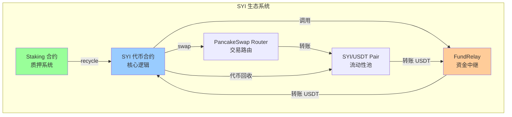

# FundRelay 合约技术说明

## 1. 合约概述

**FundRelay** 是一个专门设计的资金中继合约，用于解决 SYI 代币合约在与 Uniswap 交互时可能遇到的 `INVALID_TO` 错误。

### 1.1 核心作用

```
SYI 合约 → Uniswap Router → FundRelay → SYI 合约
        ↑                                  ↓
        └──────────── USDT 安全回流 ────────┘
```

作为 **安全中继站**，FundRelay 在 SYI 代币合约和 Uniswap Router 之间传递 USDT，确保交易流程的顺畅和资金安全。

---

## 2. 为什么需要 FundRelay？

### 2.1 问题背景：INVALID_TO 错误

在某些情况下，Uniswap V2 Router 执行代币交换时，如果 `to` 地址是调用合约本身，可能会触发以下错误：

```solidity
// Uniswap V2 Router 内部检查
require(to != address(this), "INVALID_TO");
```

**产生原因**：
- SYI 合约调用 `Router.swapExactTokensForTokens()` 时，将 `to` 设置为 `address(this)`
- 但 Router 内部有检查，不允许资金直接回流到 Router 自身
- 在某些复杂的税费逻辑或重入场景下，可能误判为回流到 Router

### 2.2 FundRelay 的解决方案



**优势**：
- ✅ **绕过限制**：Router 不会阻止转账到 FundRelay（第三方地址）
- ✅ **自动转发**：FundRelay 立即将 USDT 转回 SYI 合约
- ✅ **无手动操作**：整个流程自动化，无需人工干预
- ✅ **安全可控**：只有 SYI 合约能调用关键函数

---

## 3. 合约架构与功能

### 3.1 核心状态变量

```solidity
address public immutable SYI_CONTRACT;        // SYI 合约地址 (唯一授权调用者)
address public immutable USDT;                // USDT 代币地址
address public immutable EMERGENCY_RECIPIENT; // 紧急提款地址 (部署者/Owner)
```

**Immutable 设计**：
- 一旦部署，这些地址不可更改
- 提升安全性，防止恶意修改
- 降低 Gas 费用 (immutable 变量存储在 bytecode 中)

### 3.2 主要功能

#### 功能 1: receiveAndForward() - 接收并转发

```solidity
function receiveAndForward() external returns (uint256 usdtAmount)
```

**用途**：SYI 合约在执行 swap 后调用此函数，将 FundRelay 中的 USDT 转回 SYI 合约

**工作流程**：
```
1. 检查 FundRelay 的 USDT 余额
2. 如果余额 > 0：
   a. 发出 USDTReceived 事件
   b. 转账全部 USDT 到 SYI_CONTRACT
   c. 发出 USDTForwarded 事件
   d. 返回转账金额
3. 如果余额 = 0：返回 0
```

**关键点**：
- 📢 **任何人都可以调用**（external）
- 💰 **自动转发所有余额**
- 🔒 **只能转给 SYI_CONTRACT**（硬编码）

#### 功能 2: withdrawToSYI() - SYI 合约提款

```solidity
function withdrawToSYI(uint256 amount) external onlySYI
```

**用途**：允许 SYI 合约从 FundRelay 提取指定数量的 USDT

**权限**：仅 SYI_CONTRACT 可调用

**使用场景**：
- 手动触发 USDT 回流
- 分批提款（不是一次性全部提取）

#### 功能 3: withdrawSYIToContract() - 提取 SYI 代币

```solidity
function withdrawSYIToContract(uint256 amount) external onlySYI
```

**用途**：将 FundRelay 中累积的 SYI 代币转回 SYI 合约

**使用场景**：
- 如果 FundRelay 意外收到 SYI 代币（例如税费累积）
- SYI 合约需要处理这些代币（例如转为 USDT 再分发）

#### 功能 4: emergencyWithdraw() - 紧急提款

```solidity
function emergencyWithdraw() external onlyEmergency
```

**用途**：在紧急情况下，将所有 USDT 转到 EMERGENCY_RECIPIENT

**权限**：仅 EMERGENCY_RECIPIENT 可调用

**使用场景**：
- 合约升级
- 发现安全漏洞
- SYI 合约失效需要手动救援资金

---

## 4. 实际应用场景

### 4.1 场景 1：税费转换为 USDT（当前系统已移除税费，仅作示例）

假设 SYI 合约累积了 10,000 SYI 的税费，需要转换为 USDT 并分发给营销地址：



### 4.2 场景 2：Staking 奖励回购

用户解除质押时，Staking 合约需要从流动性池兑换 USDT 支付收益：



**注意**：Staking 合约通常不需要 FundRelay，因为它不涉及回流到 Router 的问题。FundRelay 主要为 SYI 合约服务。

### 4.3 场景 3：紧急救援

假设 SYI 合约出现 bug，无法正常调用 receiveAndForward()，导致 USDT 被锁在 FundRelay 中：

```bash
# 部署者/Owner 执行紧急提款
cast send <FundRelay_Address> "emergencyWithdraw()" \
  --private-key <PRIVATE_KEY>

# 结果: 所有 USDT 转到 EMERGENCY_RECIPIENT
```

---

## 5. 安全机制

### 5.1 权限控制

```solidity
modifier onlySYI() {
    if (msg.sender != SYI_CONTRACT) revert OnlySYIContract();
    _;
}

modifier onlyEmergency() {
    if (msg.sender != EMERGENCY_RECIPIENT) revert OnlyEmergencyRecipient();
    _;
}
```

| 函数 | 权限要求 | 说明 |
|-----|---------|------|
| `receiveAndForward()` | 任何人 | 但只能转给 SYI_CONTRACT |
| `withdrawToSYI()` | 仅 SYI_CONTRACT | 防止他人提走 USDT |
| `withdrawSYIToContract()` | 仅 SYI_CONTRACT | 防止他人提走 SYI |
| `emergencyWithdraw()` | 仅 EMERGENCY_RECIPIENT | 紧急救援 |
| `emergencyWithdrawToken()` | 仅 EMERGENCY_RECIPIENT | 提取任意代币 |

### 5.2 预授权机制

```solidity
// 构造函数中执行
IERC20(_usdt).approve(_syiContract, type(uint256).max);
```

**作用**：
- SYI 合约可以随时从 FundRelay 提取 USDT（使用 `transferFrom`）
- 无需每次手动授权
- 简化交互流程

### 5.3 Immutable 地址

```solidity
address public immutable SYI_CONTRACT;
address public immutable USDT;
address public immutable EMERGENCY_RECIPIENT;
```

**防护措施**：
- ✅ 部署后不可更改，防止恶意修改
- ✅ 避免 Owner 权限滥用
- ✅ 提升用户信心（合约行为可预测）

---

## 6. 部署与配置

### 6.1 部署顺序

```bash
# 步骤 1: 部署 Staking 合约
Staking = deploy("Staking", [USDT, Router, RootAddress, FeeRecipient])

# 步骤 2: 部署 SYI 合约（使用临时 FundRelay）
TempFundRelay = deploy("FundRelay", [DeployerAddress, USDT, DeployerAddress])
SYI = deploy("SYI", [USDT, Router, Staking.address])

# 步骤 3: 重新部署正确的 FundRelay
FundRelay = deploy("FundRelay", [SYI.address, USDT, DeployerAddress])

# 步骤 4: 设置 SYI 的 FundRelay 地址
SYI.setFundRelay(FundRelay.address)
```

### 6.2 为什么需要两次部署 FundRelay？

```mermaid
graph TB
    subgraph "问题: 循环依赖"
        SYI[SYI 合约<br/>需要知道 Staking 地址]
        FundRelay1[FundRelay<br/>需要知道 SYI 地址]

        SYI -.->|依赖| FundRelay1
        FundRelay1 -.->|依赖| SYI
    end

    subgraph "解决方案: 分步部署"
        Staking2[1. 部署 Staking]
        TempRelay[2. 部署临时 FundRelay<br/>使用 deployer 地址]
        SYI2[3. 部署 SYI<br/>传入 Staking 地址]
        FinalRelay[4. 部署正式 FundRelay<br/>使用 SYI 地址]
        SetRelay[5. SYI.setFundRelay()<br/>关联正式 FundRelay]

        Staking2 --> TempRelay --> SYI2 --> FinalRelay --> SetRelay
    end

    style SYI fill:#ff9999
    style FundRelay1 fill:#ff9999
    style SetRelay fill:#99ff99
```

**原因**：
1. SYI 合约构造函数需要 Staking 地址（在构造时设置）
2. FundRelay 构造函数需要 SYI 地址
3. 产生循环依赖：SYI → FundRelay → SYI

**解决方案**：
1. 先用临时地址部署 FundRelay（例如 deployer 地址）
2. 部署 SYI 合约
3. 再用正确的 SYI 地址重新部署 FundRelay
4. 通过 `setFundRelay()` 更新 SYI 合约的 FundRelay 地址

---

## 7. 实际代码示例

### 7.1 SYI 合约中的使用

```solidity
// SYIBase.sol - 将税费转为 USDT（示例）
function _swapTokensForUSDT(uint256 tokenAmount) private lockSwap returns (uint256 usdtReceived) {
    if (tokenAmount == 0 || balanceOf(address(this)) < tokenAmount) return 0;

    address[] memory path = new address[](2);
    path[0] = address(this);
    path[1] = USDT;

    _approve(address(this), address(uniswapV2Router), tokenAmount);

    // 关键: 将 USDT 发送到 FundRelay 而不是 SYI 合约
    address recipient = address(fundRelay) != address(0)
        ? address(fundRelay)
        : address(this);

    uniswapV2Router.swapExactTokensForTokensSupportingFeeOnTransferTokens(
        tokenAmount,
        0,
        path,
        recipient,  // ← 发送到 FundRelay
        block.timestamp + 300
    );

    // 从 FundRelay 取回 USDT
    if (address(fundRelay) != address(0)) {
        uint256 received = fundRelay.receiveAndForward();
        return received;
    } else {
        uint256 finalBalance = IERC20(USDT).balanceOf(address(this));
        uint256 actualReceived = finalBalance > initialBalance
            ? finalBalance - initialBalance
            : 0;
        return actualReceived;
    }
}
```

### 7.2 手动调用示例（Hardhat 脚本）

```javascript
// scripts/testFundRelay.js
const hre = require("hardhat");

async function main() {
  const [deployer] = await hre.ethers.getSigners();

  // 加载已部署的合约
  const fundRelayAddress = "0x...";
  const fundRelay = await hre.ethers.getContractAt("FundRelay", fundRelayAddress);

  // 查询余额
  const usdtBalance = await fundRelay.getUSDTBalance();
  console.log("FundRelay USDT 余额:", hre.ethers.formatUnits(usdtBalance, 6), "USDT");

  // 如果有余额，触发转发
  if (usdtBalance > 0) {
    const tx = await fundRelay.receiveAndForward();
    await tx.wait();
    console.log("✅ USDT 已转发到 SYI 合约");
  }

  // 紧急情况：提取所有 USDT（需要 deployer 是 EMERGENCY_RECIPIENT）
  // const emergencyTx = await fundRelay.emergencyWithdraw();
  // await emergencyTx.wait();
}

main().catch((error) => {
  console.error(error);
  process.exit(1);
});
```

---

## 8. 常见问题 (FAQ)

### Q1: FundRelay 会持有大量 USDT 吗？

**A:** 不会。FundRelay 设计为"即收即转"：
- USDT 到达后立即被 `receiveAndForward()` 转走
- 正常运行时，FundRelay 的余额应该始终接近 0
- 只有在异常情况下（例如 SYI 合约未及时调用），才会暂时累积

### Q2: 如果 FundRelay 部署错误怎么办？

**A:** 可以重新部署：
1. 调用 `SYI.setFundRelay(newFundRelayAddress)` 更新地址
2. 旧 FundRelay 中的资金可通过 `emergencyWithdraw()` 救援
3. 不影响 SYI 代币的正常功能（可暂时不使用 FundRelay）

### Q3: FundRelay 有没有安全风险？

**A:** 设计上已最小化风险：
- ✅ Immutable 地址，无法被篡改
- ✅ 只有 SYI_CONTRACT 能提款
- ✅ 任何人都可以调用 `receiveAndForward()`，但只能转给 SYI_CONTRACT
- ✅ 紧急救援机制（Owner 可提款）
- ⚠️ 唯一风险：如果 SYI_CONTRACT 地址部署错误，则 USDT 会被发送到错误地址

**缓解措施**：
- 在测试网充分测试
- 多签管理 EMERGENCY_RECIPIENT
- 部署后立即验证所有地址

### Q4: 当前系统已无交易税，还需要 FundRelay 吗？

**A:** 当前 SYI 系统已移除所有交易税（buyTax=0%, sellTax=0%, profitTax=0%），理论上 FundRelay 的使用频率会降低。但仍保留此合约的原因：
1. **预留扩展性**：未来可能需要重新引入某些经济机制
2. **通用解决方案**：可用于其他需要代币交换的场景
3. **已集成部署**：移除成本高于保留成本
4. **不影响性能**：不使用时不会产生额外 Gas 费用

---

## 9. 与其他合约的关系



**职责划分**：
| 合约 | 主要职责 |
|-----|---------|
| **SYI** | 代币逻辑、交易税、黑白名单 |
| **Staking** | 质押奖励、推荐系统、复利计算 |
| **FundRelay** | USDT 中转站（解决 Router 限制） |
| **Router** | 执行代币交换 |
| **Pair** | 提供流动性、AMM 定价 |

---

## 10. 总结

### 10.1 FundRelay 的核心价值

| 特性 | 说明 |
|-----|------|
| 🛡️ **问题解决者** | 绕过 Uniswap `INVALID_TO` 错误 |
| 🔄 **自动化** | 接收即转发，无需手动干预 |
| 🔒 **安全可控** | Immutable 地址 + 权限控制 |
| 🚨 **应急机制** | Owner 可紧急救援资金 |
| ⚡ **低开销** | 仅在需要时触发，不增加常规交易成本 |

### 10.2 适用场景

✅ **适合使用 FundRelay 的情况**：
- 合约需要执行 swap 并将结果发送回自身
- 遇到 `INVALID_TO` 或 `TransferHelper: TRANSFER_FAILED` 错误
- 需要在复杂的税费逻辑中安全转移 USDT

❌ **不需要 FundRelay 的情况**：
- 简单的用户交易（用户买卖代币）
- Staking 合约直接接收 USDT 奖励
- 无税费的纯转账

### 10.3 最佳实践

```solidity
// ✅ 推荐: 先检查 FundRelay 是否设置
if (address(fundRelay) != address(0)) {
    // 使用 FundRelay
    recipient = address(fundRelay);
} else {
    // 直接接收（可能会失败）
    recipient = address(this);
}

// ✅ 推荐: 验证转账结果
uint256 received = fundRelay.receiveAndForward();
require(received > 0, "No USDT received");

// ❌ 不推荐: 假设 FundRelay 一定有余额
// uint256 balance = fundRelay.getUSDTBalance(); // 可能为 0
```

---

**文档版本**: v1.0
**更新日期**: 2025-10-13
**合约地址**: `contracts/SYI/utils/FundRelay.sol`
**依赖关系**: SYI 代币合约、Uniswap V2 Router、USDT
