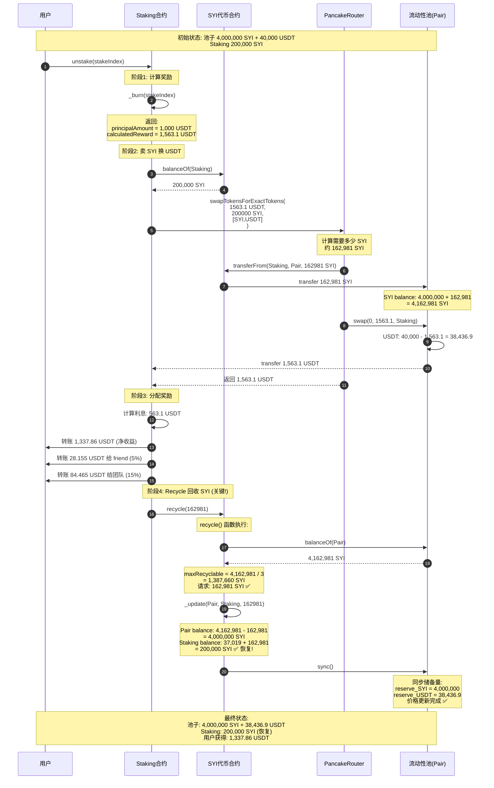
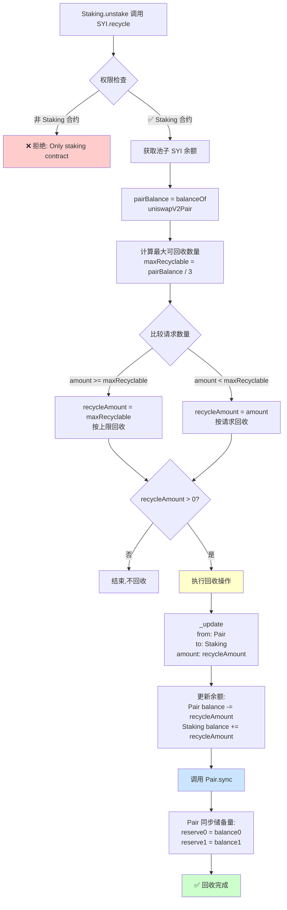
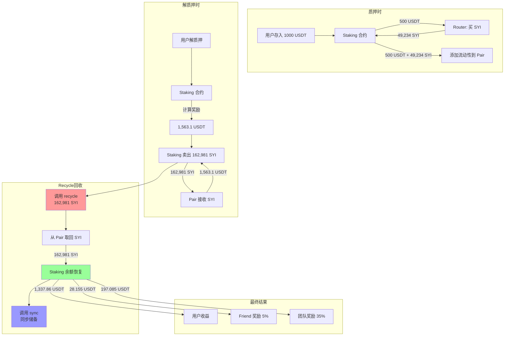
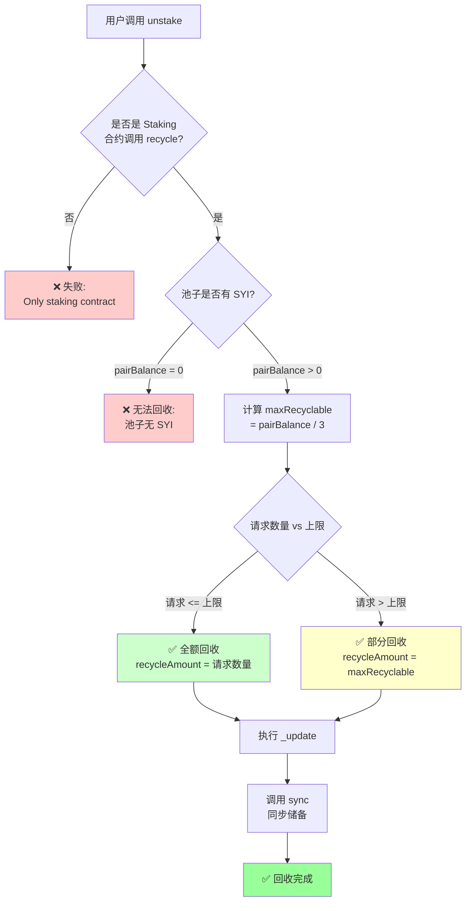
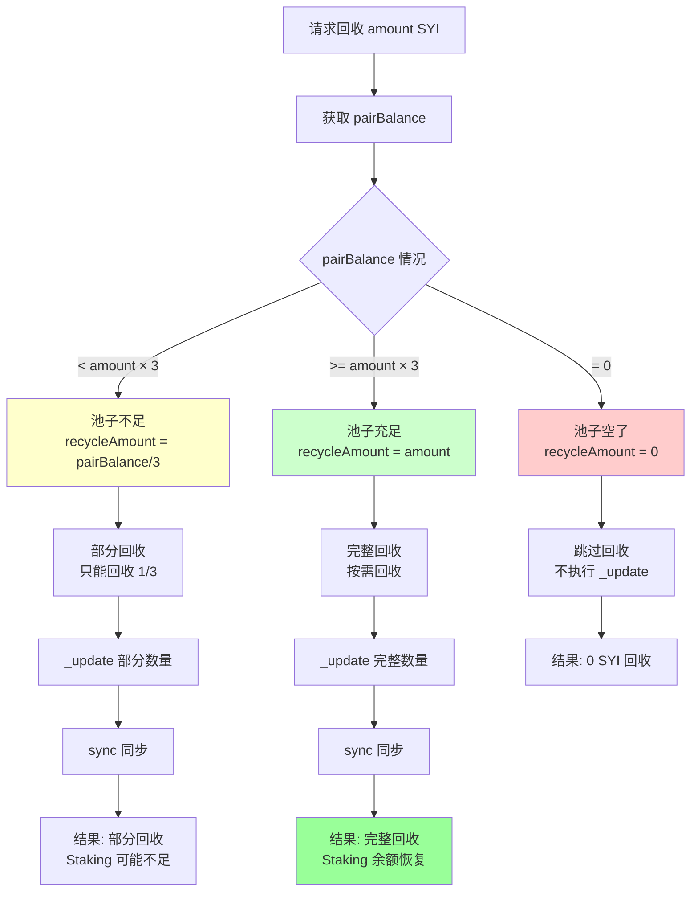
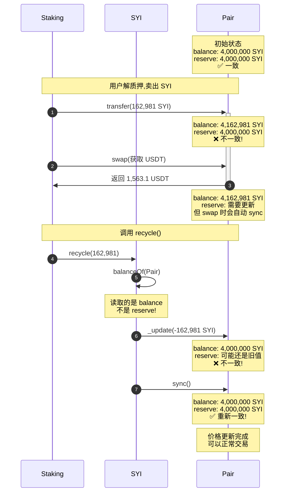
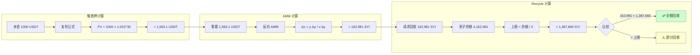

# SYI Recycle 机制流程图

## 流程图 1: 解质押完整流程 (含 Recycle)



## 流程图 2: Recycle 函数详细执行流程



## 流程图 3: 资金闭环示意图



## 流程图 4: 池子状态变化时间线

```mermaid
gantt
    title SYI 池子状态变化 (1000 USDT 质押 30 天)
    dateFormat X
    axisFormat %s

    section 池子 USDT
    初始状态 40,000 :done, 0, 1
    质押时 +500 → 40,500 :active, 1, 2
    解质押时 -1,563.1 → 38,436.9 :crit, 2, 3

    section 池子 SYI
    初始状态 4,000,000 :done, 0, 1
    质押时 +49,234.6 → 4,049,234.6 :active, 1, 2
    解质押卖出 +162,981 → 4,212,215.6 :crit, 2, 2.5
    Recycle -162,981 → 4,049,234.6 :milestone, 2.5, 3

    section Staking SYI
    初始状态 200,000 :done, 0, 1
    保持不变 200,000 :active, 1, 2
    卖出 -162,981 → 37,019 :crit, 2, 2.5
    Recycle +162,981 → 200,000 :milestone, 2.5, 3
```



## 流程图 5: 决策树 - 是否能成功 Recycle



## 数据流图

### 场景: 用户解质押时的数据流

```
┌─────────────────────────────────────────────────────────────────┐
│ 第一步: 计算奖励                                                │
├─────────────────────────────────────────────────────────────────┤
│ 输入: stakeIndex = 0                                            │
│ 计算: 本金 1,000 + 利息 563.1 = 1,563.1 USDT                   │
│ 输出: calculatedReward = 1,563.1 USDT                          │
└─────────────────────────────────────────────────────────────────┘
                           ↓
┌─────────────────────────────────────────────────────────────────┐
│ 第二步: 卖 SYI 换 USDT                                         │
├─────────────────────────────────────────────────────────────────┤
│ 输入: calculatedReward = 1,563.1 USDT (需要)                   │
│      Staking 余额 = 200,000 SYI                                │
│                                                                 │
│ Router 计算:                                                    │
│   池子: 4,000,000 SYI + 40,000 USDT                            │
│   需要: 1,563.1 USDT                                           │
│   反向 AMM: Δx = (y·Δy) / (x - Δy)                            │
│   Δx = (4,000,000 × 1,563.1) / (40,000 - 1,563.1)            │
│   Δx ≈ 162,981 SYI                                             │
│                                                                 │
│ 执行交易:                                                       │
│   Staking → Pair: 162,981 SYI                                  │
│   Pair → Staking: 1,563.1 USDT                                 │
│                                                                 │
│ 输出: usdtReceived = 1,563.1 USDT                              │
│      syiTokensUsed = 162,981 SYI                               │
└─────────────────────────────────────────────────────────────────┘
                           ↓
┌─────────────────────────────────────────────────────────────────┐
│ 第三步: 分配奖励                                                │
├─────────────────────────────────────────────────────────────────┤
│ 利息 = 1,563.1 - 1,000 = 563.1 USDT                            │
│                                                                 │
│ 分配:                                                           │
│   Friend (5%):  563.1 × 5%  = 28.155 USDT                     │
│   Team (15%):   563.1 × 15% = 84.465 USDT                     │
│   User (剩余):  1,563.1 - 28.155 - 84.465 = 1,450.48 USDT     │
│   赎回费 (1%):  1,450.48 × 1% = 14.50 USDT                    │
│                                                                 │
│ 用户实际获得: 1,450.48 - 14.50 = 1,435.98 USDT                │
└─────────────────────────────────────────────────────────────────┘
                           ↓
┌─────────────────────────────────────────────────────────────────┐
│ 第四步: Recycle 回收 SYI (关键!)                               │
├─────────────────────────────────────────────────────────────────┤
│ 输入: syiTokensUsed = 162,981 SYI                              │
│                                                                 │
│ 检查:                                                           │
│   pairBalance = balanceOf(Pair) = 4,162,981 SYI               │
│   maxRecyclable = 4,162,981 / 3 = 1,387,660 SYI               │
│   请求: 162,981 SYI                                            │
│   判断: 162,981 < 1,387,660 ✅ 可以全额回收                    │
│                                                                 │
│ 执行:                                                           │
│   _update(Pair, Staking, 162,981)                              │
│   Pair balance: 4,162,981 - 162,981 = 4,000,000 SYI           │
│   Staking balance: 37,019 + 162,981 = 200,000 SYI ✅          │
│                                                                 │
│ 同步:                                                           │
│   Pair.sync()                                                   │
│   reserve_SYI = 4,000,000                                       │
│   reserve_USDT = 38,436.9                                       │
│                                                                 │
│ 输出: Staking 余额恢复到初始状态 200,000 SYI                   │
└─────────────────────────────────────────────────────────────────┘
```

## 边界情况流程图



## 时序图: Balance vs Reserve 的变化



## 核心计算公式流程


