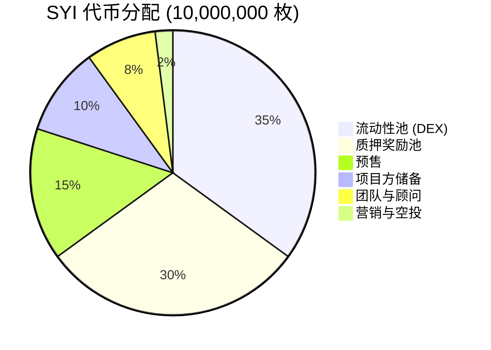
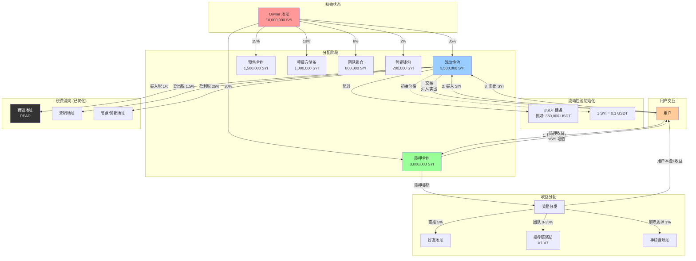
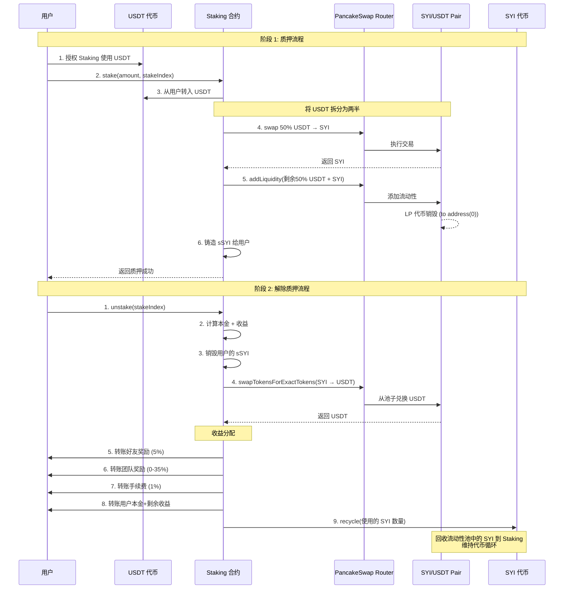
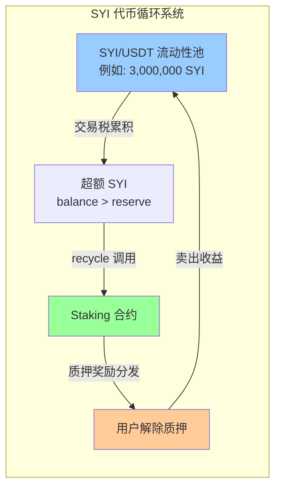
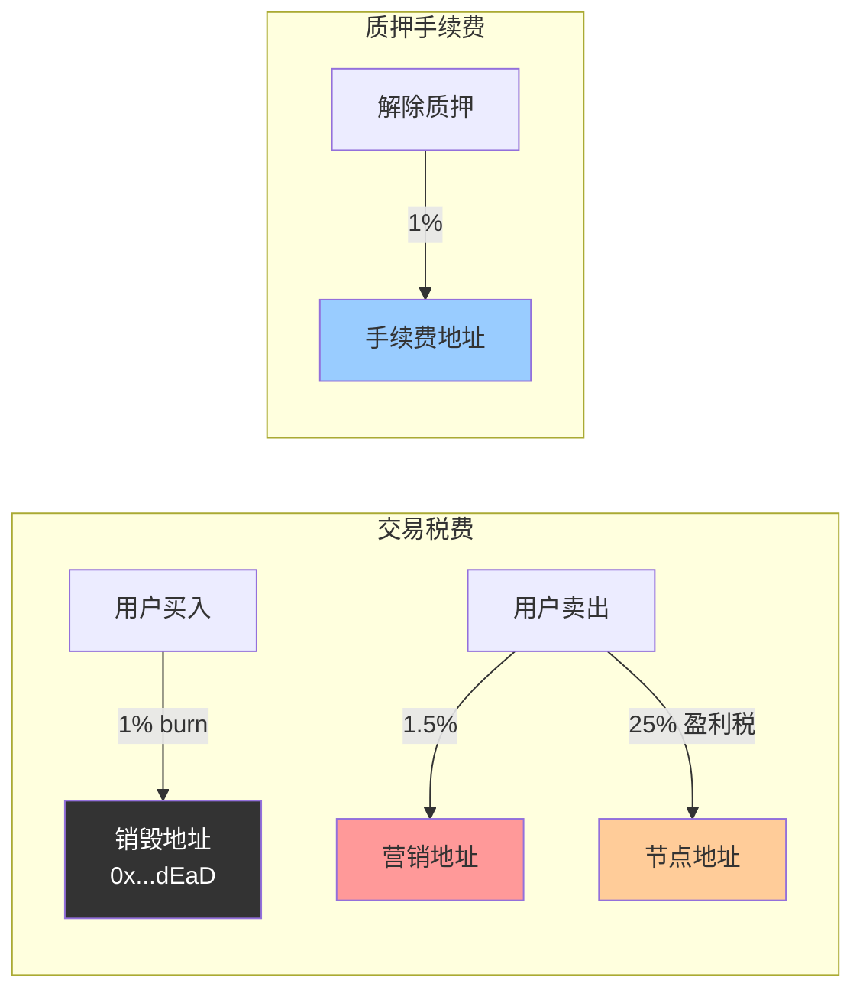
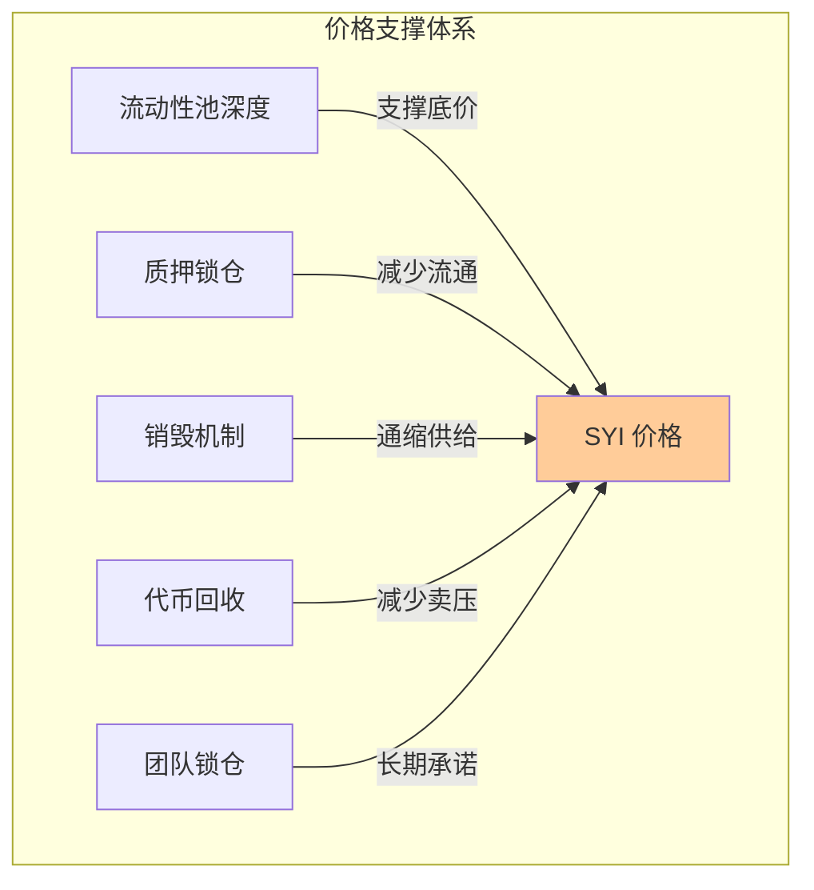

# SYI 代币经济学与资金流向分析

## 1. 代币基本信息

- **代币名称**: SYI Token
- **代币符号**: SYI
- **总供应量**: 10,000,000 枚 (1000万)
- **精度**: 18 位小数
- **初始铸造**: 所有代币在部署时铸造给 Owner 地址

## 2. 代币分配方案

### 2.1 推荐的代币分配结构

根据 DeFi 项目最佳实践，推荐以下分配方案：

```
总供应量: 10,000,000 SYI (100%)

├─ 流动性池 (DEX)         35%  =  3,500,000 SYI
│  └─ 配对 USDT 用于 PancakeSwap 交易对
│
├─ 质押奖励池             30%  =  3,000,000 SYI
│  └─ 用于质押用户的收益分发
│
├─ 预售 (Presale)         15%  =  1,500,000 SYI
│  └─ 早期投资者募资
│
├─ 项目方储备             10%  =  1,000,000 SYI
│  ├─ 运营资金            5%   =    500,000 SYI
│  └─ 生态发展基金        5%   =    500,000 SYI
│
├─ 团队与顾问              8%  =    800,000 SYI
│  ├─ 核心团队            6%   =    600,000 SYI (12个月线性解锁)
│  └─ 技术顾问            2%   =    200,000 SYI (6个月线性解锁)
│
└─ 营销与空投              2%  =    200,000 SYI
   ├─ 市场推广            1%   =    100,000 SYI
   └─ 社区空投            1%   =    100,000 SYI
```

### 2.2 代币分配图表



## 3. 代币流转与资金流向

### 3.1 核心资金流循环



### 3.2 质押系统详细流程



### 3.3 代币回收机制 (Recycle)



**Recycle 机制说明**:
- 当用户交易产生的代币留在流动性池时，会导致池子的 `balance` > `reserve`
- Staking 合约定期调用 `SYI.recycle(amount)` 回收最多 1/3 的超额代币
- 回收的代币用于支付质押奖励，形成闭环经济

## 4. 各阶段资金需求分析

### 4.1 初始流动性池配置

**推荐配置**:
```
SYI 数量:     3,500,000 枚
USDT 储备:      350,000 USDT (假设初始价格 1 SYI = 0.1 USDT)
初始市值:       350,000 USD
完全稀释估值:  1,000,000 USD (按初始价格计算)
```

**分批添加策略**:
1. **第一批**: 1,000,000 SYI + 100,000 USDT (启动池)
2. **第二批**: 1,500,000 SYI + 150,000 USDT (预售后)
3. **第三批**: 1,000,000 SYI + 100,000 USDT (稳定期)

### 4.2 预售方案

**预售配置**:
```
预售数量:    1,500,000 SYI
预售价格:    0.08 USDT/SYI (相比 DEX 价格 20% 折扣)
硬顶:        120,000 USDT
最小购买:    100 USDT
最大购买:    5,000 USDT
锁仓期:      30 天 (与合约的 presaleDuration 一致)
```

**预售资金用途**:
- 60% → 添加流动性池 (72,000 USDT)
- 20% → 营销推广 (24,000 USDT)
- 10% → 团队运营 (12,000 USDT)
- 10% → 技术开发 (12,000 USDT)

### 4.3 质押奖励池配置

**奖励池管理**:
```
总储备:      3,000,000 SYI
日均消耗:    ~3,000 - 5,000 SYI (取决于质押量)
可持续周期:  ~600 - 1000 天 (约 2-3 年)

APY 配置:
- 1 天质押:   0.3%
- 7 天质押:   4.28%
- 15 天质押:  16.1%
- 30 天质押:  56.31%
```

**补充机制**:
1. **Recycle 回收**: 从流动性池回收交易产生的代币
2. **税费注入**: 部分税费用于回购并注入奖励池
3. **动态调整**: 根据奖励池余额动态调整 APY

## 5. 项目方储备使用计划

### 5.1 运营资金 (500,000 SYI)

```
├─ CEX 上币费用         200,000 SYI
├─ 审计费用              50,000 SYI
├─ 法律合规              50,000 SYI
├─ 技术维护             100,000 SYI
└─ 应急储备             100,000 SYI
```

### 5.2 生态发展基金 (500,000 SYI)

```
├─ 合作伙伴激励         200,000 SYI
├─ 开发者奖励           150,000 SYI
├─ 生态孵化基金         100,000 SYI
└─ 社区治理基金          50,000 SYI
```

## 6. 税费结构与流向

### 6.1 当前税费配置

| 交易类型 | 税率 | 去向 | 说明 |
|---------|------|------|------|
| 买入 | 1% | 销毁地址 (DEAD) | 通缩机制 |
| 卖出 | 1.5% | 营销地址 | 用于市场推广 |
| 盈利税 | 25% | 节点/营销地址 | 仅对超过成本的收益征税 |
| 解除质押手续费 | 1% | 手续费接收地址 | Staking 合约维护 |

**注意**:
- ❌ 已移除 LP 质押功能
- ❌ 已移除买入的 2% LP 税
- ❌ 已移除卖出的 1.5% LP 累积税

### 6.2 税费流向图



## 7. 代币价值捕获机制

### 7.1 通缩机制

```
1. 买入销毁:      每次买入销毁 1%
2. 盈利税回购:    25% 盈利税可用于回购销毁
3. LP 代币销毁:   质押添加流动性时 LP 代币发送到 address(0)
```

**预期通缩率**:
- 日交易量 100,000 SYI → 日销毁 ~1,000 SYI
- 年通缩率 ~3.65% (不考虑盈利税)

### 7.2 价格支撑机制



## 8. 风险提示与建议

### 8.1 代币分配风险

| 风险 | 说明 | 缓解措施 |
|-----|------|----------|
| 流动性不足 | 35% 可能不够支撑大额交易 | 动态增加流动性，考虑增至 40-45% |
| 奖励池耗尽 | 30% 可能不足以维持高 APY | 启用 recycle 机制，税费回购注入 |
| 中心化风险 | 团队+项目方 18% 集中度较高 | 设置线性解锁，透明化资金使用 |
| 抛压风险 | 预售 15% 可能在解锁后集中卖出 | 分批解锁，设置抛售惩罚机制 |

### 8.2 优化建议

**短期 (1-3 个月)**:
1. ✅ 在 BSC 测试网部署并充分测试
2. ✅ 进行第三方安全审计 (CertiK / PeckShield)
3. ✅ 设置多签钱包管理项目方储备
4. ✅ 建立透明的代币释放时间表

**中期 (3-6 个月)**:
1. 📊 监控质押池消耗速度，调整 APY
2. 💰 预售后立即增加流动性深度
3. 🔥 启用回购销毁机制稳定价格
4. 🤝 寻找战略合作伙伴注入流动性

**长期 (6-12 个月)**:
1. 🏦 申请 CEX 上币 (Gate.io / MEXC)
2. 🌐 拓展跨链支持 (Arbitrum / Polygon)
3. 🏛️ 引入 DAO 治理机制
4. 📈 开发更多 DeFi 产品增加代币应用场景

## 9. 关键合约地址 (示例)

```
网络:           BSC Mainnet (未部署)
部署器:         0xf39F...2266 (待定)

SYI 代币:       [待部署]
Staking:        [待部署]
Pair:           [待部署]
FundRelay:      [待部署]

PancakeSwap:
- Factory:      0xcA143Ce32Fe78f1f7019d7d551a6402fC5350c73
- Router:       0x10ED43C718714eb63d5aA57B78B54704E256024E

代币:
- USDT:         0x55d398326f99059fF775485246999027B3197955
- WBNB:         0xbb4CdB9CBd36B01bD1cBaEBF2De08d9173bc095c
```

## 10. 总结

### 10.1 代币分配总览

| 类别 | 数量 (SYI) | 占比 | 解锁方式 |
|-----|-----------|------|----------|
| 流动性池 | 3,500,000 | 35% | 部署后立即添加 |
| 质押奖励池 | 3,000,000 | 30% | 按需分发 |
| 预售 | 1,500,000 | 15% | 30 天锁仓后释放 |
| 项目方储备 | 1,000,000 | 10% | 按需使用，多签管理 |
| 团队与顾问 | 800,000 | 8% | 6-12 个月线性解锁 |
| 营销与空投 | 200,000 | 2% | 分批使用 |
| **合计** | **10,000,000** | **100%** | - |

### 10.2 核心特点

✅ **无买卖税**: 已移除 LP 质押和相关税费，更适合 CEX 上币
✅ **代币回收**: Recycle 机制确保代币循环，支撑长期运营
✅ **灵活质押**: 4 档期质押，APY 0.3%-56.31%
✅ **推荐奖励**: 直推 5% + 团队差额 0-35%
✅ **通缩机制**: 买入销毁 1%，减少流通供给

### 10.3 下一步行动

```bash
# 1. 部署到 BSC 测试网
npx hardhat run scripts/deploySYI.js --network bsc-testnet

# 2. 验证合约
npx hardhat verify --network bsc-testnet <SYI_ADDRESS> <ARGS>

# 3. 运行测试
npx hardhat run scripts/testSYI.js --network bsc-testnet

# 4. 准备审计材料
# 5. 制定详细的代币释放时间表
# 6. 启动预售
```

---

**文档版本**: v1.0
**更新日期**: 2025-10-13
**文档作者**: Claude Code
