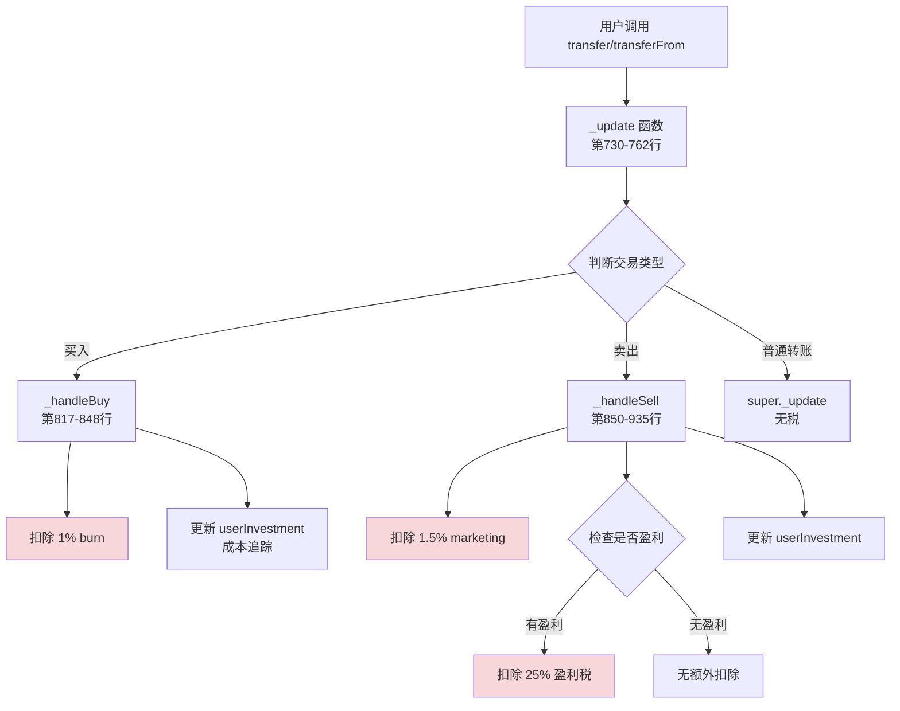
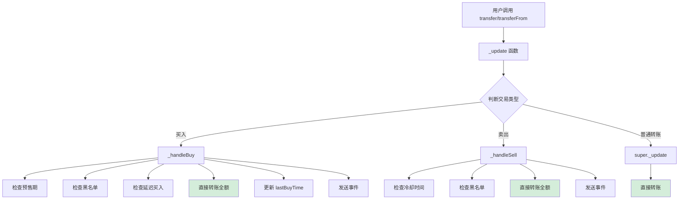

# SYI 代币合约取消交易税改造方案

**版本**: v1.0
**日期**: 2025-10-13
**目标**: 完全取消 SYI 代币的所有买卖交易税，包括 burn、marketing、盈利税、成本追踪等机制

---

## 目录

1. [当前状态分析](#1-当前状态分析)
2. [改造目标](#2-改造目标)
3. [详细改造方案](#3-详细改造方案)
4. [影响分析](#4-影响分析)
5. [风险评估](#5-风险评估)
6. [实施步骤](#6-实施步骤)
7. [测试计划](#7-测试计划)

---

## 1. 当前状态分析

### 1.1 代码位置

**主要文件**:
- `contracts/SYI/abstract/SYIBase.sol` - 核心业务逻辑（1510行）
- `contracts/SYI/mainnet/SYI.sol` - 主网环境配置（36行）

### 1.2 当前税费机制总览

| 税费项目 | 当前状态 | 费率 | 代码位置 | 接收方 |
|---------|---------|------|----------|--------|
| 买入 burn | ✅ 保留 | 1% | `SYIBase.sol:205, 830-837` | 销毁地址 (0xdead) |
| 买入 LP | ❌ 已移除 | 0% | `SYIBase.sol:846` (设为0) | 流动性池 |
| 卖出 marketing | ✅ 保留 | 1.5% | `SYIBase.sol:207, 859-893` | marketingAddress |
| 卖出 LP | ❌ 已移除 | 0% | `SYIBase.sol:925` (设为0) | 流动性池 |
| 盈利税 | ✅ 保留 | 25% | `SYIBase.sol:209, 866-915` | nodeDividendAddress/marketingAddress |
| 无盈利税 | ✅ 保留 | 25% | `SYIBase.sol:210, 869` | 未实际使用 |
| 成本追踪 | ✅ 保留 | - | `SYIBase.sol:243, 1059-1125` | userInvestment 映射 |

### 1.3 相关状态变量

```solidity
// 费率常量 (第205-211行)
uint256 private constant BUY_BURN_FEE = 100;           // 1%
uint256 private constant BUY_LIQUIDITY_FEE = 200;      // 2% (已不使用)
uint256 private constant SELL_MARKETING_FEE = 150;     // 1.5%
uint256 private constant SELL_LIQUIDITY_ACCUM_FEE = 150; // 1.5% (已不使用)
uint256 private constant PROFIT_TAX_RATE = 2500;       // 25%
uint256 private constant NO_PROFIT_FEE = 2500;         // 25% (未实际使用)

// 地址变量 (第224-225行)
address public marketingAddress;      // 营销地址
address public nodeDividendAddress;   // 节点分红地址

// 费用累积 (第227-228行)
uint256 public amountMarketingFee;    // 累积的 marketing 费用
uint256 public amountLPFee;           // 累积的 LP 费用 (已不使用)

// 成本追踪 (第243-244行)
mapping(address => uint256) public userInvestment;  // 用户投资成本
mapping(address => uint256) public lastBuyTime;     // 最后购买时间
```

### 1.4 核心税费逻辑流程



---

## 2. 改造目标

### 2.1 核心要求

1. **完全取消所有交易税**
   - ❌ 取消 1% 买入 burn 税
   - ❌ 取消 1.5% 卖出 marketing 税
   - ❌ 取消 25% 盈利税
   - ❌ 取消成本追踪机制

2. **移除相关地址和状态变量**
   - ❌ 移除 `marketingAddress` 构造参数和状态变量
   - ⚠️ 保留 `nodeDividendAddress`（可能被其他功能使用）
   - ❌ 移除 `amountMarketingFee` 累积变量
   - ❌ 移除 `userInvestment` 成本追踪
   - ⚠️ 保留 `lastBuyTime`（用于 coldTime 冷却机制）

3. **简化交易逻辑**
   - 买入交易: 直接转账，无税费
   - 卖出交易: 直接转账，无税费
   - 普通转账: 保持不变

### 2.2 需要保留的功能

| 功能 | 是否保留 | 原因 |
|------|---------|------|
| 黑名单 (blacklisted) | ✅ 保留 | 安全机制 |
| 白名单 (feeWhitelisted) | ⚠️ 可选保留 | 改名为 `blacklistExempt` 更准确 |
| 冷却时间 (coldTime) | ✅ 保留 | 防止抢跑攻击 |
| 预售期 (presale) | ✅ 保留 | 项目启动需要 |
| 延迟买入 (delayedBuy) | ✅ 保留 | 反机器人机制 |
| Recycle 机制 | ✅ 保留 | 质押系统需要 |
| FundRelay | ❌ 可移除 | 仅用于税费分发 |

---

## 3. 详细改造方案

### 3.1 修改文件清单

| 文件 | 修改内容 | 影响范围 |
|------|---------|---------|
| `contracts/SYI/mainnet/SYI.sol` | 移除 `_marketingAddress` 构造参数 | 低（仅1处） |
| `contracts/SYI/abstract/SYIBase.sol` | 核心逻辑改造 | 高（约200行） |
| `contracts/SYI/interfaces/ISYI.sol` (如果有) | 更新接口定义 | 低 |
| `scripts/deploySYI.js` | 更新部署脚本 | 中 |
| `test/SYI.test.js` | 更新测试用例 | 高 |

### 3.2 代码修改详细方案

#### 方案 A: 最小改动（推荐）

**原则**: 保留代码结构，仅移除税费计算和扣除逻辑

**优点**:
- ✅ 改动最小，风险低
- ✅ 保留所有事件和接口，向后兼容
- ✅ 测试和审计成本低

**缺点**:
- ⚠️ 保留一些无用代码和状态变量（如 `amountMarketingFee`）
- ⚠️ 合约代码量不会明显减少

#### 方案 B: 深度清理（激进）

**原则**: 彻底移除所有税费相关代码、状态变量、事件

**优点**:
- ✅ 代码简洁，合约大小减小
- ✅ Gas 费用略微降低
- ✅ 逻辑清晰，易于维护

**缺点**:
- ❌ 改动范围大，风险高
- ❌ 破坏向后兼容性
- ❌ 需要重新审计整个合约
- ❌ 测试成本高

---

### 3.3 推荐方案：方案 A（最小改动）

#### 第一步：修改 `SYI.sol` 构造函数

**文件**: `contracts/SYI/mainnet/SYI.sol`

**修改前** (第15-20行):
```solidity
constructor(
    address _usdt,
    address _router,
    address _staking,
    address _marketingAddress  // ← 需要移除
) SYIBase(_usdt, _router, _staking, _marketingAddress) {}
```

**修改后**:
```solidity
constructor(
    address _usdt,
    address _router,
    address _staking
) SYIBase(_usdt, _router, _staking) {}
```

---

#### 第二步：修改 `SYIBase.sol` 构造函数

**文件**: `contracts/SYI/abstract/SYIBase.sol`

**修改前** (第283-307行):
```solidity
constructor(
    address _usdt,
    address _router,
    address _staking,
    address _marketingAddress  // ← 需要移除
) ERC20("SYI Token", "SYI") Ownable(msg.sender) {
    if (
        _usdt == address(0) ||
        _router == address(0) ||
        _staking == address(0) ||
        _marketingAddress == address(0)  // ← 需要移除
    ) revert ZeroAddress();

    USDT = _usdt;
    uniswapV2Router = IUniswapV2Router02(_router);
    staking = IStaking(_staking);
    marketingAddress = _marketingAddress;  // ← 需要移除

    _mint(owner(), 10_000_000 ether);

    contractDeployTime = block.timestamp;
    presaleStartTime = block.timestamp;
    presaleDuration = getPresaleDuration();
    presaleActive = true;
}
```

**修改后**:
```solidity
constructor(
    address _usdt,
    address _router,
    address _staking
) ERC20("SYI Token", "SYI") Ownable(msg.sender) {
    if (
        _usdt == address(0) ||
        _router == address(0) ||
        _staking == address(0)
    ) revert ZeroAddress();

    USDT = _usdt;
    uniswapV2Router = IUniswapV2Router02(_router);
    staking = IStaking(_staking);
    // 移除 marketingAddress 初始化

    _mint(owner(), 10_000_000 ether);

    contractDeployTime = block.timestamp;
    presaleStartTime = block.timestamp;
    presaleDuration = getPresaleDuration();
    presaleActive = true;
}
```

---

#### 第三步：修改费率常量为 0

**文件**: `contracts/SYI/abstract/SYIBase.sol`

**修改前** (第204-211行):
```solidity
uint256 private constant BASIS_POINTS = 10000;
uint256 private constant BUY_BURN_FEE = 100;           // 1%
uint256 private constant BUY_LIQUIDITY_FEE = 200;      // 2%
uint256 private constant SELL_MARKETING_FEE = 150;     // 1.5%
uint256 private constant SELL_LIQUIDITY_ACCUM_FEE = 150; // 1.5%
uint256 private constant PROFIT_TAX_RATE = 2500;       // 25%
uint256 private constant NO_PROFIT_FEE = 2500;         // 25%
uint256 private constant LP_HANDLE_FEE = 250;          // 2.5%
```

**修改后**:
```solidity
uint256 private constant BASIS_POINTS = 10000;
uint256 private constant BUY_BURN_FEE = 0;             // 改为 0%
uint256 private constant BUY_LIQUIDITY_FEE = 0;        // 改为 0%
uint256 private constant SELL_MARKETING_FEE = 0;       // 改为 0%
uint256 private constant SELL_LIQUIDITY_ACCUM_FEE = 0; // 改为 0%
uint256 private constant PROFIT_TAX_RATE = 0;          // 改为 0%
uint256 private constant NO_PROFIT_FEE = 0;            // 改为 0%
uint256 private constant LP_HANDLE_FEE = 250;          // 保留（流动性操作费）
```

**注意**: 虽然设为 0，但保留这些常量定义可以保持代码结构不变。

---

#### 第四步：简化 `_handleBuy` 函数

**文件**: `contracts/SYI/abstract/SYIBase.sol`

**修改前** (第817-848行):
```solidity
function _handleBuy(
    address from,
    address to,
    uint256 amount
) private notBlacklisted(to) delayedBuyCheck(to) {
    if (
        presaleActive &&
        block.timestamp < presaleStartTime + presaleDuration
    ) {
        revert NotAllowedBuy();
    }

    // 只保留 1% burn 费用，移除 2% LP 费用
    uint256 burnFee = (amount * BUY_BURN_FEE) / BASIS_POINTS;
    uint256 totalFees = burnFee;
    uint256 netAmount = amount - totalFees;

    if (burnFee > 0) {
        super._update(from, DEAD_ADDRESS, burnFee);
        emit TokensBurned(burnFee);
    }

    super._update(from, to, netAmount);

    _updateBuyInvestmentAndEmitEvent(
        to,
        amount,
        netAmount,
        burnFee,
        0  // liquidityFee 设为 0
    );
}
```

**修改后**:
```solidity
function _handleBuy(
    address from,
    address to,
    uint256 amount
) private notBlacklisted(to) delayedBuyCheck(to) {
    // 检查预售期
    if (
        presaleActive &&
        block.timestamp < presaleStartTime + presaleDuration
    ) {
        revert NotAllowedBuy();
    }

    // 无税费，直接转账
    super._update(from, to, amount);

    // 更新最后购买时间（用于冷却机制）
    lastBuyTime[to] = block.timestamp;

    // 发送事件（仅记录，所有费用为0）
    emit TransactionExecuted(
        to,
        block.timestamp,
        "BUY",
        amount,
        0,  // usdtAmount (未追踪)
        amount,  // netUserReceived (全额)
        0,  // previousInvestment (不再追踪)
        0,  // newInvestment (不再追踪)
        0,  // burnFee
        0,  // lpFee
        0,  // marketingFee
        0,  // profitAmount
        0,  // profitTax
        address(0)  // referrer
    );

    emit UserTransaction(
        to,
        block.timestamp,
        "BUY",
        amount,
        0,  // usdtAmount
        amount  // netReceived
    );
}
```

**说明**:
- ✅ 移除所有税费计算
- ✅ 移除 `userInvestment` 成本追踪
- ✅ 保留 `lastBuyTime` 更新（冷却机制需要）
- ✅ 保留事件发送（向后兼容，但所有费用字段为0）

---

#### 第五步：简化 `_handleSell` 函数

**文件**: `contracts/SYI/abstract/SYIBase.sol`

**修改前** (第850-935行):
```solidity
function _handleSell(
    address from,
    address to,
    uint256 amount
) private notBlacklisted(from) {
    if (block.timestamp < lastBuyTime[from] + coldTime)
        revert InColdPeriod();

    // 只保留 1.5% marketing 费用，移除 1.5% LP 费用
    uint256 marketingFee = (amount * SELL_MARKETING_FEE) / BASIS_POINTS;
    uint256 netAmountAfterTradingFees = amount - marketingFee;

    uint256 estimatedUSDTFromSale = _estimateSwapOutput(
        netAmountAfterTradingFees
    );

    uint256 profitTaxUSDT = 0;
    uint256 profitTaxInSYI = 0;
    uint256 profitAmount = 0;
    uint256 noProfitFeeUSDT = 0;
    uint256 userCurrentInvestment = userInvestment[from];

    if (
        userCurrentInvestment > 0 &&
        estimatedUSDTFromSale > userCurrentInvestment
    ) {
        profitAmount = estimatedUSDTFromSale - userCurrentInvestment;
        profitTaxUSDT = (profitAmount * PROFIT_TAX_RATE) / BASIS_POINTS;

        profitTaxInSYI =
            (profitTaxUSDT * netAmountAfterTradingFees) /
            estimatedUSDTFromSale;
    }

    uint256 netAmount = amount - marketingFee - profitTaxInSYI;

    uint256 actualUSDTReceived = estimatedUSDTFromSale -
        profitTaxUSDT -
        noProfitFeeUSDT;

    if (marketingFee > 0) {
        super._update(from, address(this), marketingFee);
        amountMarketingFee += marketingFee;
    }

    uint256 profitTaxToMarketing = 0;
    uint256 profitTaxToReferrer = 0;

    if (profitTaxInSYI > 0) {
        super._update(from, address(this), profitTaxInSYI);

        uint256 usdtAmountFromProfitTax = _swapTokensForUSDT(
            profitTaxInSYI
        );

        if (usdtAmountFromProfitTax > 0) {
            // 盈利税全部给节点/营销地址，不再分给 LP
            address nodeAddr = nodeDividendAddress != address(0)
                ? nodeDividendAddress
                : marketingAddress;
            IERC20(USDT).transfer(nodeAddr, usdtAmountFromProfitTax);

            profitTaxToMarketing = usdtAmountFromProfitTax;
            profitTaxToReferrer = 0;  // 不再有 LP 份额
        }
    }

    super._update(from, to, netAmount);

    _updateInvestmentAfterSell(from, actualUSDTReceived);

    _emitSellTransactionEvent(
        from,
        amount,
        marketingFee,
        0,  // liquidityAccumFee 设为 0
        netAmountAfterTradingFees,
        estimatedUSDTFromSale,
        userCurrentInvestment,
        profitTaxUSDT,
        noProfitFeeUSDT,
        profitTaxToMarketing,
        profitTaxToReferrer,
        actualUSDTReceived
    );
}
```

**修改后**:
```solidity
function _handleSell(
    address from,
    address to,
    uint256 amount
) private notBlacklisted(from) {
    // 检查冷却时间
    if (block.timestamp < lastBuyTime[from] + coldTime)
        revert InColdPeriod();

    // 无税费，直接转账全额
    super._update(from, to, amount);

    // 发送事件（仅记录，所有费用为0）
    emit SellTransaction(
        from,
        block.timestamp,
        amount,  // originalXFAmount
        0,  // tradingFeeXF
        0,  // marketingFeeXF
        0,  // lpFeeXF
        amount,  // netXFAfterTradingFees (全额)
        0,  // estimatedUSDTFromSale (未计算)
        0,  // userHistoricalInvestment (不再追踪)
        0,  // totalProfitAmount
        0,  // profitTaxUSDT
        0,  // noProfitFeeUSDT
        0,  // profitTaxToMarketing
        0,  // profitTaxToReferrer
        0,  // userNetProfitUSDT
        0,  // finalUSDTReceived
        address(0)  // referrer
    );

    emit TransactionExecuted(
        from,
        block.timestamp,
        "SELL",
        amount,
        0,  // usdtAmount
        amount,  // netUserReceived (全额)
        0,  // previousInvestment
        0,  // newInvestment
        0,  // burnFee
        0,  // lpFee
        0,  // marketingFee
        0,  // profitAmount
        0,  // profitTax
        address(0)  // referrer
    );
}
```

**说明**:
- ✅ 移除所有税费计算（marketing、盈利税）
- ✅ 移除成本追踪和盈利判断
- ✅ 移除 `_estimateSwapOutput` 调用
- ✅ 移除 `_swapTokensForUSDT` 调用
- ✅ 移除 `userInvestment` 更新
- ✅ 保留冷却时间检查
- ✅ 保留事件发送（向后兼容）

---

#### 第六步：移除或注释无用函数

以下函数在取消税费后不再被调用，可以选择：
- **方案1**: 保留但不调用（推荐，保持向后兼容）
- **方案2**: 删除（激进，代码更简洁但破坏兼容性）

**建议保留的函数** (不修改，仅不调用):
```solidity
// 第1059-1106行
function _updateBuyInvestmentAndEmitEvent(...) private { ... }

// 第1108-1125行
function _updateInvestmentAfterSell(...) private { ... }

// 第1127-1181行
function _emitSellTransactionEvent(...) private { ... }

// 第1009-1027行
function _estimateSwapOutput(...) private view returns (uint256) { ... }

// 第1036-1057行
function _estimateBuyUSDTCost(...) private view returns (uint256) { ... }

// 第945-1006行
function _swapTokensForUSDT(...) private lockSwap returns (uint256) { ... }

// 第1207-1295行
function _processFeeDistribution() private lockSwap { ... }

// 第1268-1295行
function _tryProcessAccumulatedFees() private { ... }
```

**建议在函数开头添加注释**:
```solidity
/**
 * @dev DEPRECATED - 此函数在取消交易税后不再使用
 * @dev 保留此函数仅为保持接口向后兼容
 */
```

---

#### 第七步：移除 `marketingAddress` 相关代码（可选）

**选项A: 完全移除** (激进)
```solidity
// 删除状态变量 (第224行)
// address public marketingAddress;  // ← 删除

// 删除 setter 函数 (第348-354行)
// function setMarketingAddress(address _newAddress) external onlyOwner { ... }  // ← 删除

// 删除事件 (第60-63行)
// event MarketingAddressUpdated(address indexed oldAddress, address indexed newAddress);  // ← 删除
```

**选项B: 保留但设为只读** (推荐)
```solidity
// 保留状态变量，但设为 address(0)
address public marketingAddress;  // 不再使用，始终为 address(0)

// 移除 setter 函数，或添加 revert
function setMarketingAddress(address _newAddress) external onlyOwner {
    revert("Marketing address feature removed");
}
```

---

#### 第八步：简化 `initializeWhitelist` 函数

**文件**: `contracts/SYI/abstract/SYIBase.sol`

**修改前** (第318-329行):
```solidity
function initializeWhitelist() external onlyOwner {
    if (_whitelistInitialized) revert AlreadyInitialized();

    _whitelistInitialized = true;

    // Whitelist core addresses
    feeWhitelisted[owner()] = true;
    feeWhitelisted[address(this)] = true;
    feeWhitelisted[address(staking)] = true;
    feeWhitelisted[marketingAddress] = true;  // ← 移除
    feeWhitelisted[address(uniswapV2Router)] = true;
}
```

**修改后**:
```solidity
function initializeWhitelist() external onlyOwner {
    if (_whitelistInitialized) revert AlreadyInitialized();

    _whitelistInitialized = true;

    // Whitelist core addresses
    feeWhitelisted[owner()] = true;
    feeWhitelisted[address(this)] = true;
    feeWhitelisted[address(staking)] = true;
    // 移除 marketingAddress 白名单（已不存在）
    feeWhitelisted[address(uniswapV2Router)] = true;
}
```

---

#### 第九步：更新 `getUserInvestment` 函数（可选）

**文件**: `contracts/SYI/abstract/SYIBase.sol`

**修改前** (第579-583行):
```solidity
function getUserInvestment(
    address user
) external view returns (uint256 investment, uint256 lastBuy) {
    return (userInvestment[user], lastBuyTime[user]);
}
```

**选项A: 保留但始终返回0** (推荐)
```solidity
function getUserInvestment(
    address user
) external view returns (uint256 investment, uint256 lastBuy) {
    // 成本追踪已移除，始终返回 0
    return (0, lastBuyTime[user]);
}
```

**选项B: 完全移除函数** (激进)
```solidity
// 删除此函数
```

---

### 3.4 部署脚本修改

**文件**: `scripts/deploySYI.js`

**修改前**:
```javascript
// 部署 SYI 合约
const SYI = await hre.ethers.getContractFactory("SYI");
const syi = await SYI.deploy(
  usdtAddress,
  routerAddress,
  stakingAddress,
  marketingWallet.address  // ← 移除此参数
);
await syi.deployed();
```

**修改后**:
```javascript
// 部署 SYI 合约
const SYI = await hre.ethers.getContractFactory("SYI");
const syi = await SYI.deploy(
  usdtAddress,
  routerAddress,
  stakingAddress
  // 移除 marketingWallet.address 参数
);
await syi.deployed();
```

---

### 3.5 修改后的完整买卖流程



**对比**:

| 步骤 | 改造前 | 改造后 |
|------|--------|--------|
| 买入税费 | 1% burn | ❌ 无税费 |
| 买入成本追踪 | 更新 userInvestment | ❌ 不追踪 |
| 卖出税费 | 1.5% marketing + 25% 盈利税 | ❌ 无税费 |
| 卖出成本更新 | 减少 userInvestment | ❌ 不更新 |
| 冷却时间 | ✅ 检查 | ✅ 保留 |
| 黑名单 | ✅ 检查 | ✅ 保留 |
| 预售限制 | ✅ 检查 | ✅ 保留 |

---

## 4. 影响分析

### 4.1 对用户的影响

| 方面 | 改造前 | 改造后 | 影响评估 |
|------|--------|--------|----------|
| 买入体验 | 扣除 1% burn | 无扣除 | 🟢 正面：多得 1% |
| 卖出体验 | 扣除 1.5% - 26.5% | 无扣除 | 🟢 正面：多得最高 26.5% |
| 交易成本 | 最高 27.5% | 0% | 🟢 正面：零成本 |
| 套利风险 | 盈利税抑制 | 无限制 | 🔴 负面：易被套利 |

### 4.2 对项目方的影响

| 方面 | 改造前 | 改造后 | 影响评估 |
|------|--------|--------|----------|
| 交易税收入 | 1.5% - 26.5% | 0% | 🔴 负面：无收入 |
| Burn 通缩 | 1% 自动销毁 | 无自动 burn | 🔴 负面：无通缩压力 |
| 流动性增长 | 自动添加（已移除） | 无自动添加 | 🟡 中性：已移除 |
| 价格稳定性 | 税费缓冲波动 | 无缓冲 | 🔴 负面：易波动 |
| 营销资金 | 持续积累 | 无积累 | 🔴 负面：需其他来源 |

### 4.3 对 Staking 系统的影响

| 方面 | 改造前 | 改造后 | 影响评估 |
|------|--------|--------|----------|
| Recycle 机制 | ✅ 正常 | ✅ 不受影响 | 🟢 正常 |
| 质押奖励 | ✅ 正常 | ✅ 不受影响 | 🟢 正常 |
| 解质押 | ✅ 正常 | ✅ 不受影响 | 🟢 正常 |
| 流动性来源 | 质押添加 | 质押添加 | 🟢 正常 |

**说明**: SYI 代币的税费机制与 Staking 合约完全解耦，取消税费不影响 Staking 功能。

### 4.4 对流动性池的影响

| 方面 | 改造前 | 改造后 | 影响评估 |
|------|--------|--------|----------|
| 自动添加流动性 | ❌ 已移除 | ❌ 仍无 | 🟡 中性：已移除 |
| 池子深度 | 质押添加 | 质押添加 | 🟢 正常 |
| 价格稳定性 | 税费支撑 | 无支撑 | 🔴 负面：易波动 |
| Recycle 抽取 | 1/3 上限 | 1/3 上限 | 🟢 正常 |

### 4.5 对合约安全的影响

| 方面 | 改造前 | 改造后 | 影响评估 |
|------|--------|--------|----------|
| 黑名单 | ✅ 保留 | ✅ 保留 | 🟢 正常 |
| 冷却时间 | ✅ 保留 | ✅ 保留 | 🟢 正常 |
| 预售限制 | ✅ 保留 | ✅ 保留 | 🟢 正常 |
| 延迟买入 | ✅ 保留 | ✅ 保留 | 🟢 正常 |
| 套利攻击 | 盈利税防护 | 无防护 | 🔴 负面：易被攻击 |

### 4.6 对上交易所的影响

| 方面 | 改造前 | 改造后 | 影响评估 |
|------|--------|--------|----------|
| OKX 合规性 | ⚠️ 有税费 | ✅ 无税费 | 🟢 正面：符合要求 |
| 黑白名单 | ⚠️ 有 | ⚠️ 仍有 | 🔴 负面：可能被标记 |
| 代码透明度 | 复杂税费逻辑 | 简单转账 | 🟢 正面：审计友好 |
| 用户信任 | 税费可能被质疑 | 纯粹代币 | 🟢 正面：提升信任 |

**重要提醒**:
- ⚠️ OKX 等交易所会自动检测合约代码，黑白名单功能（`blacklisted`、`feeWhitelisted`）可能被标记为"蜜罐"或"骗局"
- 建议：如果要上 OKX，需要进一步移除或禁用黑白名单功能

---

## 5. 风险评估

### 5.1 技术风险

| 风险 | 严重程度 | 概率 | 缓解措施 |
|------|---------|------|----------|
| 改造引入 bug | 🟡 中 | 🟡 中 | 完整测试、代码审计 |
| Gas 费用增加 | 🟢 低 | 🟢 低 | 简化逻辑，Gas 反而减少 |
| 兼容性破坏 | 🟡 中 | 🟡 中 | 保留事件和接口 |
| 合约不可升级 | 🟡 中 | 🟢 低 | 重新部署即可 |

### 5.2 经济风险

| 风险 | 严重程度 | 概率 | 缓解措施 |
|------|---------|------|----------|
| 无税收收入 | 🔴 高 | 🔴 100% | 通过质押赎回费、其他机制补充 |
| 价格剧烈波动 | 🔴 高 | 🟡 中 | 增加流动性深度、社区稳定 |
| 套利攻击 | 🔴 高 | 🔴 高 | 冷却时间、延迟买入、社区监控 |
| 通胀压力 | 🟡 中 | 🟡 中 | 通过 Staking 锁定、手动 burn |

### 5.3 合规风险

| 风险 | 严重程度 | 概率 | 缓解措施 |
|------|---------|------|----------|
| 黑白名单被标记 | 🔴 高 | 🔴 高 | 移除或禁用黑白名单功能 |
| 预售限制问题 | 🟡 中 | 🟢 低 | 及时关闭预售期 |
| 冷却时间争议 | 🟢 低 | 🟢 低 | 合理的 10 秒冷却时间 |

### 5.4 运营风险

| 风险 | 严重程度 | 概率 | 缓解措施 |
|------|---------|------|----------|
| 营销资金不足 | 🔴 高 | 🔴 100% | 提前储备、其他融资渠道 |
| 社区信任危机 | 🟡 中 | 🟡 中 | 充分沟通、公开透明 |
| 竞争劣势 | 🟡 中 | 🟡 中 | 强化 Staking 奖励、社区建设 |

### 5.5 总体风险评分

| 方面 | 风险等级 | 建议 |
|------|---------|------|
| 技术实施 | 🟡 中等 | 可以实施，需要充分测试 |
| 经济模型 | 🔴 高 | 需要重新设计收入来源 |
| 合规性 | 🔴 高 | 需要进一步移除黑白名单 |
| 总体 | 🔴 中高 | 建议慎重评估，与项目方充分沟通 |

---

## 6. 实施步骤

### 阶段一：准备（1-2天）

1. **代码备份**
   ```bash
   git checkout -b feature/remove-trading-fee
   git add .
   git commit -m "Backup before removing trading fee"
   ```

2. **创建测试环境**
   - 部署当前版本到测试网
   - 记录所有交易税费数据作为对照

3. **准备测试用例**
   - 编写买入交易测试
   - 编写卖出交易测试
   - 编写边界条件测试

### 阶段二：代码修改（1天）

4. **按顺序修改代码**
   - [ ] 修改 `SYI.sol` 构造函数
   - [ ] 修改 `SYIBase.sol` 构造函数
   - [ ] 修改费率常量为 0
   - [ ] 简化 `_handleBuy` 函数
   - [ ] 简化 `_handleSell` 函数
   - [ ] 修改 `initializeWhitelist` 函数
   - [ ] 更新部署脚本

5. **编译合约**
   ```bash
   npx hardhat compile
   ```

6. **检查编译错误**
   - 修复所有编译错误
   - 确认合约大小未超限

### 阶段三：测试（2-3天）

7. **单元测试**
   ```bash
   npx hardhat test test/SYI.test.js --network localhost
   ```

8. **集成测试**
   - 测试 SYI + Staking 完整流程
   - 测试 Recycle 机制
   - 测试冷却时间
   - 测试黑名单
   - 测试预售期

9. **压力测试**
   - 大量买入交易
   - 大量卖出交易
   - 边界条件测试

10. **Gas 费用对比**
    - 记录改造前后 Gas 消耗
    - 确认 Gas 未异常增加

### 阶段四：部署（1天）

11. **部署到测试网**
    ```bash
    npx hardhat run scripts/deploySYI.js --network bscTestnet
    ```

12. **验证合约**
    - 在 BscScan 验证合约代码
    - 检查合约地址正确性

13. **功能验证**
    - 通过测试网进行真实交易
    - 验证所有功能正常

14. **社区测试**
    - 邀请社区成员测试
    - 收集反馈和问题

### 阶段五：主网部署（1天）

15. **最终审查**
    - 代码 review
    - 安全审计（如有预算）
    - 团队确认

16. **部署到主网**
    ```bash
    npx hardhat run scripts/deploySYI.js --network bsc
    ```

17. **验证和公告**
    - 验证合约代码
    - 发布官方公告
    - 更新文档

### 阶段六：监控（持续）

18. **监控关键指标**
    - 交易量
    - 价格波动
    - 异常交易
    - 社区反馈

19. **应急响应**
    - 准备紧急停机方案（如果合约有 pause 功能）
    - 准备回滚方案

---

## 7. 测试计划

### 7.1 买入交易测试

| 测试用例 | 期望结果 | 实际结果 |
|---------|---------|---------|
| 正常买入 | 用户收到全额 SYI，无扣除 | |
| 预售期买入（非白名单） | 交易失败，revert NotAllowedBuy | |
| 预售期买入（白名单） | 成功买入 | |
| 黑名单买入 | 交易失败，revert Blacklisted | |
| 延迟买入期买入 | 交易失败或成功（取决于时间） | |
| lastBuyTime 更新 | 正确记录购买时间 | |
| 事件发送 | TransactionExecuted 事件正确发送 | |

### 7.2 卖出交易测试

| 测试用例 | 期望结果 | 实际结果 |
|---------|---------|---------|
| 正常卖出 | 用户卖出全额 SYI，无扣除 | |
| 冷却期内卖出 | 交易失败，revert InColdPeriod | |
| 冷却期后卖出 | 成功卖出 | |
| 黑名单卖出 | 交易失败，revert Blacklisted | |
| 盈利卖出（改造后） | 无盈利税，全额到账 | |
| 亏损卖出（改造后） | 全额到账 | |
| 事件发送 | SellTransaction 事件正确发送 | |

### 7.3 成本追踪测试

| 测试用例 | 期望结果 | 实际结果 |
|---------|---------|---------|
| getUserInvestment | 返回 (0, lastBuyTime) | |
| 买入后 userInvestment | 保持为 0（不再追踪） | |
| 卖出后 userInvestment | 保持为 0（不再更新） | |

### 7.4 Staking 集成测试

| 测试用例 | 期望结果 | 实际结果 |
|---------|---------|---------|
| 质押功能 | 正常质押，添加流动性 | |
| 解质押功能 | 正常解质押，recycle 正常 | |
| Recycle 机制 | 从池子正常回收 SYI | |
| 奖励分发 | 正常分发奖励 | |

### 7.5 边界条件测试

| 测试用例 | 期望结果 | 实际结果 |
|---------|---------|---------|
| 余额为 0 时买入 | 正常买入 | |
| 全部余额卖出 | 正常卖出，余额归零 | |
| 连续买入卖出 | 冷却时间生效 | |
| 大额交易 | 不溢出，正常处理 | |

### 7.6 Gas 费用测试

| 交易类型 | 改造前 Gas | 改造后 Gas | 变化 |
|---------|-----------|-----------|------|
| 买入交易 | | | |
| 卖出交易（无盈利） | | | |
| 卖出交易（有盈利） | | | |
| 普通转账 | | | |

---

## 8. 附录

### 8.1 完整改造清单

| 文件 | 行号 | 修改内容 | 优先级 |
|------|------|---------|--------|
| `SYI.sol` | 15-20 | 移除 `_marketingAddress` 参数 | 🔴 必须 |
| `SYIBase.sol` | 283-307 | 移除构造函数 `_marketingAddress` 参数 | 🔴 必须 |
| `SYIBase.sol` | 205-211 | 费率常量改为 0 | 🔴 必须 |
| `SYIBase.sol` | 817-848 | 简化 `_handleBuy` 函数 | 🔴 必须 |
| `SYIBase.sol` | 850-935 | 简化 `_handleSell` 函数 | 🔴 必须 |
| `SYIBase.sol` | 318-329 | 移除 `marketingAddress` 白名单 | 🔴 必须 |
| `SYIBase.sol` | 579-583 | 修改 `getUserInvestment` 返回值 | 🟡 建议 |
| `SYIBase.sol` | 224 | 注释或移除 `marketingAddress` 变量 | 🟡 建议 |
| `SYIBase.sol` | 348-354 | 移除 `setMarketingAddress` 函数 | 🟡 建议 |
| `deploySYI.js` | - | 更新部署脚本 | 🔴 必须 |

### 8.2 保留的安全机制

| 机制 | 状态 | 说明 |
|------|------|------|
| 黑名单 (blacklisted) | ✅ 保留 | 阻止恶意地址交易 |
| 白名单 (feeWhitelisted) | ✅ 保留 | 核心地址免检查 |
| 冷却时间 (coldTime) | ✅ 保留 | 10 秒买卖冷却 |
| 预售期 (presale) | ✅ 保留 | 30 天预售限制 |
| 延迟买入 (delayedBuy) | ✅ 保留 | 反机器人机制 |
| Recycle 上限 | ✅ 保留 | 最多回收 1/3 |

### 8.3 移除的功能

| 功能 | 状态 | 说明 |
|------|------|------|
| 买入 burn 税 | ❌ 移除 | 1% 销毁税 |
| 卖出 marketing 税 | ❌ 移除 | 1.5% 营销税 |
| 盈利税 | ❌ 移除 | 25% 盈利税 |
| 成本追踪 | ❌ 移除 | userInvestment 机制 |
| 自动 swap | ❌ 移除 | _swapTokensForUSDT |
| 费用累积 | ❌ 移除 | amountMarketingFee |
| 费用分发 | ❌ 移除 | _processFeeDistribution |

### 8.4 与项目方沟通要点

**必须确认的问题**:

1. **收入来源替代方案**
   - 问：取消交易税后，项目运营资金从哪里来？
   - 建议：质押赎回费、项目方储备、社区捐赠

2. **通缩机制替代方案**
   - 问：没有自动 burn，如何控制供应量？
   - 建议：定期手动 burn、Staking 锁定、社区投票销毁

3. **流动性管理方案**
   - 问：没有自动添加流动性，如何保证深度？
   - 建议：初始添加大额流动性、质押持续添加

4. **黑白名单保留问题**
   - 问：OKX 会标记黑白名单功能，是否需要移除？
   - 建议：上交易所前完全移除或禁用

5. **价格稳定性方案**
   - 问：无税费缓冲，如何应对价格波动？
   - 建议：增加流动性深度、社区稳定机制、做市商

6. **套利攻击防护**
   - 问：无盈利税，如何防止套利攻击？
   - 建议：冷却时间、延迟买入、社区监控

---

## 9. 总结与建议

### 9.1 方案可行性

| 方面 | 评估 |
|------|------|
| 技术可行性 | 🟢 **高** - 改动明确，风险可控 |
| 经济可行性 | 🔴 **低** - 无收入来源，需重新设计 |
| 合规可行性 | 🟡 **中** - 需进一步移除黑白名单 |
| 运营可行性 | 🟡 **中** - 需要额外资金支持 |

### 9.2 最终建议

**强烈建议**: 在实施此方案前，务必与项目方充分沟通以下问题：

1. ✅ **确认改造目标**: 是否真的需要完全取消所有税费？
   - 可选方案：保留少量盈利税（如 5%-10%）

2. ✅ **确认收入来源**: 取消交易税后，项目运营资金从哪里来？
   - 质押赎回费（1%）可能不足以支撑运营

3. ✅ **确认上币计划**: 是否确定要上 OKX？
   - 如果上 OKX，必须移除黑白名单功能

4. ✅ **确认通缩机制**: 如何控制代币供应量？
   - 建议：每季度手动 burn、Staking 锁定率

5. ✅ **确认风险承受能力**: 无税费后价格可能剧烈波动
   - 建议：准备充足流动性（至少 10 万 USDT）

### 9.3 替代方案

如果完全取消税费风险过高，建议考虑**渐进式改造**：

**阶段一: 移除买入税**
```solidity
uint256 private constant BUY_BURN_FEE = 0;  // 改为 0%
uint256 private constant SELL_MARKETING_FEE = 150;  // 保留 1.5%
uint256 private constant PROFIT_TAX_RATE = 1000;  // 降低到 10%
```

**阶段二: 移除卖出税**
```solidity
uint256 private constant SELL_MARKETING_FEE = 0;  // 改为 0%
uint256 private constant PROFIT_TAX_RATE = 500;  // 降低到 5%
```

**阶段三: 完全无税**
```solidity
uint256 private constant PROFIT_TAX_RATE = 0;  // 改为 0%
```

这样可以：
- ✅ 观察每个阶段对价格和流动性的影响
- ✅ 保留最低限度的收入来源
- ✅ 降低一次性改造的风险

---

**文档版本**: v1.0
**最后更新**: 2025-10-13
**作者**: Claude Code
**状态**: 待项目方确认
