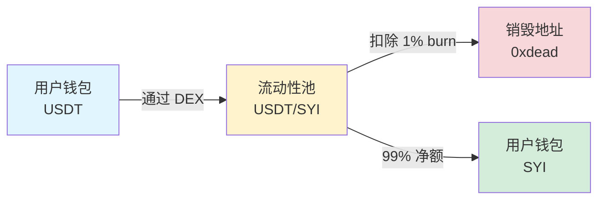
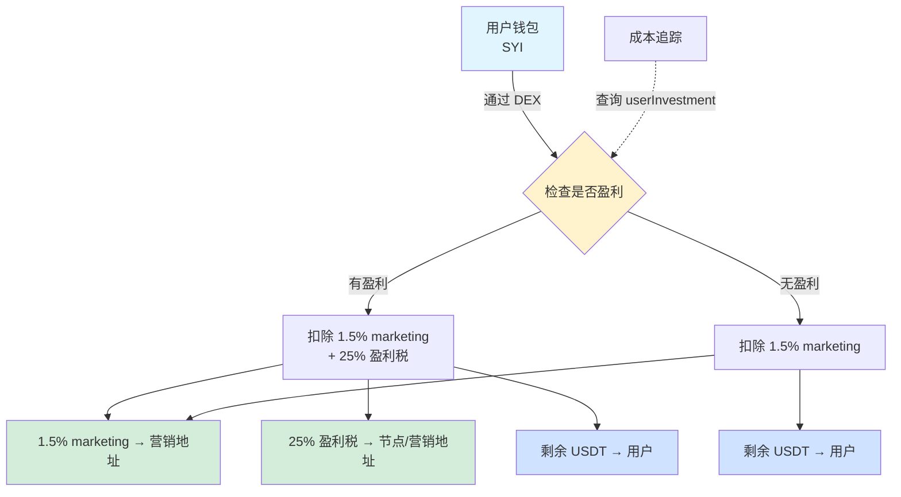
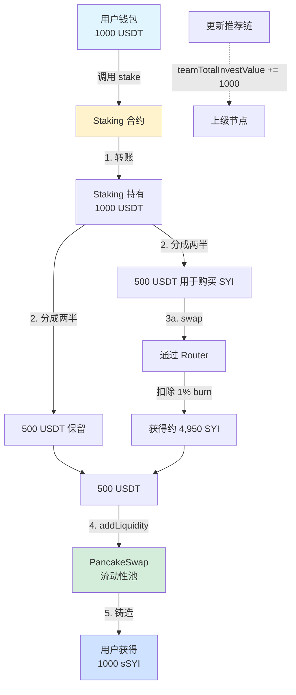
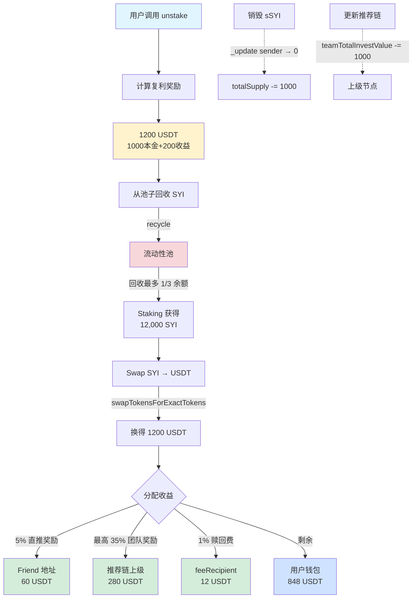
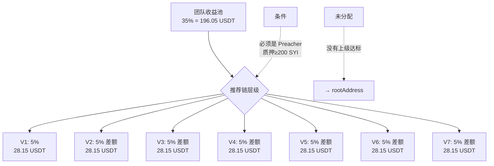
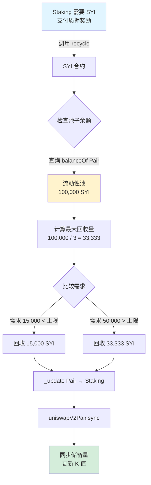
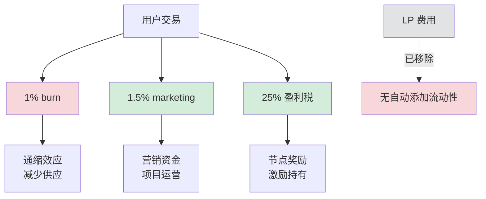
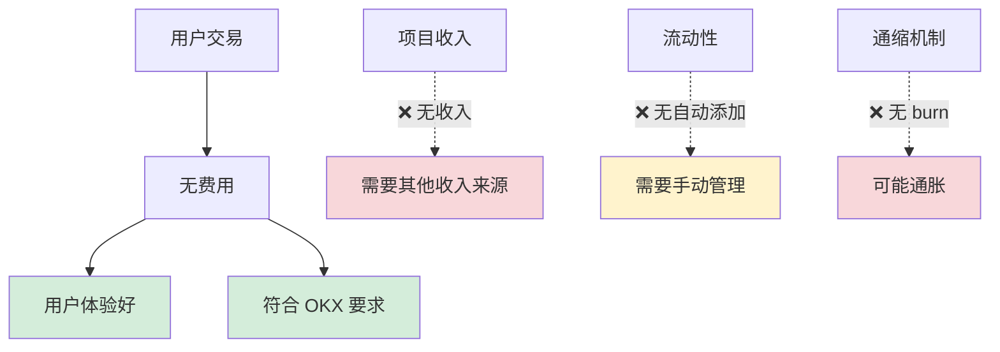
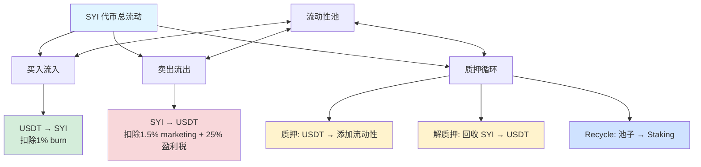

# SYI 系统资金流向分析

## 目录
1. [交易场景资金流向](#1-交易场景资金流向)
2. [质押场景资金流向](#2-质押场景资金流向)
3. [解质押场景资金流向](#3-解质押场景资金流向)
4. [Recycle 机制](#4-recycle-机制)
5. [去掉 Swap 交易费影响分析](#5-去掉-swap-交易费影响分析)

---

## 1. 交易场景资金流向

### 1.1 买入交易 (Buy)



**代码位置**: `SYIBase.sol:817-848`

**资金流向详细**:
1. 用户在 DEX 用 USDT 购买 SYI
2. **扣除费用**: 1% burn (销毁到 0xdead)
3. **用户实得**: 99% SYI
4. **成本追踪**: 更新 `userInvestment[user]` 记录购买成本（用于盈利税计算）

**关键参数**:
- `BUY_BURN_FEE = 100` (1%)
- 已移除: `BUY_LIQUIDITY_FEE = 200` (2%)，现设为 0

**示例**:
```
用户用 1000 USDT 购买 SYI:
├─ 买到 SYI 总额: 假设 10,000 SYI (按当前价格)
├─ 扣除 1% burn: 100 SYI → 销毁
└─ 用户实得: 9,900 SYI
```

---

### 1.2 卖出交易 (Sell)



**代码位置**: `SYIBase.sol:850-935`

**资金流向详细**:

#### 情况1: 无盈利卖出
```
用户卖出 1000 SYI:
├─ 扣除 1.5% marketing: 15 SYI → SYI 合约累积
├─ 净额: 985 SYI
├─ Swap 成 USDT: 假设 950 USDT
└─ 用户实得: 950 USDT
```

#### 情况2: 有盈利卖出
```
用户卖出 1000 SYI:
├─ 历史成本: 500 USDT
├─ 当前价值: 1000 USDT
├─ 盈利: 500 USDT
├─ 扣除 1.5% marketing: 15 SYI → SYI 合约
├─ 净额: 985 SYI → swap 成 1000 USDT
├─ 扣除 25% 盈利税: 125 USDT → 节点/营销地址
├─ 更新成本: 500 - (1000 - 125) = 0 (清零)
└─ 用户实得: 875 USDT
```

**关键参数**:
- `SELL_MARKETING_FEE = 150` (1.5%)
- `PROFIT_TAX_RATE = 2500` (25%)
- 已移除: `SELL_LIQUIDITY_ACCUM_FEE = 150` (1.5%)，现设为 0

**冷却时间**: 买入后 10 秒内不能卖出（`coldTime = 10 seconds`）

---

## 2. 质押场景资金流向

### 2.1 质押流程图



**代码位置**: `StakingBase.sol:193-198, 1211-1245`

**详细步骤**:

1. **用户授权并质押** (第1212行)
   - 用户调用 `stake(1000 USDT, stakeIndex)`
   - Staking 合约从用户转入 1000 USDT

2. **购买 SYI** (第1219-1229行)
   - 将 50% (500 USDT) 用于购买 SYI
   - 通过 Router 调用 `swapExactTokensForTokensSupportingFeeOnTransferTokens`
   - 扣除 SYI 买入税 1% burn
   - 实际获得约 4,950 SYI (假设 1 USDT = 10 SYI，扣除1%税)

3. **添加流动性** (第1234-1244行)
   - 将剩余 500 USDT + 购买的 4,950 SYI
   - 调用 `addLiquidity` 添加到 SYI/USDT 池
   - LP 代币发送到 `address(0)`（销毁）

4. **铸造 sSYI** (第863-895行)
   - 铸造 1000 sSYI 给用户（等额本金）
   - sSYI 不可转账，仅作为质押凭证
   - 更新 `balances[user]` 和 `totalSupply`

5. **更新推荐链** (第885行)
   - 将 1000 USDT 累加到所有上级的 `teamTotalInvestValue`
   - 用于计算团队层级 (V1-V7)

**质押档位**:
| 档位 | 周期 | 年化收益 | 日利率 |
|------|------|----------|--------|
| 0    | 1天  | 0.3%     | 1.003  |
| 1    | 7天  | 4.28%    | 1.006  |
| 2    | 15天 | 16.1%    | 1.010  |
| 3    | 30天 | 56.31%   | 1.015  |

---

## 3. 解质押场景资金流向

### 3.1 解质押流程图



**代码位置**: `StakingBase.sol:200-264`

**详细步骤**:

### 第一步：计算奖励 (第203行, 1167-1196行)

**复利公式**:
```
奖励 = 本金 × (日利率 ^ 已过天数)
```

**示例** (30天档，1000 USDT):
```javascript
本金: 1000 USDT
日利率: 1.015 (1.5% per day)
已过天数: 30 天
奖励 = 1000 × (1.015 ^ 30) = 1000 × 1.5631 = 1563.1 USDT
```

### 第二步：从池子回收 SYI (第261行)

**Recycle 机制** (SYIBase.sol:453-553):
```javascript
// 假设池子有 100,000 SYI
maxRecyclable = 100,000 / 3 = 33,333 SYI  // 最多回收 1/3
需要: 约 15,631 SYI (用于换 1563 USDT)
实际回收: 15,631 SYI (小于上限，按需回收)

// 操作流程:
1. _update(Pair地址, Staking地址, 15631 SYI)
2. uniswapV2Pair.sync()  // 同步储备量
```

### 第三步：Swap SYI 为 USDT (第204-206行)

**Swap 机制** (第922-950行):
```javascript
// 使用 swapTokensForExactTokens（精确输出）
输入: 最多 15,631 SYI
输出: 精确 1563 USDT
实际消耗: 约 15,631 SYI (含滑点)
```

### 第四步：分配收益 (第212-221行)

假设收益是 563 USDT (1563 - 1000本金):

| 接收方 | 比例 | 金额 | 代码位置 |
|--------|------|------|----------|
| Friend 直推 | 5% | 28.15 USDT | 999-1012行 |
| 团队奖励 | 最高35% | 196.05 USDT | 1014-1078行 |
| 赎回费 | 1% | 15.63 USDT | 224-242行 |
| 用户 | 剩余 | 1323.17 USDT | 258行 |

**团队奖励分配详解** (最高35%):



**V1-V7 层级要求**:
| 层级 | 团队KPI门槛 | 奖励比例 | 差额奖励 |
|------|-------------|----------|----------|
| V1   | 10,000 SYI  | 5%       | 5%       |
| V2   | 50,000 SYI  | 10%      | 5%       |
| V3   | 200,000 SYI | 15%      | 5%       |
| V4   | 500,000 SYI | 20%      | 5%       |
| V5   | 1M SYI      | 25%      | 5%       |
| V6   | 2.5M SYI    | 30%      | 5%       |
| V7   | 5M SYI      | 35%      | 5%       |

**差额奖励示例**:
```
假设推荐链: User → A(V2) → B(V4) → C(V7)
收益: 563 USDT，团队总池: 196.05 USDT

分配:
- C (V7): 35% - 0% = 35% → 196.05 USDT (全部)
- B (V4): 已被 C 拿走，无差额
- A (V2): 已被 C 拿走，无差额

如果推荐链: User → A(V2) → B(V4)
- B (V4): 20% - 0% = 20% → 112.6 USDT
- A (V2): 10% - 0% = 10% → 56.3 USDT
- 剩余 15%: 27.15 USDT → rootAddress
```

### 第五步：销毁 sSYI (第915行)

```javascript
_update(user, address(0), 1000 sSYI)
// balances[user] -= 1000
// totalSupply -= 1000
```

### 第六步：更新团队投资 (第219行)

```javascript
_updateTeamInvestmentValues(user, 1000, false)
// 遍历推荐链，所有上级的 teamTotalInvestValue -= 1000
```

---

## 4. Recycle 机制

### 4.1 Recycle 流程图



**代码位置**: `SYIBase.sol:453-553`

**关键逻辑**:

1. **权限控制** (第458行):
   ```solidity
   require(msg.sender == address(staking), "Only staking contract");
   ```

2. **获取实际余额** (第496行):
   ```solidity
   uint256 pairBalance = balanceOf(address(uniswapV2Pair));
   // 这是 SYI 代币合约记录的"Pair 地址拥有的 SYI 数量"
   ```

3. **Balance vs Reserve 的区别**:

   ```mermaid
   graph LR
       A[SYI Token 合约] -->|balanceOf Pair| B[Balance<br/>实际余额<br/>100,000 SYI]
       C[Pair 合约] -->|getReserves| D[Reserve<br/>账面储备<br/>95,000 SYI]

       E[差额 5,000 SYI] -.->|可被 skim 取走<br/>或 recycle 回收| F[多余代币]
   ```

   **为什么会有差额？**
   - 有人直接转账 SYI 给 Pair（不通过 Router）
   - 交易税留在 Pair 里（如果 SYI 有税）
   - 价格波动导致的积累

4. **安全上限** (第507行):
   ```solidity
   uint256 maxRecyclable = pairBalance / 3;  // 最多 1/3
   ```
   **为什么限制 1/3？**
   - 保护流动性不被过度抽取
   - 避免单次回收导致价格剧烈波动
   - 防止恶意耗尽流动性

5. **执行回收** (第525-526行):
   ```solidity
   _update(address(uniswapV2Pair), address(staking), recycleAmount);
   uniswapV2Pair.sync();  // 关键！必须同步
   ```

6. **为什么必须 sync()？**

   ```
   回收前:
   ├─ balance (实际): 100,000 SYI
   └─ reserve (账面): 100,000 SYI
   ✅ K 值: reserve0 * reserve1 = k

   回收 15,000 SYI 后 (如果不 sync):
   ├─ balance (实际): 85,000 SYI  ← _update 修改了
   └─ reserve (账面): 100,000 SYI ← Pair 不知道
   ❌ 价格计算错误！ (reserve 还是 100,000)
   ❌ 交易滑点异常
   ❌ K 值验证失败

   执行 sync() 后:
   ├─ balance (实际): 85,000 SYI
   └─ reserve (账面): 85,000 SYI  ← 强制同步
   ✅ K 值: reserve0 * reserve1 = k (更新)
   ✅ 价格正常
   ```

**Recycle 对价格的影响**:

假设池子: 100,000 SYI / 10,000 USDT (1 SYI = 0.1 USDT)

```
回收前:
├─ SYI reserve: 100,000
├─ USDT reserve: 10,000
├─ K = 100,000 × 10,000 = 1,000,000,000
└─ 价格: 1 SYI = 0.1 USDT

回收 15,000 SYI 后:
├─ SYI reserve: 85,000 (减少)
├─ USDT reserve: 10,000 (不变)
├─ K = 85,000 × 10,000 = 850,000,000 (减少)
└─ 价格: 1 SYI = 10,000/85,000 = 0.1176 USDT (上涨17.6%)

注意: Recycle 导致 SYI 价格上涨！
```

---

## 5. 去掉 Swap 交易费影响分析

### 5.1 当前状态（代码中已部分移除）

| 费用项目 | 原设计 | 当前状态 | 代码位置 |
|---------|--------|----------|----------|
| 买入 burn | 1% | ✅ 保留 1% | 第830行 |
| 买入 LP | 2% | ❌ 已移除 | 第846行 (设为0) |
| 卖出 marketing | 1.5% | ✅ 保留 1.5% | 第859行 |
| 卖出 LP | 1.5% | ❌ 已移除 | 第925行 (设为0) |
| 盈利税 | 25% | ✅ 保留 25% | 第877行 |

### 5.2 如果完全去掉所有 Swap 交易费

#### 方案A: 仅去掉 Swap 费用，保留盈利税

```solidity
// 修改后的买入逻辑
function _handleBuy(address from, address to, uint256 amount) private {
    // 完全无税
    super._update(from, to, amount);

    // 仍然追踪成本（用于盈利税）
    uint256 estimatedUSDTCost = _estimateBuyUSDTCost(amount);
    userInvestment[to] = userInvestment[to] + estimatedUSDTCost;
}

// 修改后的卖出逻辑
function _handleSell(address from, address to, uint256 amount) private {
    // 无 Swap 税，只有盈利税
    uint256 estimatedUSDTFromSale = _estimateSwapOutput(amount);

    uint256 profitTaxInSYI = 0;
    if (userInvestment[from] > 0 && estimatedUSDTFromSale > userInvestment[from]) {
        uint256 profitAmount = estimatedUSDTFromSale - userInvestment[from];
        uint256 profitTaxUSDT = (profitAmount * 25) / 100;
        profitTaxInSYI = (profitTaxUSDT * amount) / estimatedUSDTFromSale;
    }

    uint256 netAmount = amount - profitTaxInSYI;
    super._update(from, to, netAmount);
}
```

**影响分析**:

| 方面 | 影响 | 严重程度 |
|------|------|----------|
| 用户体验 | 🟢 更好的买卖体验，无 Swap 税 | 正面 |
| 流动性 | 🟡 无自动添加流动性 | 中性 |
| 营销资金 | 🔴 无 1.5% 卖出税收入 | 负面 |
| 价格稳定性 | 🟡 缺少 burn 通缩机制 | 中性偏负 |
| 盈利税 | 🟢 仍然收取 25% 盈利税 | 正面 |

#### 方案B: 完全去掉所有费用（包括盈利税）

```solidity
function _handleBuy(address from, address to, uint256 amount) private {
    super._update(from, to, amount);  // 完全无税，无成本追踪
}

function _handleSell(address from, address to, uint256 amount) private {
    super._update(from, to, amount);  // 完全无税
}
```

**影响分析**:

| 方面 | 影响 | 严重程度 |
|------|------|----------|
| 合规性 | 🟢 符合 OKX 上币要求（无黑白名单限制） | 正面 |
| 用户体验 | 🟢 完全无税，体验最佳 | 正面 |
| 项目收入 | 🔴 无任何交易费收入 | 负面 |
| 通缩机制 | 🔴 无 burn，可能通胀 | 负面 |
| 价格稳定性 | 🟡 缺少费用缓冲机制 | 中性偏负 |

### 5.3 交易费对流动性的影响

#### 当前设计 (部分费用已移除):



#### 完全无税设计:



### 5.4 推荐方案

根据项目需求分析，推荐**方案A**（仅去掉 Swap 费用，保留盈利税）:

**理由**:
1. ✅ 符合 OKX 上币要求（无黑白名单，无基础 Swap 税）
2. ✅ 保留盈利税机制，仍有收入来源
3. ✅ 用户体验好（日常买卖无税）
4. ✅ 防止套利（盈利税惩罚短期炒作）
5. ⚠️ 需要注意：无 burn 可能导致通胀，建议通过质押奖励控制

**需要调整的代码**:

```solidity
// SYIBase.sol
uint256 private constant BUY_BURN_FEE = 0;        // 改为 0
uint256 private constant SELL_MARKETING_FEE = 0;  // 改为 0
uint256 private constant PROFIT_TAX_RATE = 2500;  // 保留 25%
```

**额外建议**:
1. 增加质押锁定期，减少流通供应
2. 通过 Staking 奖励吸引长期持有
3. 定期从质押收入中 burn 代币，维持通缩
4. 流动性由项目方或社区定期手动添加

---

## 6. 总结对比表

### 6.1 各场景资金流向总览

| 场景 | 用户投入 | 协议扣除 | 用户实得 | 协议累积 |
|------|----------|----------|----------|----------|
| 买入 | 1000 USDT | 1% burn | 9,900 SYI | 100 SYI burn |
| 卖出(无盈利) | 1000 SYI | 1.5% marketing | 985 SYI → ~950 USDT | 15 SYI |
| 卖出(有盈利) | 1000 SYI | 1.5% marketing + 25% 盈利税 | ~875 USDT | 15 SYI + 125 USDT |
| 质押 | 1000 USDT | 1% burn (买入时) | 1000 sSYI | 添加流动性 |
| 解质押 | 1000 sSYI | 5%+35%+1% 收益 | ~848 USDT | 368 USDT 分配 |

### 6.2 费用对比

| 费用类型 | 当前费率 | 接收方 | 是否保留 |
|---------|---------|--------|----------|
| 买入 burn | 1% | 销毁地址 | ✅ 是 |
| 买入 LP | 2% | 流动性池 | ❌ 已移除 |
| 卖出 marketing | 1.5% | 营销地址 | ✅ 是 |
| 卖出 LP | 1.5% | 流动性池 | ❌ 已移除 |
| 盈利税 | 25% | 节点/营销 | ✅ 是 |
| 直推奖励 | 5% | Friend | ✅ 是 |
| 团队奖励 | 最高35% | 推荐链 | ✅ 是 |
| 赎回费 | 1% | feeRecipient | ✅ 是 |

### 6.3 代币流动路径



---

## 附录：关键合约函数索引

| 函数名 | 合约 | 行号 | 功能 |
|--------|------|------|------|
| `_handleBuy` | SYIBase | 817-848 | 处理买入交易 |
| `_handleSell` | SYIBase | 850-935 | 处理卖出交易 |
| `recycle` | SYIBase | 453-553 | 从池子回收 SYI |
| `stake` | StakingBase | 193-198 | 质押 USDT |
| `unstake` | StakingBase | 200-264 | 解除质押 |
| `_swapAndAddLiquidity` | StakingBase | 1211-1245 | 添加流动性 |
| `_calculateStakeReward` | StakingBase | 1167-1196 | 计算复利 |
| `_distributeFriendReward` | StakingBase | 999-1012 | 分配直推奖励 |
| `_distributeTeamReward` | StakingBase | 1014-1078 | 分配团队奖励 |

---

## 附录二：营销地址与赎回费接收地址说明

### 问题：marketingAddress 与 feeRecipient 是同一个地址吗？

**答案：它们是两个独立的地址变量，但在部署时通常设置为同一个地址。**

### 详细说明

#### 1. 代码定义位置

| 变量名 | 所属合约 | 代码位置 | 用途 |
|--------|----------|----------|------|
| `marketingAddress` | SYI 合约 | `SYIBase.sol:224` | 接收卖出交易的 marketing 费（1.5%） |
| `feeRecipient` | Staking 合约 | `StakingBase.sol:134` | 接收解质押的赎回费（1%） |

#### 2. 初始化设置

**SYI 合约的 marketingAddress** (`SYIBase.sol:283-299`):
```solidity
constructor(
    address _usdt,
    address _router,
    address _staking,
    address _marketingAddress  // 构造函数参数
) ERC20("SYI Token", "SYI") Ownable(msg.sender) {
    // ... 验证
    marketingAddress = _marketingAddress;  // 第299行：设置营销地址
}
```

**Staking 合约的 feeRecipient** (`StakingBase.sol:171-183`):
```solidity
constructor(
    address _usdt,
    address _router,
    address _rootAddress,
    address _feeRecipient  // 构造函数参数
) Ownable(msg.sender) {
    // ... 验证
    feeRecipient = _feeRecipient;  // 第183行：设置赎回费接收地址
}
```

#### 3. 部署脚本中的设置

**文件**: `scripts/deploySYI.js`

```javascript
// 第10行：定义钱包地址
const [deployer, marketingWallet, rootWallet] = await hre.ethers.getSigners();

// 第43-48行：部署 Staking 合约
const staking = await Staking.deploy(
  usdtAddress,
  routerAddress,
  rootWallet.address,         // rootAddress
  marketingWallet.address     // feeRecipient ← 设置为 marketingWallet
);

// 第73-78行：部署 SYI 合约
const syi = await SYI.deploy(
  usdtAddress,
  routerAddress,
  stakingAddress,
  marketingWallet.address       // marketingAddress ← 设置为 marketingWallet
);
```

**结论**：在部署时，这两个地址都设置为 `marketingWallet.address`，因此**实际上是同一个地址**。

#### 4. 运行时修改

虽然部署时设置为同一个地址，但它们可以通过管理员函数独立修改：

**修改 marketingAddress** (`SYIBase.sol:348-354`):
```solidity
function setMarketingAddress(address _newAddress) external onlyOwner {
    if (_newAddress == address(0)) revert ZeroAddress();
    address oldAddress = marketingAddress;
    marketingAddress = _newAddress;
    feeWhitelisted[_newAddress] = true;
    emit MarketingAddressUpdated(oldAddress, _newAddress);
}
```

**修改 feeRecipient** (`StakingBase.sol:1415-1420`):
```solidity
function setFeeRecipient(address _feeRecipient) external onlyOwner {
    require(_feeRecipient != address(0), "Invalid fee recipient");
    address oldRecipient = feeRecipient;
    feeRecipient = _feeRecipient;
    emit FeeRecipientUpdated(oldRecipient, _feeRecipient);
}
```

#### 5. 资金流向对比

| 费用来源 | 费率 | 接收地址 | 所属合约 | 触发场景 |
|---------|------|----------|----------|----------|
| 卖出 marketing 费 | 1.5% | `marketingAddress` | SYI | 用户在 DEX 卖出 SYI |
| 盈利税 | 25% | `nodeDividendAddress` 或 `marketingAddress` | SYI | 用户卖出时有盈利 |
| 赎回费 (USDT) | 1% | `feeRecipient` | Staking | 用户解除质押 |

**代码位置**:
- 卖出 marketing 费: `SYIBase.sol:890-893`
  ```solidity
  if (marketingFee > 0) {
      super._update(from, address(this), marketingFee);
      amountMarketingFee += marketingFee;
  }
  ```

- 盈利税: `SYIBase.sol:906-913`
  ```solidity
  address nodeAddr = nodeDividendAddress != address(0)
      ? nodeDividendAddress
      : marketingAddress;
  IERC20(USDT).transfer(nodeAddr, usdtAmountFromProfitTax);
  ```

- 赎回费: `StakingBase.sol:227-242`
  ```solidity
  if (expectedRedemptionFeeUSDT > 0 && feeRecipient != address(0)) {
      // 将 1% SYI swap 成 USDT
      (, uint256 redemptionFeeSYIUsed) = _swapSYIForReward(
          expectedRedemptionFeeUSDT
      );

      emit RedemptionFeeCollected(
          msg.sender,
          stakeIndex,
          redemptionFeeSYIUsed,
          expectedRedemptionFeeUSDT,
          feeRecipient,
          block.timestamp
      );
  }
  ```

#### 6. 架构设计理由

**为什么设计成两个独立变量？**

1. **职责分离**:
   - `marketingAddress` 负责 SYI 代币的交易费用
   - `feeRecipient` 负责 Staking 的赎回费用

2. **灵活性**:
   - 可以将交易费和赎回费分配给不同的地址
   - 便于财务管理和审计

3. **合约解耦**:
   - SYI 合约和 Staking 合约独立管理各自的费用接收地址
   - 不需要跨合约查询或修改

#### 7. 实际部署建议

**选项A：使用同一个地址（当前实现）**
```
优点:
✅ 管理简单，所有费用集中到一个地址
✅ 减少地址管理成本
✅ 财务审计方便

缺点:
⚠️ 无法区分不同来源的费用
⚠️ 缺少分账灵活性
```

**选项B：使用不同地址**
```
优点:
✅ 清晰区分交易费和赎回费
✅ 可以设置不同的分配策略
✅ 更精细的财务控制

缺点:
⚠️ 需要管理多个地址
⚠️ 增加运营复杂度
```

#### 8. 查询当前地址

**查询 SYI 的 marketingAddress**:
```solidity
address marketing = syi.marketingAddress();
```

**查询 Staking 的 feeRecipient**:
```solidity
address recipient = staking.feeRecipient();
```

---

**生成时间**: 2025-10-13
**分析版本**: SYI v1.0 (已移除 LP 质押功能)
**分析人**: Claude Code
