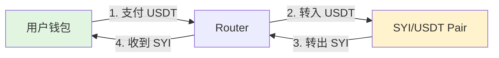
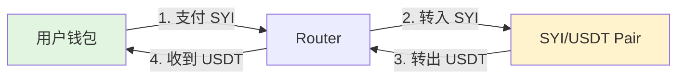
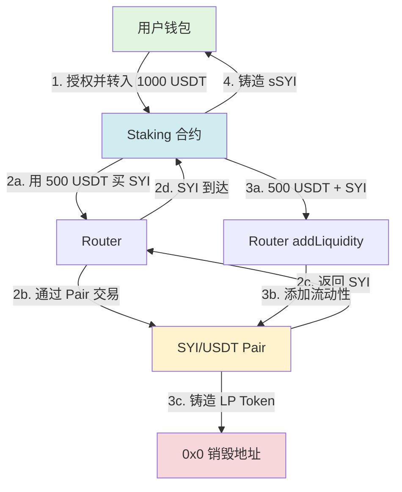
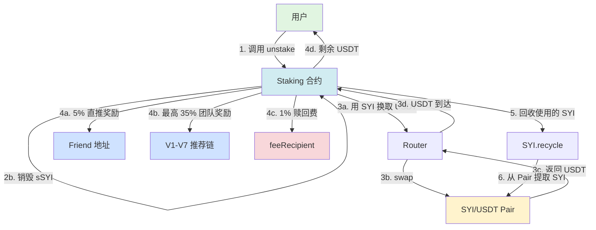
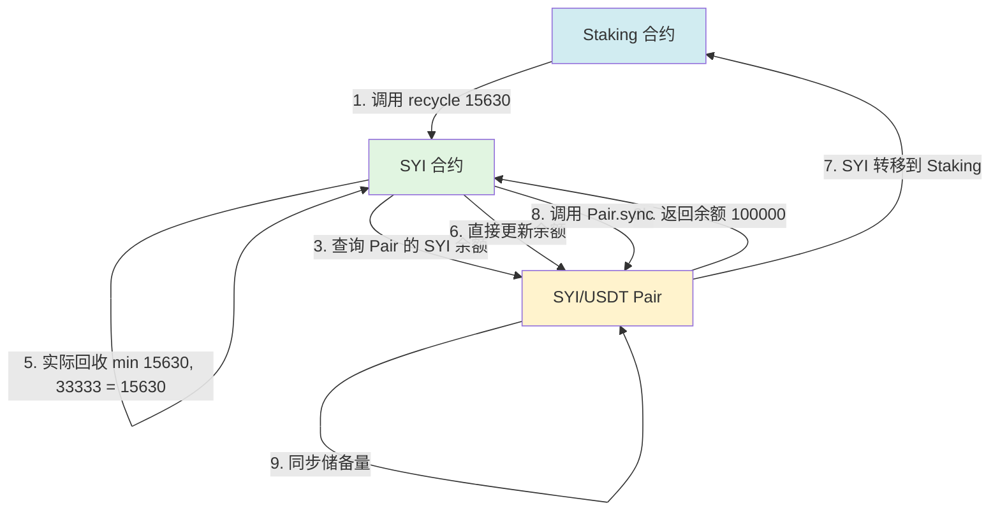
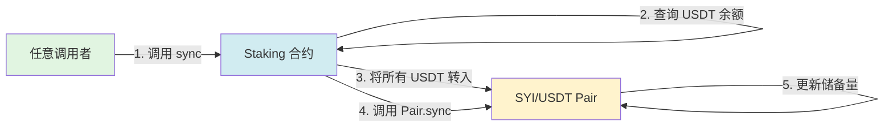
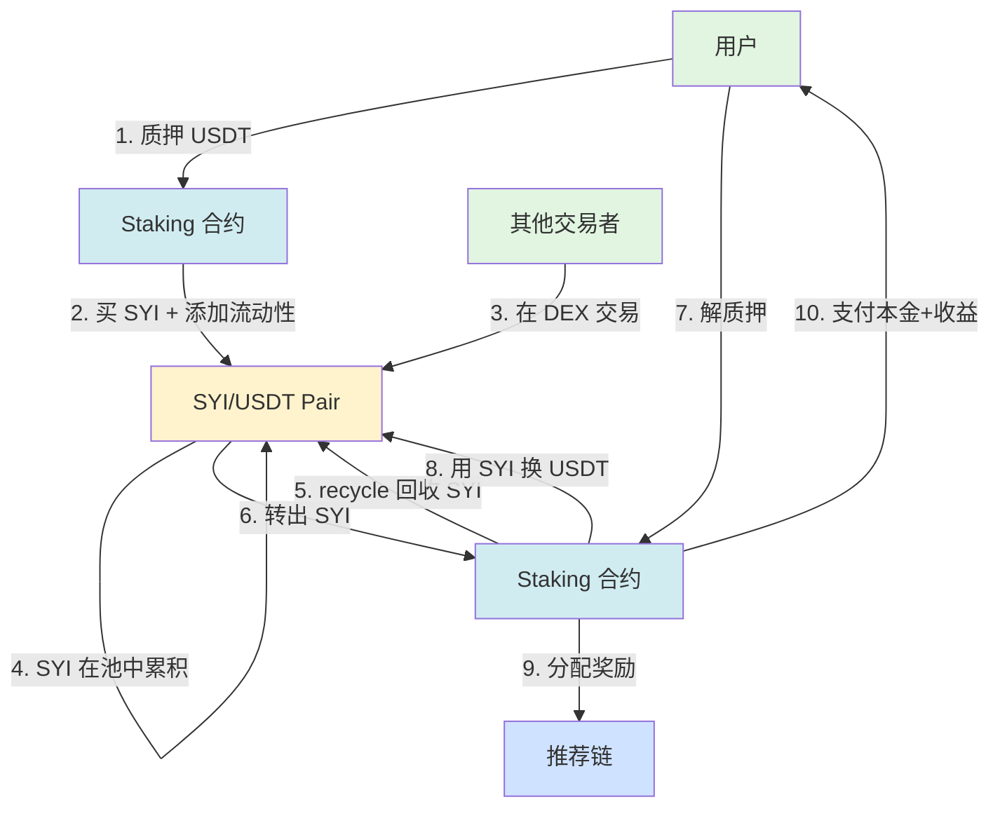

# SYI 资金流向分析 - 去交易税版

## 📋 系统概述

SYI 生态系统是一个去中心化金融（DeFi）协议，包含以下核心组件：

- **SYI 代币**：无交易税的 ERC20 代币（总量 1000 万）
- **Staking 质押系统**：支持多档期质押，自动添加流动性
- **DEX 交易对**：SYI/USDT 流动性池（基于 Uniswap V2）
- **推荐系统**：直推奖励（5%）+ 团队差额奖励（最高 35%）

## 🔑 关键特性

1. ✅ **无交易税**：买入、卖出均无税费（已移除原 3% 买卖税和 25% 利润税）
2. ✅ **LP 永久锁定**：质押时添加的流动性永久销毁，无法撤回
3. ✅ **回收机制**：Staking 合约从流动性池回收 SYI 用于支付奖励
4. ✅ **1% 赎回费**：解质押时收取 1% 费用

---

## 📊 资金流向场景

### 1️⃣ DEX 交易场景

#### 场景 A：买入 SYI



**资金流向**：
- ✅ 用户支付：例如 100 USDT
- ✅ 用户收到：按 AMM 公式计算的 SYI 数量
- ✅ 税费：**0%**（无任何税费）
- ✅ 流动性池变化：USDT 增加，SYI 减少

**代码位置**：`SYIBase.sol:815-860` (_handleBuy)

---

#### 场景 B：卖出 SYI



**资金流向**：
- ✅ 用户支付：例如 1000 SYI
- ✅ 用户收到：按 AMM 公式计算的 USDT 数量
- ✅ 税费：**0%**（无任何税费）
- ✅ 冷却期：需等待 10 秒（从上次买入时间开始）
- ✅ 流动性池变化：SYI 增加，USDT 减少

**代码位置**：`SYIBase.sol:862-911` (_handleSell)

---

### 2️⃣ 质押场景 (Stake)



**详细步骤**：

1. **用户转入 USDT**
   - 数量：1000 USDT（示例）
   - 去向：Staking 合约

2. **购买 SYI**（50% USDT）
   - 使用：500 USDT
   - 路径：Staking → Router → Pair
   - 获得：SYI 代币（数量由 AMM 决定）
   - 交易税：**0%**

3. **添加流动性**（50% USDT + 全部 SYI）
   - USDT：500
   - SYI：步骤 2 获得的全部 SYI
   - LP Token：铸造后发送到 `address(0)` **永久销毁**
   - 流动性池增加：USDT 和 SYI 同时增加

4. **铸造质押凭证**
   - 用户收到：1000 sSYI（不可转账）
   - 本金记录：`balances[user] = 1000`
   - 团队 KPI 更新：推荐链上所有地址的 `teamTotalInvestValue` +1000

**代码位置**：
- 主函数：`StakingBase.sol:193-198` (stake)
- 交换逻辑：`StakingBase.sol:1211-1245` (_swapAndAddLiquidity)
- 铸造记录：`StakingBase.sol:863-895` (_mintStakeRecord)

---

### 3️⃣ 解质押场景 (Unstake)



**详细步骤**：

#### 步骤 1-2：计算奖励并销毁 sSYI

- 本金：1000 USDT（示例）
- 质押时长：30 天
- APY：56.31%（30 天档）
- 计算奖励：1000 × (1.015^30) ≈ 1563 USDT
- 销毁 sSYI：1000 sSYI

**代码位置**：`StakingBase.sol:897-920` (_burn)

#### 步骤 3：用 SYI 换取 USDT

- 需要 USDT：1563（本金 + 利息）
- Staking 合约持有的 SYI：从流动性池回收的代币
- 交换路径：SYI → USDT（通过 Router）
- 实际获得：例如 1563 USDT（取决于价格和滑点）
- 使用的 SYI：例如 15630 SYI（按 1:0.1 价格）

**代码位置**：`StakingBase.sol:922-950` (_swapSYIForReward)

#### 步骤 4：奖励分配

假设利息收益 = 563 USDT（1563 - 1000）

| 分配项 | 比例 | 金额 (USDT) | 接收方 | 条件 |
|--------|------|-------------|--------|------|
| 直推奖励 | 5% | 28.15 | Friend 地址（或 root） | 用户绑定了 friend |
| 团队奖励 | 最高 35% | 最高 197.05 | V1-V7 推荐链 | 推荐人满足 preacher + tier 条件 |
| 赎回费 | 1% | 15.63 | feeRecipient | 从用户实际收益扣除 |
| 用户实收 | 剩余 | ~1322 | 用户 | 扣除所有费用后 |

**团队奖励差额制度**：

- V1 (KPI 1万)：5%，获得 5% × 563 = 28.15 USDT
- V2 (KPI 5万)：10%，获得 (10%-5%) × 563 = 28.15 USDT
- V3 (KPI 20万)：15%，获得 (15%-10%) × 563 = 28.15 USDT
- ...
- V7 (KPI 500万)：35%，获得 (35%-30%) × 563 = 28.15 USDT

**代码位置**：
- 直推奖励：`StakingBase.sol:999-1012` (_distributeFriendReward)
- 团队奖励：`StakingBase.sol:1014-1078` (_distributeTeamReward)
- 差额分配：`StakingBase.sol:1080-1165` (_distributeHybridRewards)

#### 步骤 5-6：SYI 回收机制

- 调用：`SYI.recycle(15630)`（使用的 SYI 数量）
- 从哪里取：流动性池 (SYI/USDT Pair)
- 最大回收量：池子余额的 1/3
- 实际回收：min(请求量, 池子余额/3)
- 同步：调用 `Pair.sync()` 更新储备量

**代码位置**：
- 回收调用：`StakingBase.sol:261` (unstake 中)
- 回收逻辑：`SYIBase.sol:450-550` (recycle)

---

### 4️⃣ 回收机制 (Recycle)



**关键机制**：

1. **权限控制**：只允许 Staking 合约调用
2. **安全上限**：每次最多回收池子余额的 1/3
3. **直接转移**：使用 `_update` 绕过交易税检查
4. **强制同步**：调用 `sync()` 确保 AMM 价格正确

**为什么需要回收？**

```
┌─────────────┐  交易累积  ┌──────────────┐
│ 流动性池    │ ────────→  │  SYI 代币    │
│ (Pair)      │             │  在池中积累  │
└─────────────┘             └──────────────┘
      ↑                            ↓
      │                       recycle()
      │                            ↓
      │                     ┌──────────────┐
      │                     │   Staking    │
      │                     │   合约       │
      │                     └──────────────┘
      │                            ↓
      │                      分发质押奖励
      │                            ↓
      └────────── 用户卖出 ────────┘
```

**代码位置**：`SYIBase.sol:450-550` (recycle)

---

### 5️⃣ 流动性同步 (Sync)



**作用**：

- 将 Staking 合约累积的 USDT 捐赠到流动性池
- 不产生 LP Token（永久性增加流动性）
- 导致 SYI 价格上涨（USDT 增加，SYI 不变）

**示例**：

```
初始状态：
- 池子：10万 USDT + 100万 SYI
- 价格：1 SYI = 0.1 USDT

Staking 合约累积：5万 USDT

调用 sync() 后：
- 池子：15万 USDT + 100万 SYI
- 价格：1 SYI = 0.15 USDT（上涨 50%）
```

**代码位置**：`StakingBase.sol:328-346` (sync)

---

## 💰 费用总结

### 交易费用

| 操作 | 原版税费 | 去交易税版 | 说明 |
|------|---------|-----------|------|
| 买入 SYI | 3% (1% burn + 2% LP) | **0%** | ✅ 完全无税 |
| 卖出 SYI | 3% (1.5% marketing + 1.5% LP) | **0%** | ✅ 完全无税 |
| 利润税 | 25% | **0%** | ✅ 已移除 |
| LP 操作手续费 | 2.5% | 2.5% | ⚠️ 保留（给营销地址） |

### 质押费用

| 费用项 | 比例 | 扣除来源 | 接收方 |
|--------|------|---------|--------|
| 直推奖励 | 5% | 利息收益 | Friend 地址（或 root） |
| 团队奖励 | 最高 35% | 利息收益 | V1-V7 推荐链 |
| 赎回费 | 1% | 用户实收金额 | feeRecipient |

**示例计算**（利息 563 USDT）：

```
利息收益：563 USDT
- 直推奖励：563 × 5% = 28.15 USDT
- 团队奖励：563 × 35% = 197.05 USDT（最高，取决于推荐链）
- 可分配：563 - 28.15 - 197.05 = 337.8 USDT
- 本金：1000 USDT
- 用户应得：1000 + 337.8 = 1337.8 USDT
- 赎回费：1337.8 × 1% = 13.38 USDT
- 用户实收：1337.8 - 13.38 = 1324.42 USDT
```

---

## 🔄 完整资金循环



---

## 📌 关键代码位置

### SYI 代币合约

| 功能 | 文件 | 行数 | 说明 |
|------|------|------|------|
| 交易税配置 | SYIBase.sol | 206-211 | 所有税率设为 0% |
| 买入处理 | SYIBase.sol | 815-860 | _handleBuy |
| 卖出处理 | SYIBase.sol | 862-911 | _handleSell |
| 回收机制 | SYIBase.sol | 450-550 | recycle |

### Staking 合约

| 功能 | 文件 | 行数 | 说明 |
|------|------|------|------|
| 质押入口 | StakingBase.sol | 193-198 | stake |
| 交换+添加流动性 | StakingBase.sol | 1211-1245 | _swapAndAddLiquidity |
| 解质押入口 | StakingBase.sol | 200-264 | unstake |
| SYI 换 USDT | StakingBase.sol | 922-950 | _swapSYIForReward |
| 直推奖励 | StakingBase.sol | 999-1012 | _distributeFriendReward |
| 团队奖励 | StakingBase.sol | 1014-1078 | _distributeTeamReward |
| 流动性同步 | StakingBase.sol | 328-346 | sync |
| 赎回费 | StakingBase.sol | 224-242 | unstake 中收取 |

---

## ⚠️ 风险提示

1. **LP 永久锁定**：质押时添加的流动性无法撤回，LP Token 被销毁
2. **回收依赖池子余额**：如果池子 SYI 不足，可能影响解质押
3. **价格波动风险**：解质押时 SYI 价格可能低于质押时价格
4. **推荐奖励上限**：最多扣除 40% 利息（5% 直推 + 35% 团队）
5. **赎回费不可免除**：所有解质押都要支付 1% 费用

---

## 📊 数据统计参数

### 质押档位

| 档位 | 周期 | 年化收益 | 实际收益 | 复利方式 |
|------|------|---------|---------|---------|
| 0 | 1 天 | 109.5% | 0.3% | 按天复利 |
| 1 | 7 天 | 22.32% | 4.28% | 按天复利 |
| 2 | 15 天 | 39.15% | 16.1% | 按天复利 |
| 3 | 30 天 | 56.31% | 56.31% | 按天复利 |

### 团队等级阈值

| 等级 | 团队 KPI | 奖励比例 | 差额奖励 |
|------|---------|---------|---------|
| V1 | 1 万 | 5% | 5% |
| V2 | 5 万 | 10% | 5% (10%-5%) |
| V3 | 20 万 | 15% | 5% (15%-10%) |
| V4 | 50 万 | 20% | 5% (20%-15%) |
| V5 | 100 万 | 25% | 5% (25%-20%) |
| V6 | 250 万 | 30% | 5% (30%-25%) |
| V7 | 500 万 | 35% | 5% (35%-30%) |

### 其他参数

| 参数 | 值 | 说明 |
|------|-----|------|
| 单次质押上限 | 1000 USDT | 动态计算，不超过池子 1% |
| 用户总质押上限 | 10000 USDT | 所有质押的本金总和 |
| Preacher 门槛 | 200 SYI | 当前质押价值（非本金） |
| 推荐链最大深度 | 30 层 | 理论上限 |
| 赎回费率 | 1% | 固定 |
| 直推奖励 | 5% | 固定 |

---

## 📝 总结

SYI 去交易税版本的核心变化：

1. ✅ **完全去除交易税**：买卖 SYI 无任何税费
2. ✅ **保留 LP 操作费**：2.5% LP 添加/移除手续费（给营销地址）
3. ✅ **质押奖励不变**：5% 直推 + 35% 团队 + 1% 赎回费
4. ✅ **回收机制保留**：确保 Staking 有足够 SYI 支付奖励
5. ✅ **LP 永久锁定**：质押添加的流动性永久销毁

**资金流向清晰度**：
- 质押：USDT → 50% 买 SYI + 50% 添加流动性 → LP 销毁
- 解质押：SYI 换 USDT → 扣除推荐奖励 → 扣除赎回费 → 支付用户
- 回收：从池子提取 SYI（最多 1/3）→ 供 Staking 使用
- 同步：将累积 USDT 捐赠到池子 → SYI 价格上涨

---

*文档生成时间：2025-10-13*
*合约版本：SYI v2.0 (去交易税版)*
