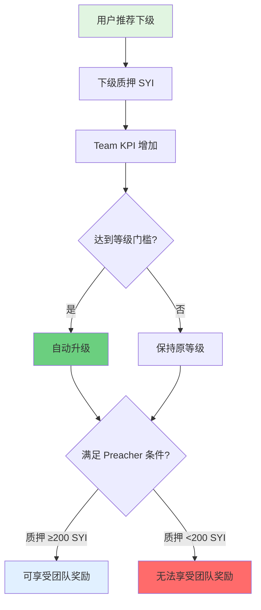
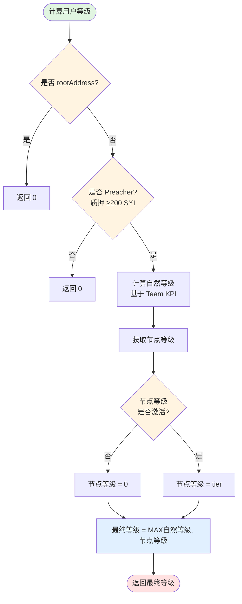
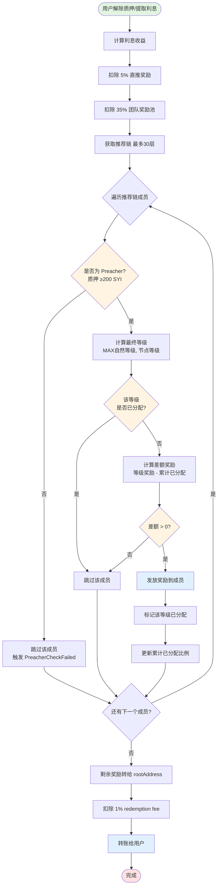
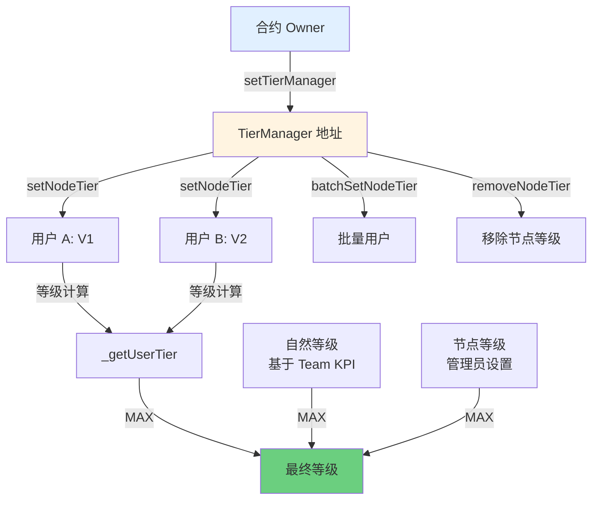

# SYI 质押系统 - 团队收益机制详解

## 一、概述

团队收益是 SYI 质押系统的核心激励机制,旨在通过推荐关系和团队业绩奖励用户。用户通过发展团队、提升团队业绩(Team KPI)来获得更高等级和更高比例的团队奖励。

### 核心特点

- **7级等级体系**(V1-V7)
- **差额奖励机制**(避免重复分配)
- **Preacher 门槛**(必须质押 ≥200 SYI)
- **节点等级保障**(管理员可强制设置 V1/V2)
- **最高奖励比例 35%**

---

## 二、等级体系

### 2.1 等级门槛与奖励比例

| 等级 | Team KPI 门槛 | 奖励比例 | 差额比例 |
|------|---------------|----------|----------|
| V1   | 10,000 SYI    | 5%       | 5%       |
| V2   | 50,000 SYI    | 10%      | 5%       |
| V3   | 200,000 SYI   | 15%      | 5%       |
| V4   | 500,000 SYI   | 20%      | 5%       |
| V5   | 1,000,000 SYI | 25%      | 5%       |
| V6   | 2,500,000 SYI | 30%      | 5%       |
| V7   | 5,000,000 SYI | 35%      | 5%       |

**说明**:
- **Team KPI**: 团队总投资额(所有下级质押本金总和)
- **奖励比例**: 该等级可获得的最大奖励比例
- **差额比例**: 每个等级实际分配的比例(5%)

**代码位置**:
- 门槛定义: `contracts/SYI-Staking/mainnet/Staking.sol:65-91`
- 奖励比例: `contracts/SYI-Staking/abstract/StakingBase.sol:67-73`

### 2.2 等级计算逻辑

```solidity
最终等级 = MAX(自然等级, 节点等级)
```

#### 自然等级
基于 Team KPI 自动计算:
```
if (teamKPI >= 5,000,000) → V7
if (teamKPI >= 2,500,000) → V6
if (teamKPI >= 1,000,000) → V5
if (teamKPI >= 500,000)   → V4
if (teamKPI >= 200,000)   → V3
if (teamKPI >= 50,000)    → V2
if (teamKPI >= 10,000)    → V1
else                      → V0 (无等级)
```

**代码**: `StakingBase.sol:1569-1588` (`_calculateNaturalTier` 函数)

#### 节点等级
- 由管理员地址 `tierManager` 手动设置
- **只能设置 V1 或 V2**
- 作为最低保障,不限制自然升级
- 用户自然升级到更高等级后,节点等级自动被覆盖

**代码**: `StakingBase.sol:1541-1561` (`_getUserTier` 函数)

---

## 三、升级机制

### 3.1 自然升级流程



### 3.2 节点等级设置(管理员操作)

#### 设置单个用户节点等级
```solidity
function setNodeTier(address user, uint8 tier) external onlyTierManager
```

**参数**:
- `user`: 目标用户地址
- `tier`: 等级(1=V1, 2=V2)

**限制**:
- 只能由 `tierManager` 调用
- 只能设置 V1 或 V2
- 不能为 rootAddress 设置
- 不能设置 address(0)

**代码位置**: `StakingBase.sol:1772-1788`

**示例**:
```javascript
// 为用户设置 V1 节点等级
await staking.setNodeTier("0x123...", 1);

// 为用户设置 V2 节点等级
await staking.setNodeTier("0x456...", 2);
```

#### 批量设置节点等级
```solidity
function batchSetNodeTier(address[] calldata users, uint8[] calldata tiers) external onlyTierManager
```

**参数**:
- `users`: 用户地址数组
- `tiers`: 对应等级数组

**限制**:
- 最多一次处理 100 个用户
- 数组长度必须相等

**代码位置**: `StakingBase.sol:1811-1842`

**示例**:
```javascript
const users = ["0x123...", "0x456...", "0x789..."];
const tiers = [1, 2, 1];  // 分别设置为 V1, V2, V1
await staking.batchSetNodeTier(users, tiers);
```

#### 移除节点等级
```solidity
function removeNodeTier(address user) external onlyTierManager
function batchRemoveNodeTier(address[] calldata users) external onlyTierManager
```

**代码位置**:
- 单个移除: `StakingBase.sol:1795-1802`
- 批量移除: `StakingBase.sol:1849-1867`

### 3.3 管理员地址设置

```solidity
function setTierManager(address _tierManager) external onlyOwner
```

**代码位置**: `StakingBase.sol:1753-1763`

**说明**:
- 只能由合约 owner 调用
- 设置为 address(0) 可禁用节点等级功能

### 3.4 等级计算完整流程图



---

## 四、奖励分配机制

### 4.1 差额奖励原理

团队收益采用**严格差额奖励**机制,确保每个等级只分配一次,避免重复分配。

**核心逻辑**:
```
实际奖励比例 = 当前等级奖励比例 - 累计已分配比例
```

**示例**:
假设推荐链为: 用户A → 用户B → 用户C → 用户D

| 用户 | 等级 | 等级奖励比例 | 累计已分配 | 实际获得比例 |
|------|------|--------------|------------|--------------|
| A    | V1   | 5%           | 0%         | 5%           |
| B    | V3   | 15%          | 5%         | 10%          |
| C    | V2   | 10%          | 15%        | 0%(已被分配)|
| D    | V5   | 25%          | 15%        | 10%          |

**总分配比例**: 5% + 10% + 0% + 10% = 25%
**未分配比例**: 35% - 25% = 10% → 转给 rootAddress

### 4.2 完整分配流程



### 4.3 Preacher 资格检查

**定义**:
```solidity
isPreacher = currentStakeValue(user) >= 200 ether
```

**代码位置**: `StakingBase.sol:942-944`

**影响**:
- **不满足 Preacher 条件**: 即使有等级,也无法获得团队奖励
- **满足 Preacher 条件**: 可以根据等级获得团队奖励

**事件**:
```solidity
emit PreacherCheckFailed(
    referralChain[i],
    currentTier,
    "INSUFFICIENT_PREACHER_STATUS"
);
```

### 4.4 奖励分配代码逻辑

**核心函数**: `_distributeHybridRewards`

**代码位置**: `StakingBase.sol:1358-1443`

```solidity
function _distributeHybridRewards(
    address[] memory referralChain,
    uint8[] memory memberTiers,
    uint256 _interset
) private returns (
    uint256 totalDistributed,
    address[7] memory tierRecipients,
    uint256[7] memory tierAmounts,
    uint8 activeTiers
)
{
    bool[8] memory tierAllocated;  // 标记每个等级是否已分配
    uint256 cumulativeAllocatedRate = 0;  // 累计已分配比例

    for (uint256 i = 0; i < referralChain.length; i++) {
        uint8 currentTier = memberTiers[i];

        // 检查: 有等级 && 该等级未分配 && 满足 Preacher 条件
        if (currentTier > 0 && !tierAllocated[currentTier] && isPreacher(referralChain[i])) {
            uint256 tierRewardRate = _getTierRewardRate(currentTier);

            // 计算差额奖励
            uint256 actualRewardRate = tierRewardRate - cumulativeAllocatedRate;

            if (actualRewardRate > 0) {
                uint256 memberReward = (_interset * actualRewardRate) / 100;

                // 发放奖励
                IERC20(USDT).transfer(referralChain[i], memberReward);
                totalDistributed += memberReward;

                // 标记该等级已分配
                tierAllocated[currentTier] = true;
                cumulativeAllocatedRate = tierRewardRate;
            }
        }
    }
}
```

---

## 五、查询接口

### 5.1 查询团队业绩

```solidity
function getTeamKpi(address user) public view returns (uint256)
```
返回用户的 Team KPI(团队总投资额)

**代码位置**: `StakingBase.sol:946-948`

### 5.2 查询团队表现详情

```solidity
function getTeamPerformanceDetails(address user) external view returns (
    uint256 totalTeamInvestment,   // 团队总投资
    uint256 teamMemberCount,        // 团队成员数
    uint8 currentTier,              // 当前等级
    uint256 nextTierThreshold,      // 下一等级门槛
    uint256 progressToNextTier      // 进度百分比
)
```

**代码位置**: `StakingBase.sol:950-977`

### 5.3 查询节点等级详情

```solidity
function getNodeTierDetails(address user) external view returns (
    bool hasNodeTier,    // 是否设置了节点等级
    uint8 tier,          // 节点等级
    uint40 setTime,      // 设置时间
    address setBy,       // 设置者地址
    bool isActive        // 是否激活
)
```

**代码位置**: `StakingBase.sol:1882-1897`

**示例**:
```javascript
const details = await staking.getNodeTierDetails("0x123...");
console.log("是否有节点等级:", details.hasNodeTier);
console.log("节点等级:", details.tier);
console.log("设置时间:", details.setTime);
console.log("设置者:", details.setBy);
console.log("是否激活:", details.isActive);
```

### 5.4 查询完整等级信息

```solidity
function getUserTierBreakdown(address user) external view returns (
    bool isPreacherStatus,    // 是否为 Preacher
    uint8 naturalTier,        // 自然等级(基于 Team KPI)
    uint8 nodeTier,           // 节点等级
    uint8 finalTier,          // 最终等级(实际生效)
    bool usingNodeTier        // 是否使用了节点等级
)
```

**代码位置**: `StakingBase.sol:1908-1931`

**示例**:
```javascript
const breakdown = await staking.getUserTierBreakdown("0x123...");
console.log("Preacher 状态:", breakdown.isPreacherStatus);
console.log("自然等级:", breakdown.naturalTier);
console.log("节点等级:", breakdown.nodeTier);
console.log("最终等级:", breakdown.finalTier);
console.log("是否使用节点等级:", breakdown.usingNodeTier);
```

---

## 六、完整示例

### 6.1 场景一: 自然升级

**背景**:
- 用户 Alice 推荐了 10 个下级
- 每个下级质押 2,000 SYI
- Alice 自己质押 300 SYI(满足 Preacher)

**计算**:
```
Team KPI = 10 × 2,000 = 20,000 SYI
自然等级 = V1(门槛 10,000 SYI)
节点等级 = 0(未设置)
最终等级 = MAX(V1, 0) = V1
奖励比例 = 5%
```

**某下级解除质押**:
- 本金: 2,000 SYI
- 利息: 500 USDT
- 直推奖励(friend): 500 × 5% = 25 USDT
- 团队奖励池: 500 × 35% = 175 USDT
- Alice 获得: 500 × 5% = 25 USDT(V1 奖励)
- 剩余: 175 - 25 = 150 USDT → rootAddress

### 6.2 场景二: 节点等级保障

**背景**:
- 用户 Bob 刚加入,Team KPI = 0
- 管理员为 Bob 设置 V2 节点等级
- Bob 质押 300 SYI(满足 Preacher)

**计算**:
```
自然等级 = V0(Team KPI = 0)
节点等级 = V2(管理员设置)
最终等级 = MAX(V0, V2) = V2
奖励比例 = 10%
```

**某下级解除质押**:
- 利息: 500 USDT
- 团队奖励池: 500 × 35% = 175 USDT
- Bob 获得: 500 × 10% = 50 USDT(V2 奖励)
- 剩余: 175 - 50 = 125 USDT → rootAddress

### 6.3 场景三: 复杂推荐链

**推荐链**:
```
用户A (V5, Preacher ✓)
  ↓
用户B (V3, Preacher ✓)
  ↓
用户C (V7, Preacher ✓)
  ↓
用户D (V2, Preacher ✗)  ← 质押不足 200 SYI
  ↓
下级解除质押,利息 1,000 USDT
```

**分配流程**:

| 轮次 | 用户 | 等级 | Preacher | 等级奖励 | 累计已分配 | 实际获得 |
|------|------|------|----------|----------|------------|----------|
| 1    | A    | V5   | ✓        | 25%      | 0%         | 25%      |
| 2    | B    | V3   | ✓        | 15%      | 25%        | 0%(已超过)|
| 3    | C    | V7   | ✓        | 35%      | 25%        | 10%      |
| 4    | D    | V2   | ✗        | 10%      | 35%        | 0%(非 Preacher)|

**奖励计算**:
```
团队奖励池 = 1,000 × 35% = 350 USDT
用户A = 1,000 × 25% = 250 USDT
用户B = 0 USDT(等级已被更高者占用)
用户C = 1,000 × 10% = 100 USDT
用户D = 0 USDT(非 Preacher)
剩余 = 350 - 250 - 100 = 0 USDT
```

### 6.4 场景四: 节点等级与自然升级共存

**推荐链**:
```
用户A (自然V3, 节点V1, Preacher ✓) → 最终等级 V3
  ↓
用户B (自然V0, 节点V2, Preacher ✓) → 最终等级 V2
  ↓
用户C (自然V0, 节点V0, Preacher ✓) → 最终等级 V0
  ↓
下级解除质押,利息 1,000 USDT
```

**分配流程**:

| 轮次 | 用户 | 自然等级 | 节点等级 | 最终等级 | 累计已分配 | 实际获得 |
|------|------|----------|----------|----------|------------|----------|
| 1    | A    | V3       | V1       | V3       | 0%         | 15%      |
| 2    | B    | V0       | V2       | V2       | 15%        | 0%(已超过)|
| 3    | C    | V0       | V0       | V0       | 15%        | 0%(无等级)|

**奖励计算**:
```
用户A = 1,000 × 15% = 150 USDT
用户B = 0 USDT(V2 < V3,已被覆盖)
用户C = 0 USDT(无等级)
剩余 = 1,000 × (35% - 15%) = 200 USDT → rootAddress
```

---

## 七、关键事件

### 7.1 节点等级相关事件

```solidity
// 设置 tierManager
event TierManagerUpdated(
    address indexed oldManager,
    address indexed newManager,
    address indexed operator,
    uint256 timestamp
);

// 设置节点等级
event NodeTierSet(
    address indexed user,
    uint8 tier,
    address indexed setBy,
    uint256 timestamp
);

// 移除节点等级
event NodeTierRemoved(
    address indexed user,
    uint8 previousTier,
    address indexed removedBy,
    uint256 timestamp
);

// 批量设置节点等级
event NodeTierBatchSet(
    address[] users,
    uint8[] tiers,
    address indexed setBy,
    uint256 count,
    uint256 timestamp
);
```

### 7.2 奖励分配相关事件

```solidity
// 差额奖励发放
event StrictDifferentialRewardPaid(
    address indexed recipient,
    uint8 tier,
    uint256 actualRewardRate,
    uint256 rewardAmount,
    uint256 previousAllocated,
    uint256 tierTotalRate
);

// Preacher 检查失败
event PreacherCheckFailed(
    address indexed user,
    uint8 tier,
    string reason
);

// 团队奖励分配完成
event TeamRewardDistributionCompleted(
    uint256 interestAmount,
    uint256 totalTeamRewardPool,
    uint256 totalDistributed,
    uint256 marketingAmount,
    address[7] tierRecipients,
    uint256[7] tierAmounts,
    uint8 activeTiers
);
```

---

## 八、注意事项

### 8.1 升级时机
- **自然升级**: Team KPI 增加时实时生效
- **节点等级**: 管理员设置后立即生效
- **等级降级**: Team KPI 减少(下级解除质押)时实时降级

### 8.2 Preacher 条件
- **门槛**: 质押本金 ≥ 200 SYI
- **检查时机**: 每次分配团队奖励时实时检查
- **失败处理**: 不满足条件时跳过该成员,触发 `PreacherCheckFailed` 事件

### 8.3 节点等级使用建议
- **用途**: 帮助新用户或关键节点快速获得 V1/V2 保障
- **限制**: 只能设置 V1/V2,不能用于高等级
- **自动失效**: 用户自然升级到 ≥V3 后,节点等级自动失效

### 8.4 奖励分配优先级
1. 直推奖励(friend): 5%
2. 团队奖励(推荐链): 最高 35%
3. Redemption Fee: 1%(从用户剩余部分扣除)
4. 剩余部分: 归用户

### 8.5 安全考虑
- **权限分离**: tierManager 只能设置节点等级,不能提取资金
- **批量操作限制**: 单次最多 100 个用户
- **等级限制**: 节点等级只能设置 V1/V2,防止滥用
- **地址校验**: 不能为 rootAddress 或 address(0) 设置

---

## 九、代码位置

### 核心逻辑
- **等级计算**: `_getUserTier()` (StakingBase.sol:1541)
- **自然等级**: `_calculateNaturalTier()` (StakingBase.sol:1569)
- **奖励分配**: `_distributeHybridRewards()` (StakingBase.sol:1358)
- **团队奖励入口**: `_distributeTeamReward()` (StakingBase.sol:1292)

### 节点等级管理
- **设置单个**: `setNodeTier()` (StakingBase.sol:1772)
- **批量设置**: `batchSetNodeTier()` (StakingBase.sol:1811)
- **移除等级**: `removeNodeTier()` (StakingBase.sol:1795)
- **批量移除**: `batchRemoveNodeTier()` (StakingBase.sol:1849)

### 查询接口
- **Team KPI**: `getTeamKpi()` (StakingBase.sol:946)
- **团队详情**: `getTeamPerformanceDetails()` (StakingBase.sol:950)
- **节点等级详情**: `getNodeTierDetails()` (StakingBase.sol:1882)
- **完整等级信息**: `getUserTierBreakdown()` (StakingBase.sol:1908)

---

## 十、节点等级管理详解

### 10.1 节点等级系统架构



### 10.2 节点等级数据结构

```solidity
struct NodeTierRecord {
    uint8 tier;           // 等级 (1=V1, 2=V2)
    uint40 setTime;       // 设置时间戳
    address setBy;        // 设置操作者地址
    bool active;          // 是否激活
}

mapping(address => NodeTierRecord) public nodeTiers;
```

### 10.3 管理员操作流程

#### 初始化 TierManager

```solidity
// 1. 部署合约后,默认 tierManager = owner
// 2. Owner 可以更改 tierManager
await staking.setTierManager("0x新管理员地址...");
```

#### 设置节点等级

```javascript
// 单个用户
await staking.connect(tierManager).setNodeTier("0x用户地址...", 1);  // V1
await staking.connect(tierManager).setNodeTier("0x用户地址...", 2);  // V2

// 批量设置
const users = ["0xAAA...", "0xBBB...", "0xCCC..."];
const tiers = [1, 2, 1];
await staking.connect(tierManager).batchSetNodeTier(users, tiers);
```

#### 查询节点等级

```javascript
// 查询详情
const details = await staking.getNodeTierDetails("0x用户地址...");
// {
//   hasNodeTier: true,
//   tier: 1,
//   setTime: 1234567890,
//   setBy: "0x管理员...",
//   isActive: true
// }

// 查询完整等级信息
const breakdown = await staking.getUserTierBreakdown("0x用户地址...");
// {
//   isPreacherStatus: true,
//   naturalTier: 0,     // 自然等级 V0
//   nodeTier: 1,        // 节点等级 V1
//   finalTier: 1,       // 最终等级 V1 (取最大值)
//   usingNodeTier: true // 正在使用节点等级
// }
```

#### 移除节点等级

```javascript
// 单个移除
await staking.connect(tierManager).removeNodeTier("0x用户地址...");

// 批量移除
const users = ["0xAAA...", "0xBBB..."];
await staking.connect(tierManager).batchRemoveNodeTier(users);
```

### 10.4 节点等级使用场景

#### 场景 1: 新用户激励

**问题**: 新用户没有团队,Team KPI = 0,无法获得团队奖励

**解决方案**:
```javascript
// 1. 用户质押 200 SYI 成为 Preacher
await staking.connect(user).stake(200e18, 0);

// 2. 管理员设置 V1 节点等级
await staking.connect(tierManager).setNodeTier(user.address, 1);

// 3. 用户立即拥有 V1 等级,可获得 5% 团队奖励
```

#### 场景 2: 战略合作伙伴

**问题**: 合作伙伴带来大量用户,但初期 Team KPI 较低

**解决方案**:
```javascript
// 批量设置合作伙伴为 V2
const partners = ["0xAAA...", "0xBBB...", "0xCCC..."];
const tiers = [2, 2, 2];  // 全部设置为 V2
await staking.connect(tierManager).batchSetNodeTier(partners, tiers);
```

#### 场景 3: 自然升级覆盖节点等级

**过程**:
```
时间 T0: 用户 Alice
  - 自然等级: V0 (Team KPI = 0)
  - 节点等级: V2 (管理员设置)
  - 最终等级: V2 (MAX(V0, V2))

时间 T1: Alice 推荐下级,Team KPI = 250,000
  - 自然等级: V3 (Team KPI ≥ 200,000)
  - 节点等级: V2 (仍然存在)
  - 最终等级: V3 (MAX(V3, V2))  ← 自然升级覆盖

时间 T2: 下级解除质押,Team KPI = 30,000
  - 自然等级: V1 (Team KPI ≥ 10,000)
  - 节点等级: V2 (仍然存在)
  - 最终等级: V2 (MAX(V1, V2))  ← 节点等级保底
```

---

## 十一、常见问题 FAQ

### Q1: 节点等级会被自然等级覆盖吗?

**答**: 不会被"覆盖",而是取最大值。

```
最终等级 = MAX(自然等级, 节点等级)
```

示例:
- 自然等级 V3 + 节点等级 V1 = 最终等级 V3
- 自然等级 V1 + 节点等级 V2 = 最终等级 V2

### Q2: 如果用户不是 Preacher,节点等级还有效吗?

**答**: 无效。节点等级和自然等级都必须满足 Preacher 条件(质押 ≥200 SYI)才能生效。

### Q3: 为什么节点等级只能设置 V1 和 V2?

**答**:
1. **防止滥用**: 高等级(V3-V7)需要大量 Team KPI,不应轻易授予
2. **激励平衡**: V1/V2 作为起步保障,鼓励用户后续自然升级
3. **经济安全**: 限制管理员权限,避免过度分发团队奖励

### Q4: 节点等级可以降级吗?

**答**: 可以。管理员可以通过以下方式降级:

```javascript
// 方法 1: 移除后重新设置
await staking.removeNodeTier(user.address);
await staking.setNodeTier(user.address, 1);  // 从 V2 降到 V1

// 方法 2: 直接设置更低等级(会覆盖)
await staking.setNodeTier(user.address, 1);  // 覆盖之前的 V2
```

### Q5: 如果推荐链上有多个相同等级,谁获得奖励?

**答**: **第一个遇到的用户**获得奖励,后续相同等级的用户被跳过。

示例:
```
用户A (V3) → 获得 15% 奖励
  ↓
用户B (V3) → 跳过(V3 已被分配)
  ↓
用户C (V5) → 获得 10% 奖励(25% - 15%)
```

### Q6: 节点等级设置后,什么时候生效?

**答**: **立即生效**。设置 `setNodeTier` 交易确认后,下一次团队奖励分配时就会使用新等级。

### Q7: TierManager 和 Owner 有什么区别?

**答**:

| 角色 | 权限 |
|------|------|
| **Owner** | - 设置 TierManager<br/>- 设置 SYI 合约<br/>- 紧急提取资金 |
| **TierManager** | - 设置/移除节点等级<br/>- 批量操作节点等级<br/>- **不能**提取资金 |

**权限分离原则**: TierManager 负责运营管理,Owner 负责系统安全。

---

## 十二、总结

### 团队收益机制核心要点

1. **7级差额制度**: 奖励比例 5%-35%,差额分发
2. **Preacher 门槛**: 必须质押 ≥ 200 SYI
3. **团队 KPI 驱动**: 基于下级累计投资自动升级
4. **推荐链扫描**: 从下往上查找,高等级优先
5. **等级去重**: 每个等级只分配一次
6. **剩余归项目方**: 未分配部分给 rootAddress

### 节点等级管理

1. **双轨等级系统**: 自然等级 + 节点等级
2. **取最大值**: `最终等级 = MAX(自然等级, 节点等级)`
3. **权限控制**: 只有 TierManager 可以设置
4. **等级限制**: 只能设置 V1/V2
5. **Preacher 必须**: 节点等级也需要满足 Preacher 条件
6. **灵活管理**: 支持单个/批量设置/移除

### 设计优势

- **公平性**: 差额制度避免重复分配
- **激励性**: 节点等级降低新用户门槛
- **安全性**: 权限分离,等级限制
- **灵活性**: 支持自然升级和管理员干预
- **可扩展**: 未来可调整等级门槛和奖励比例
