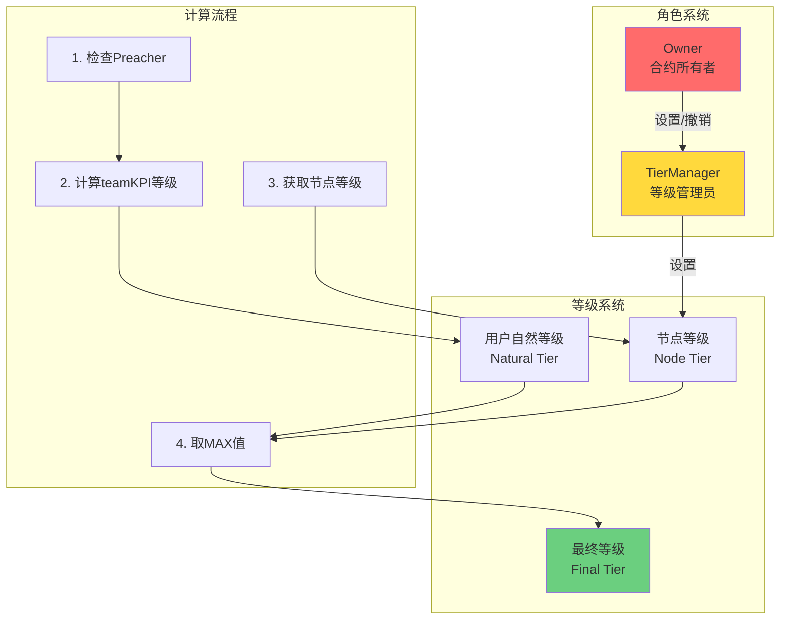
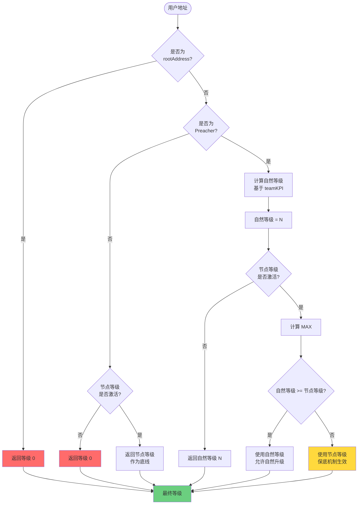

# 节点等级管理系统实现方案（方案A改进版）

## 目录
- [需求概述](#需求概述)
- [设计方案](#设计方案)
- [核心逻辑](#核心逻辑)
- [完整实现代码](#完整实现代码)
- [影响分析](#影响分析)
- [安全风险评估](#安全风险评估)
- [测试方案](#测试方案)
- [部署与升级指南](#部署与升级指南)

---

## 需求概述

### 功能需求

1. **角色管理**: 增加"节点等级管理员"角色（`tierManager`）
   - Owner 可以设置/更换此角色
   - 只有此角色能调用等级设置函数

2. **等级设置**: `tierManager` 可为用户设置"节点来源等级"
   - 仅支持 V1 (1) 和 V2 (2)
   - 记录设置时间和操作者

3. **等级计算逻辑**: 采用"保底机制"
   ```
   最终等级 = MAX(自然等级, 节点等级)
   ```
   - 先计算用户的自然等级（基于 teamKPI + Preacher）
   - 如果自然等级 < 节点等级，使用节点等级
   - 如果自然等级 ≥ 节点等级，使用自然等级
   - **不阻碍自然升级**

### 设计目标

- ✅ 不破坏现有升级机制
- ✅ 节点等级作为"底线保障"
- ✅ 权限分离（Owner ≠ 等级管理员）
- ✅ 完整的事件记录
- ✅ 可追溯性

---

## 设计方案

### 架构图



### 数据结构设计

```solidity
// 节点等级记录
struct NodeTierRecord {
    uint8 tier;              // 等级 (1 或 2)
    uint40 setTime;          // 设置时间
    address setBy;           // 操作者地址
    bool active;             // 是否激活
}

// 状态变量
address public tierManager;                              // 等级管理员地址
mapping(address => NodeTierRecord) public nodeTiers;     // 用户节点等级记录
```

---

## 核心逻辑

### 等级计算流程详解



### 关键场景分析

#### 场景 1: 非 Preacher 用户

```
用户状态:
- 质押: 100 SYI (< 200 SYI)
- teamKPI: 20,000 USDT
- 节点等级: V1

计算过程:
1. isPreacher(user) = false
2. 检查节点等级: nodeTiers[user].active = true
3. 返回: 0 (因为不满足 Preacher 条件)

结论: 节点等级不能绕过 Preacher 检查
```

#### 场景 2: 节点等级作为底线

```
用户状态:
- 质押: 300 SYI (Preacher ✓)
- teamKPI: 5,000 USDT (不足 V1 门槛 10,000)
- 节点等级: V1

计算过程:
1. isPreacher(user) = true
2. 自然等级 = 0 (teamKPI 不足)
3. 节点等级 = 1
4. MAX(0, 1) = 1

结论: 使用节点等级 V1
```

#### 场景 3: 自然升级优先

```
用户状态:
- 质押: 500 SYI (Preacher ✓)
- teamKPI: 250,000 USDT (达到 V3 门槛)
- 节点等级: V1

计算过程:
1. isPreacher(user) = true
2. 自然等级 = 3 (teamKPI ≥ 200,000)
3. 节点等级 = 1
4. MAX(3, 1) = 3

结论: 使用自然等级 V3 (节点等级不限制升级)
```

#### 场景 4: 节点等级被撤销

```
用户状态:
- 质押: 300 SYI
- teamKPI: 8,000 USDT
- 节点等级: 已撤销 (active = false)

计算过程:
1. isPreacher(user) = true
2. 自然等级 = 0
3. nodeTiers[user].active = false
4. 返回自然等级 = 0

结论: 失去节点等级保障
```

---

## 完整实现代码

### 1. 修改 `StakingBase.sol`

#### 1.1 添加状态变量（第 134 行后）

```solidity
// =========================================================================
// NODE TIER MANAGEMENT SYSTEM
// =========================================================================

/**
 * @notice 节点等级管理员地址
 * @dev 只有此地址可以设置用户的节点等级
 */
address public tierManager;

/**
 * @notice 节点等级记录结构
 * @param tier 等级 (1=V1, 2=V2)
 * @param setTime 设置时间戳
 * @param setBy 设置操作者地址
 * @param active 是否激活
 */
struct NodeTierRecord {
    uint8 tier;
    uint40 setTime;
    address setBy;
    bool active;
}

/**
 * @notice 用户节点等级映射
 */
mapping(address => NodeTierRecord) public nodeTiers;
```

#### 1.2 添加事件（第 155 行后）

```solidity
// Node Tier Management Events
event TierManagerUpdated(
    address indexed oldManager,
    address indexed newManager,
    address indexed operator,
    uint256 timestamp
);

event NodeTierSet(
    address indexed user,
    uint8 tier,
    address indexed setBy,
    uint256 timestamp
);

event NodeTierRemoved(
    address indexed user,
    uint8 previousTier,
    address indexed removedBy,
    uint256 timestamp
);

event NodeTierBatchSet(
    address[] users,
    uint8[] tiers,
    address indexed setBy,
    uint256 count,
    uint256 timestamp
);

event NodeTierUsed(
    address indexed user,
    uint8 naturalTier,
    uint8 nodeTier,
    uint8 finalTier,
    string reason
);
```

#### 1.3 添加修饰器（第 165 行后）

```solidity
/**
 * @notice 限制只有 tierManager 可以调用
 */
modifier onlyTierManager() {
    require(msg.sender == tierManager, "Caller is not tier manager");
    _;
}
```

#### 1.4 修改构造函数（第 176 行）

```solidity
constructor(
    address _usdt,
    address _router,
    address _rootAddress,
    address _feeRecipient
) Ownable(msg.sender) {
    require(_usdt != address(0), "Invalid USDT address");
    require(_router != address(0), "Invalid router address");

    USDT = _usdt;
    ROUTER = IUniswapV2Router02(_router);
    rootAddress = _rootAddress;
    feeRecipient = _feeRecipient;

    // 初始化 tierManager 为 owner
    tierManager = msg.sender;

    IERC20(_usdt).approve(_router, type(uint256).max);
    _updateRatesForMode();
}
```

#### 1.5 添加管理函数（第 1420 行后）

```solidity
// =========================================================================
// NODE TIER MANAGEMENT FUNCTIONS
// =========================================================================

/**
 * @notice 设置节点等级管理员地址
 * @param _tierManager 新的管理员地址
 * @dev 只能由 owner 调用，0地址表示禁用功能
 */
function setTierManager(address _tierManager) external onlyOwner {
    address oldManager = tierManager;
    tierManager = _tierManager;

    emit TierManagerUpdated(
        oldManager,
        _tierManager,
        msg.sender,
        block.timestamp
    );
}

/**
 * @notice 为用户设置节点等级（V1或V2）
 * @param user 目标用户地址
 * @param tier 等级 (1=V1, 2=V2)
 * @dev 只能由 tierManager 调用
 * @dev 节点等级作为最低保障，不限制自然升级
 */
function setNodeTier(
    address user,
    uint8 tier
) external onlyTierManager {
    require(user != address(0), "NodeTier: invalid address");
    require(user != rootAddress, "NodeTier: cannot set for root");
    require(tier >= 1 && tier <= 2, "NodeTier: only tier 1 or 2 allowed");

    nodeTiers[user] = NodeTierRecord({
        tier: tier,
        setTime: uint40(block.timestamp),
        setBy: msg.sender,
        active: true
    });

    emit NodeTierSet(user, tier, msg.sender, block.timestamp);
}

/**
 * @notice 移除用户的节点等级
 * @param user 目标用户地址
 * @dev 只能由 tierManager 调用
 */
function removeNodeTier(address user) external onlyTierManager {
    require(nodeTiers[user].active, "NodeTier: no active tier");

    uint8 previousTier = nodeTiers[user].tier;
    nodeTiers[user].active = false;

    emit NodeTierRemoved(user, previousTier, msg.sender, block.timestamp);
}

/**
 * @notice 批量设置节点等级
 * @param users 用户地址数组
 * @param tiers 对应等级数组
 * @dev 只能由 tierManager 调用
 * @dev 最多一次处理 100 个用户
 */
function batchSetNodeTier(
    address[] calldata users,
    uint8[] calldata tiers
) external onlyTierManager {
    require(users.length == tiers.length, "NodeTier: array length mismatch");
    require(users.length > 0, "NodeTier: empty array");
    require(users.length <= 100, "NodeTier: max 100 users per batch");

    for (uint256 i = 0; i < users.length; ) {
        address user = users[i];
        uint8 tier = tiers[i];

        require(user != address(0), "NodeTier: invalid address in batch");
        require(user != rootAddress, "NodeTier: cannot set for root");
        require(tier >= 1 && tier <= 2, "NodeTier: invalid tier in batch");

        nodeTiers[user] = NodeTierRecord({
            tier: tier,
            setTime: uint40(block.timestamp),
            setBy: msg.sender,
            active: true
        });

        emit NodeTierSet(user, tier, msg.sender, block.timestamp);

        unchecked {
            ++i;
        }
    }

    emit NodeTierBatchSet(users, tiers, msg.sender, users.length, block.timestamp);
}

/**
 * @notice 批量移除节点等级
 * @param users 用户地址数组
 * @dev 只能由 tierManager 调用
 */
function batchRemoveNodeTier(
    address[] calldata users
) external onlyTierManager {
    require(users.length > 0, "NodeTier: empty array");
    require(users.length <= 100, "NodeTier: max 100 users per batch");

    for (uint256 i = 0; i < users.length; ) {
        address user = users[i];
        if (nodeTiers[user].active) {
            uint8 previousTier = nodeTiers[user].tier;
            nodeTiers[user].active = false;
            emit NodeTierRemoved(user, previousTier, msg.sender, block.timestamp);
        }

        unchecked {
            ++i;
        }
    }
}

// =========================================================================
// NODE TIER QUERY FUNCTIONS
// =========================================================================

/**
 * @notice 查询用户的节点等级详情
 * @param user 用户地址
 * @return hasNodeTier 是否设置了节点等级
 * @return tier 节点等级
 * @return setTime 设置时间
 * @return setBy 设置者地址
 * @return isActive 是否激活
 */
function getNodeTierDetails(
    address user
) external view returns (
    bool hasNodeTier,
    uint8 tier,
    uint40 setTime,
    address setBy,
    bool isActive
) {
    NodeTierRecord memory record = nodeTiers[user];
    hasNodeTier = record.tier > 0;
    tier = record.tier;
    setTime = record.setTime;
    setBy = record.setBy;
    isActive = record.active;
}

/**
 * @notice 查询用户的完整等级信息
 * @param user 用户地址
 * @return isPreacherStatus 是否为 Preacher
 * @return naturalTier 自然等级 (基于 teamKPI)
 * @return nodeTier 节点等级
 * @return finalTier 最终等级 (实际生效)
 * @return usingNodeTier 是否使用了节点等级
 */
function getUserTierBreakdown(
    address user
) external view returns (
    bool isPreacherStatus,
    uint8 naturalTier,
    uint8 nodeTier,
    uint8 finalTier,
    bool usingNodeTier
) {
    isPreacherStatus = isPreacher(user);

    // 计算自然等级（不考虑节点等级）
    naturalTier = _calculateNaturalTier(user);

    // 获取节点等级
    NodeTierRecord memory record = nodeTiers[user];
    nodeTier = (record.active && isPreacherStatus) ? record.tier : 0;

    // 最终等级（通过 _getUserTier 获取）
    finalTier = _getUserTier(user);

    // 判断是否使用了节点等级
    usingNodeTier = (nodeTier > 0 && finalTier == nodeTier && naturalTier < nodeTier);
}
```

#### 1.6 修改 `_getUserTier` 函数（第 1255-1273 行）

**原函数**:
```solidity
function _getUserTier(address user) private view returns (uint8 tier) {
    if (user == rootAddress || !isPreacher(user)) {
        return 0;
    }

    uint256 teamKPI = getTeamKpi(user);
    IStaking.TeamTier[7] memory tiers = _getTeamTiers();

    for (uint256 i = 0; i < tiers.length; ) {
        if (teamKPI >= tiers[i].threshold) {
            return uint8(7 - i);
        }
        unchecked {
            ++i;
        }
    }

    return 0;
}
```

**修改后**:
```solidity
/**
 * @notice 计算用户的最终等级
 * @param user 用户地址
 * @return tier 最终等级 (0-7)
 * @dev 逻辑：MAX(自然等级, 节点等级)
 * @dev 节点等级作为最低保障，不限制自然升级
 */
function _getUserTier(address user) private view returns (uint8 tier) {
    // 1. rootAddress 永远返回 0
    if (user == rootAddress) {
        return 0;
    }

    // 2. 非 Preacher 用户返回 0（节点等级也无效）
    if (!isPreacher(user)) {
        return 0;
    }

    // 3. 计算自然等级（基于 teamKPI）
    uint8 naturalTier = _calculateNaturalTier(user);

    // 4. 检查节点等级
    NodeTierRecord memory record = nodeTiers[user];
    uint8 nodeTier = record.active ? record.tier : 0;

    // 5. 取最大值
    uint8 finalTier = _max8(naturalTier, nodeTier);

    // 6. 记录使用情况（仅用于追踪）
    if (nodeTier > 0 && finalTier > naturalTier) {
        emit NodeTierUsed(
            user,
            naturalTier,
            nodeTier,
            finalTier,
            "Node tier used as floor"
        );
    }

    return finalTier;
}

/**
 * @notice 计算用户的自然等级（不考虑节点等级）
 * @param user 用户地址
 * @return tier 自然等级 (0-7)
 * @dev 纯粹基于 teamKPI 计算
 */
function _calculateNaturalTier(address user) private view returns (uint8 tier) {
    // rootAddress 或非 Preacher 返回 0
    if (user == rootAddress || !isPreacher(user)) {
        return 0;
    }

    uint256 teamKPI = getTeamKpi(user);
    IStaking.TeamTier[7] memory tiers = _getTeamTiers();

    for (uint256 i = 0; i < tiers.length; ) {
        if (teamKPI >= tiers[i].threshold) {
            return uint8(7 - i);
        }
        unchecked {
            ++i;
        }
    }

    return 0;
}

/**
 * @notice 返回两个 uint8 的最大值
 */
function _max8(uint8 a, uint8 b) private pure returns (uint8) {
    return a >= b ? a : b;
}
```

---

## 影响分析

### 3.1 直接影响的函数

#### 🔴 高影响：需要验证

| 函数名 | 位置 | 调用 `_getUserTier` | 影响描述 |
|--------|------|---------------------|----------|
| `_distributeHybridRewards` | `StakingBase.sol:1080` | ✅ 是 | 团队奖励分发核心逻辑 |
| `getTeamPerformanceDetails` | `StakingBase.sol:677` | ✅ 是 | 团队绩效查询 |

#### 🟡 中影响：间接依赖

| 函数名 | 位置 | 依赖关系 | 影响描述 |
|--------|------|----------|----------|
| `_distributeTeamReward` | `StakingBase.sol:1014` | 调用 `_distributeHybridRewards` | unstake 时分发奖励 |
| `unstake` | `StakingBase.sol:200` | 调用 `_distributeTeamReward` | 用户解质押入口 |

### 3.2 影响详细分析

#### 影响 1: 团队奖励分发逻辑

**代码位置**: `StakingBase.sol:1104-1164`

```solidity
function _distributeHybridRewards(...) private returns (...) {
    // ...
    for (uint256 i = 0; i < referralChain.length; ) {
        uint8 currentTier = memberTiers[i];  // ← 这里获取的是 _getUserTier 的结果

        if (
            currentTier > 0 &&
            !tierAllocated[currentTier] &&
            isPreacher(referralChain[i])  // ← 重复检查 Preacher
        ) {
            // 分发奖励
        }
    }
}
```

**影响分析**:

✅ **正向影响**:
- 节点等级用户可以获得对应等级的团队奖励
- 即使 teamKPI 不足，也能获得 V1/V2 的奖励

⚠️ **潜在问题**:
- `isPreacher` 被检查了两次（`_getUserTier` 内部 + `_distributeHybridRewards` 内部）
- **结论**: 无问题，冗余检查增加安全性

**测试场景**:
```
用户A: 节点等级 V1, 自然等级 0
下级B 解质押，利息 1000 USDT

预期:
- A 获得 1000 × 5% = 50 USDT (V1 奖励)
- 剩余 300 USDT 给 rootAddress
```

---

#### 影响 2: 团队绩效查询

**代码位置**: `StakingBase.sol:677-704`

```solidity
function getTeamPerformanceDetails(
    address _user
) external view returns (
    uint256 totalTeamInvestment,
    uint256 teamMemberCount,
    uint8 currentTier,  // ← 返回最终等级
    uint256 nextTierThreshold,
    uint256 progressToNextTier
) {
    // ...
    currentTier = _getUserTier(_user);  // ← 包含节点等级的最终等级
    // ...
}
```

**影响分析**:

⚠️ **潜在误导**:
- 如果用户使用节点等级，`currentTier` 会显示 V1/V2
- 但 `totalTeamInvestment` 可能不足对应门槛
- 用户可能困惑："我怎么是 V1 但 teamKPI 才 5000？"

✅ **解决方案**:
- 使用新函数 `getUserTierBreakdown` 查询详情
- 前端应区分显示"自然等级"和"节点等级"

**建议前端显示**:
```
当前等级: V1 ⭐ (节点等级)
自然等级: V0 (teamKPI: 5,000 / 10,000)
距离 V1: 5,000 USDT
```

---

### 3.3 不受影响的函数

以下函数**不调用** `_getUserTier`，因此**完全不受影响**:

| 函数名 | 功能 | 原因 |
|--------|------|------|
| `stake` | 质押 | 不涉及等级计算 |
| `lockReferral` | 绑定推荐人 | 不涉及等级计算 |
| `_updateTeamInvestmentValues` | 更新 teamKPI | 仅修改 KPI，不查询等级 |
| `isPreacher` | Preacher 检查 | 独立逻辑 |
| `getTeamKpi` | 查询 teamKPI | 返回原始 KPI 值 |
| `balanceOf` | 查询余额 | 不涉及等级 |

---

### 3.4 存储布局影响

**新增状态变量**:
```solidity
address public tierManager;                     // 20 bytes
mapping(address => NodeTierRecord) public nodeTiers;  // 动态大小
```

**NodeTierRecord 大小**:
```solidity
struct NodeTierRecord {
    uint8 tier;        // 1 byte
    uint40 setTime;    // 5 bytes
    address setBy;     // 20 bytes
    bool active;       // 1 byte
}
// 总计: 27 bytes (打包后占用 1 个 slot)
```

✅ **影响评估**:
- 每个用户增加 **1 个 storage slot** (32 bytes)
- Gas 成本: 设置节点等级 ~20,000 gas
- **结论**: 影响可接受

---

### 3.5 事件日志影响

**新增事件**:
- `TierManagerUpdated`: 管理员变更
- `NodeTierSet`: 设置节点等级
- `NodeTierRemoved`: 移除节点等级
- `NodeTierBatchSet`: 批量设置
- `NodeTierUsed`: 节点等级生效

✅ **影响**:
- 增强可追溯性
- 方便前端监听
- 不影响现有功能

---

### 3.6 Gas 成本影响

| 操作 | 原始 Gas | 修改后 Gas | 增加 | 原因 |
|------|----------|-----------|------|------|
| `unstake` (无节点等级) | ~450,000 | ~452,000 | +2,000 | 额外的 SLOAD |
| `unstake` (使用节点等级) | ~450,000 | ~453,000 | +3,000 | SLOAD + emit |
| `setNodeTier` | - | ~45,000 | - | SSTORE + emit |
| `batchSetNodeTier` (10个) | - | ~250,000 | - | 批量 SSTORE |

✅ **结论**: Gas 增加 < 1%，可接受

---

### 3.7 安全性影响

#### 风险 1: 权限滥用

**场景**: tierManager 恶意给大量地址设置 V2
**影响**:
- 这些地址可以获得 10% 的团队奖励
- 损害其他高等级用户利益
- 项目方收益减少

**缓解措施**:
1. ✅ Owner 可随时更换 tierManager
2. ✅ 所有操作有事件记录，可追溯
3. ✅ 仅限 V1/V2，无法设置更高等级
4. ✅ 仍需满足 Preacher 条件（200 SYI）

#### 风险 2: Preacher 条件失效

**场景**: 用户获得节点等级后解除质押
**影响**: 失去 Preacher 资格，节点等级无效

**设计决策**:
- ✅ **保留此行为**
- 原因: 防止用户"白嫖"（拿到节点等级后立即提币）
- 要求: 必须持续质押 ≥ 200 SYI

#### 风险 3: 等级去重机制

**场景**: 推荐链中多个用户有相同节点等级
**影响**: 第一个遇到的用户获得奖励

**代码验证**:
```solidity
// StakingBase.sol:1147
tierAllocated[currentTier] = true;  // ← 防止重复分配
```

✅ **结论**: 现有机制已覆盖

---

## 安全风险评估

### 风险矩阵

| 风险类型 | 概率 | 影响 | 等级 | 缓解措施 |
|----------|------|------|------|----------|
| tierManager 恶意操作 | 中 | 高 | 🟡 中 | 事件记录 + Owner 可撤换 |
| 权限管理漏洞 | 低 | 高 | 🟢 低 | 使用 OpenZeppelin Ownable |
| 等级计算错误 | 低 | 高 | 🟢 低 | 详细测试 + 查询函数验证 |
| Gas 攻击（批量操作）| 低 | 低 | 🟢 低 | 限制批量上限 100 |
| 重入攻击 | 极低 | 高 | 🟢 低 | 无外部调用 |
| 整数溢出 | 极低 | 高 | 🟢 低 | Solidity 0.8+ 自动检查 |

### 审计建议

**重点审计项**:
1. `_getUserTier` 的 MAX 逻辑
2. `_distributeHybridRewards` 的等级去重
3. `onlyTierManager` 修饰器
4. 批量操作的 Gas 上限

**推荐审计工具**:
- Slither (静态分析)
- Mythril (符号执行)
- Echidna (模糊测试)

---

## 测试方案

### 5.1 单元测试

#### 测试文件: `test/NodeTierManagement.test.js`

```javascript
const { expect } = require("chai");
const { ethers } = require("hardhat");

describe("节点等级管理系统", function() {
    let staking, owner, tierManager, user1, user2, root;

    beforeEach(async function() {
        [owner, tierManager, user1, user2, root] = await ethers.getSigners();

        // 部署合约（假设已部署 USDT, Router 等）
        const Staking = await ethers.getContractFactory("Staking");
        staking = await Staking.deploy(usdt, router, root.address, root.address);

        // 设置 tierManager
        await staking.setTierManager(tierManager.address);
    });

    describe("1. 角色管理", function() {
        it("应该正确设置 tierManager", async function() {
            expect(await staking.tierManager()).to.equal(tierManager.address);
        });

        it("非 owner 不能设置 tierManager", async function() {
            await expect(
                staking.connect(user1).setTierManager(user1.address)
            ).to.be.revertedWith("Ownable: caller is not the owner");
        });

        it("应该能更换 tierManager", async function() {
            await staking.setTierManager(user1.address);
            expect(await staking.tierManager()).to.equal(user1.address);
        });

        it("设置 tierManager 应触发事件", async function() {
            await expect(staking.setTierManager(user1.address))
                .to.emit(staking, "TierManagerUpdated")
                .withArgs(tierManager.address, user1.address, owner.address);
        });
    });

    describe("2. 设置节点等级", function() {
        it("tierManager 应该能设置节点等级", async function() {
            await staking.connect(tierManager).setNodeTier(user1.address, 1);

            const details = await staking.getNodeTierDetails(user1.address);
            expect(details.hasNodeTier).to.be.true;
            expect(details.tier).to.equal(1);
            expect(details.isActive).to.be.true;
        });

        it("非 tierManager 不能设置节点等级", async function() {
            await expect(
                staking.connect(user1).setNodeTier(user2.address, 1)
            ).to.be.revertedWith("Caller is not tier manager");
        });

        it("应拒绝无效等级", async function() {
            await expect(
                staking.connect(tierManager).setNodeTier(user1.address, 0)
            ).to.be.revertedWith("NodeTier: only tier 1 or 2 allowed");

            await expect(
                staking.connect(tierManager).setNodeTier(user1.address, 3)
            ).to.be.revertedWith("NodeTier: only tier 1 or 2 allowed");
        });

        it("应拒绝为 rootAddress 设置", async function() {
            await expect(
                staking.connect(tierManager).setNodeTier(root.address, 1)
            ).to.be.revertedWith("NodeTier: cannot set for root");
        });

        it("设置节点等级应触发事件", async function() {
            await expect(
                staking.connect(tierManager).setNodeTier(user1.address, 1)
            ).to.emit(staking, "NodeTierSet")
              .withArgs(user1.address, 1, tierManager.address);
        });
    });

    describe("3. 等级计算逻辑", function() {
        beforeEach(async function() {
            // user1 质押 300 SYI 成为 Preacher
            await staking.connect(user1).stake(ethers.parseEther("300"), 0);
        });

        it("场景1: 无节点等级，无 teamKPI", async function() {
            const breakdown = await staking.getUserTierBreakdown(user1.address);
            expect(breakdown.naturalTier).to.equal(0);
            expect(breakdown.nodeTier).to.equal(0);
            expect(breakdown.finalTier).to.equal(0);
            expect(breakdown.usingNodeTier).to.be.false;
        });

        it("场景2: 有节点等级 V1，无 teamKPI", async function() {
            await staking.connect(tierManager).setNodeTier(user1.address, 1);

            const breakdown = await staking.getUserTierBreakdown(user1.address);
            expect(breakdown.naturalTier).to.equal(0);
            expect(breakdown.nodeTier).to.equal(1);
            expect(breakdown.finalTier).to.equal(1);  // 使用节点等级
            expect(breakdown.usingNodeTier).to.be.true;
        });

        it("场景3: 节点等级 V1，自然等级 V3", async function() {
            // 模拟 user1 的 teamKPI 达到 250,000 (V3)
            // 这需要修改合约状态或使用 mock
            // 假设已设置 teamTotalInvestValue[user1] = 250,000 ether

            await staking.connect(tierManager).setNodeTier(user1.address, 1);

            const breakdown = await staking.getUserTierBreakdown(user1.address);
            expect(breakdown.naturalTier).to.equal(3);
            expect(breakdown.nodeTier).to.equal(1);
            expect(breakdown.finalTier).to.equal(3);  // 使用自然等级
            expect(breakdown.usingNodeTier).to.be.false;
        });

        it("场景4: 非 Preacher，节点等级无效", async function() {
            // user2 未质押，不是 Preacher
            await staking.connect(tierManager).setNodeTier(user2.address, 1);

            const breakdown = await staking.getUserTierBreakdown(user2.address);
            expect(breakdown.isPreacherStatus).to.be.false;
            expect(breakdown.nodeTier).to.equal(0);  // 无效
            expect(breakdown.finalTier).to.equal(0);
        });

        it("场景5: 移除节点等级", async function() {
            await staking.connect(tierManager).setNodeTier(user1.address, 1);
            await staking.connect(tierManager).removeNodeTier(user1.address);

            const details = await staking.getNodeTierDetails(user1.address);
            expect(details.isActive).to.be.false;

            const breakdown = await staking.getUserTierBreakdown(user1.address);
            expect(breakdown.nodeTier).to.equal(0);
            expect(breakdown.finalTier).to.equal(0);
        });
    });

    describe("4. 批量操作", function() {
        it("应该能批量设置节点等级", async function() {
            const users = [user1.address, user2.address];
            const tiers = [1, 2];

            await staking.connect(tierManager).batchSetNodeTier(users, tiers);

            const details1 = await staking.getNodeTierDetails(user1.address);
            const details2 = await staking.getNodeTierDetails(user2.address);

            expect(details1.tier).to.equal(1);
            expect(details2.tier).to.equal(2);
        });

        it("应拒绝数组长度不匹配", async function() {
            await expect(
                staking.connect(tierManager).batchSetNodeTier(
                    [user1.address],
                    [1, 2]
                )
            ).to.be.revertedWith("NodeTier: array length mismatch");
        });

        it("应拒绝超过 100 个用户", async function() {
            const users = new Array(101).fill(user1.address);
            const tiers = new Array(101).fill(1);

            await expect(
                staking.connect(tierManager).batchSetNodeTier(users, tiers)
            ).to.be.revertedWith("NodeTier: max 100 users per batch");
        });
    });

    describe("5. 团队奖励分发", function() {
        it("节点等级用户应获得对应比例奖励", async function() {
            // 设置推荐关系: user2 -> user1
            await staking.connect(user1).lockReferral(root.address);
            await staking.connect(user2).lockReferral(user1.address);

            // user1 质押 300 SYI (Preacher)
            await staking.connect(user1).stake(ethers.parseEther("300"), 0);

            // 设置 user1 为 V1
            await staking.connect(tierManager).setNodeTier(user1.address, 1);

            // user2 质押并解质押
            await staking.connect(user2).stake(ethers.parseEther("1000"), 0);
            await ethers.provider.send("evm_increaseTime", [86400]); // 1天后
            await staking.connect(user2).unstake(0);

            // 验证 user1 获得了 5% 的奖励
            // （需要查询 user1 的 USDT 余额变化）
        });
    });
});
```

---

### 5.2 集成测试场景

#### 场景 1: 完整生命周期

```javascript
it("完整流程: 设置 -> 使用 -> 升级 -> 移除", async function() {
    // 1. 用户质押成为 Preacher
    await staking.connect(user1).stake(ethers.parseEther("300"), 0);

    // 2. 设置节点等级 V1
    await staking.connect(tierManager).setNodeTier(user1.address, 1);
    let breakdown = await staking.getUserTierBreakdown(user1.address);
    expect(breakdown.finalTier).to.equal(1);

    // 3. 用户团队发展，自然升级到 V3
    // (模拟 teamKPI 增加)
    breakdown = await staking.getUserTierBreakdown(user1.address);
    expect(breakdown.finalTier).to.equal(3);  // 自然等级优先
    expect(breakdown.usingNodeTier).to.be.false;

    // 4. 移除节点等级
    await staking.connect(tierManager).removeNodeTier(user1.address);
    breakdown = await staking.getUserTierBreakdown(user1.address);
    expect(breakdown.finalTier).to.equal(3);  // 仍保持 V3
});
```

#### 场景 2: 推荐链中的节点等级

```javascript
it("推荐链中多个节点等级用户的奖励分配", async function() {
    // 推荐链: user3 -> user2(V1节点) -> user1(V2节点) -> root

    // 设置推荐关系
    await staking.connect(user1).lockReferral(root.address);
    await staking.connect(user2).lockReferral(user1.address);
    await staking.connect(user3).lockReferral(user2.address);

    // 都成为 Preacher
    await staking.connect(user1).stake(ethers.parseEther("300"), 0);
    await staking.connect(user2).stake(ethers.parseEther("300"), 0);

    // 设置节点等级
    await staking.connect(tierManager).setNodeTier(user1.address, 2);
    await staking.connect(tierManager).setNodeTier(user2.address, 1);

    // user3 解质押
    await staking.connect(user3).stake(ethers.parseEther("1000"), 0);
    await ethers.provider.send("evm_increaseTime", [86400]);
    await staking.connect(user3).unstake(0);

    // 验证:
    // - user2 应获得 5% (V1)
    // - user1 应获得 5% (V2-V1 差额)
    // - root 获得剩余 25%
});
```

---

### 5.3 Gas 测试

```javascript
describe("Gas 成本测试", function() {
    it("设置单个节点等级的 Gas 成本", async function() {
        const tx = await staking.connect(tierManager).setNodeTier(user1.address, 1);
        const receipt = await tx.wait();
        console.log("setNodeTier gas:", receipt.gasUsed.toString());
        expect(receipt.gasUsed).to.be.lessThan(50000);
    });

    it("批量设置 10 个用户的 Gas 成本", async function() {
        const users = new Array(10).fill(user1.address);
        const tiers = new Array(10).fill(1);

        const tx = await staking.connect(tierManager).batchSetNodeTier(users, tiers);
        const receipt = await tx.wait();
        console.log("batchSetNodeTier (10) gas:", receipt.gasUsed.toString());
    });

    it("unstake 时使用节点等级的额外 Gas", async function() {
        await staking.connect(user1).stake(ethers.parseEther("300"), 0);

        // 不使用节点等级
        await ethers.provider.send("evm_increaseTime", [86400]);
        const tx1 = await staking.connect(user1).unstake(0);
        const receipt1 = await tx1.wait();

        // 使用节点等级
        await staking.connect(tierManager).setNodeTier(user2.address, 1);
        await staking.connect(user2).stake(ethers.parseEther("300"), 0);
        await ethers.provider.send("evm_increaseTime", [86400]);
        const tx2 = await staking.connect(user2).unstake(0);
        const receipt2 = await tx2.wait();

        console.log("unstake without node tier:", receipt1.gasUsed.toString());
        console.log("unstake with node tier:", receipt2.gasUsed.toString());
        console.log("difference:", (receipt2.gasUsed - receipt1.gasUsed).toString());
    });
});
```

---

## 部署与升级指南

### 6.1 部署步骤

#### 步骤 1: 修改合约代码

按照"完整实现代码"章节修改以下文件：
- `contracts/SYI-Staking/abstract/StakingBase.sol`

#### 步骤 2: 编译合约

```bash
npx hardhat compile
```

验证编译无错误。

#### 步骤 3: 部署新合约

```bash
# 部署到本地测试网
npx hardhat run scripts/deployOLASystem.js --network localhost

# 或部署到 BSC 测试网
npx hardhat run scripts/deployOLASystem.js --network bscTestnet
```

#### 步骤 4: 设置 tierManager

```javascript
// scripts/setTierManager.js
const { ethers } = require("hardhat");

async function main() {
    const [deployer, tierManager] = await ethers.getSigners();

    const stakingAddress = "0x..."; // 从 deployed-addresses.json 获取
    const Staking = await ethers.getContractAt("Staking", stakingAddress);

    console.log("Setting tier manager to:", tierManager.address);
    const tx = await Staking.setTierManager(tierManager.address);
    await tx.wait();

    console.log("Tier manager set successfully");
    console.log("Current tier manager:", await Staking.tierManager());
}

main().catch((error) => {
    console.error(error);
    process.exitCode = 1;
});
```

运行:
```bash
npx hardhat run scripts/setTierManager.js --network localhost
```

---

### 6.2 升级现有合约

如果已有运行中的合约，需要使用代理模式升级。

#### 方案 A: 透明代理（推荐）

```javascript
// 使用 OpenZeppelin 的 Transparent Proxy
const { ethers, upgrades } = require("hardhat");

async function upgrade() {
    const proxyAddress = "0x..."; // 现有代理地址

    const StakingV2 = await ethers.getContractFactory("Staking");
    console.log("Upgrading Staking...");

    const upgraded = await upgrades.upgradeProxy(proxyAddress, StakingV2);
    await upgraded.deployed();

    console.log("Staking upgraded at:", upgraded.address);

    // 验证新功能
    console.log("Tier manager:", await upgraded.tierManager());
}

upgrade();
```

#### 方案 B: 重新部署 + 数据迁移

如果未使用代理，需要：
1. 部署新合约
2. 暂停旧合约
3. 迁移用户数据（质押记录、推荐关系等）
4. 切换前端指向新合约

⚠️ **风险高，需要详细计划**

---

### 6.3 验证部署

```javascript
// scripts/verifyNodeTierSystem.js
async function verify() {
    const staking = await ethers.getContractAt("Staking", stakingAddress);

    // 1. 检查 tierManager 是否设置
    const tierManager = await staking.tierManager();
    console.log("✓ Tier manager:", tierManager);

    // 2. 测试设置节点等级
    const [_, manager, testUser] = await ethers.getSigners();
    await staking.connect(manager).setNodeTier(testUser.address, 1);
    console.log("✓ setNodeTier works");

    // 3. 测试查询
    const details = await staking.getNodeTierDetails(testUser.address);
    console.log("✓ Node tier details:", details);

    // 4. 测试移除
    await staking.connect(manager).removeNodeTier(testUser.address);
    console.log("✓ removeNodeTier works");

    console.log("\n✅ All checks passed!");
}

verify();
```

---

### 6.4 前端集成

#### 监听事件

```javascript
// 监听节点等级设置
staking.on("NodeTierSet", (user, tier, setBy, timestamp) => {
    console.log(`用户 ${user} 被设置为 V${tier}`);
    // 更新 UI
});

// 监听节点等级使用
staking.on("NodeTierUsed", (user, naturalTier, nodeTier, finalTier, reason) => {
    console.log(`用户 ${user} 使用节点等级 V${nodeTier} (自然等级: V${naturalTier})`);
});
```

#### 查询用户等级

```javascript
async function getUserFullInfo(userAddress) {
    const breakdown = await staking.getUserTierBreakdown(userAddress);

    return {
        isPreacher: breakdown.isPreacherStatus,
        naturalTier: breakdown.naturalTier,
        nodeTier: breakdown.nodeTier,
        finalTier: breakdown.finalTier,
        usingNodeTier: breakdown.usingNodeTier
    };
}

// 显示
const info = await getUserFullInfo("0x...");
console.log(`
当前等级: V${info.finalTier} ${info.usingNodeTier ? '⭐ (节点等级)' : ''}
自然等级: V${info.naturalTier}
节点等级: V${info.nodeTier}
Preacher: ${info.isPreacher ? '是' : '否'}
`);
```

#### 管理界面

```javascript
// tierManager 专用管理面板
async function setNodeTier(userAddress, tier) {
    try {
        const tx = await staking.connect(tierManager).setNodeTier(userAddress, tier);
        await tx.wait();
        alert(`成功设置 ${userAddress} 为 V${tier}`);
    } catch (error) {
        alert(`设置失败: ${error.message}`);
    }
}

async function batchSetNodeTier(userList, tierList) {
    if (userList.length > 100) {
        alert("每次最多处理 100 个用户");
        return;
    }

    const tx = await staking.connect(tierManager).batchSetNodeTier(userList, tierList);
    await tx.wait();
    alert(`批量设置成功: ${userList.length} 个用户`);
}
```

---

## 总结

### 实现要点

| 项目 | 说明 |
|------|------|
| **新增角色** | `tierManager` 地址，由 owner 设置 |
| **新增状态变量** | `nodeTiers` mapping (27 bytes/用户) |
| **核心逻辑** | `finalTier = MAX(naturalTier, nodeTier)` |
| **权限控制** | `onlyTierManager` 修饰器 |
| **等级限制** | 仅支持 V1 (1) 和 V2 (2) |
| **Preacher 检查** | 仍需满足 ≥ 200 SYI |

### 代码修改量

- **新增代码**: ~250 行（函数 + 结构体 + 事件）
- **修改代码**: ~30 行（`_getUserTier` + `_calculateNaturalTier`）
- **测试代码**: ~400 行（完整测试套件）

### 开发时间估算

| 阶段 | 时间 |
|------|------|
| 代码实现 | 4-6 小时 |
| 单元测试 | 4-6 小时 |
| 集成测试 | 2-3 小时 |
| 前端集成 | 3-4 小时 |
| 审计准备 | 2-3 小时 |
| **总计** | **15-22 小时** |

### 风险等级

| 类别 | 等级 | 说明 |
|------|------|------|
| **技术风险** | 🟢 低 | 逻辑简单，影响可控 |
| **安全风险** | 🟡 中 | 需要审计 tierManager 权限 |
| **Gas 成本** | 🟢 低 | 增加 < 1% |
| **用户体验** | 🟢 低 | 透明可查询 |

### 建议实施路径

1. ✅ **本地测试**: 完成所有单元测试和集成测试
2. ✅ **测试网部署**: BSC 测试网运行 1-2 周
3. ⚠️ **安全审计**: 聘请专业审计公司
4. ✅ **主网部署**: 使用多签钱包部署
5. ✅ **监控**: 监听所有节点等级相关事件

---

## 附录

### A. 完整事件列表

```solidity
event TierManagerUpdated(address indexed oldManager, address indexed newManager, address indexed operator, uint256 timestamp);
event NodeTierSet(address indexed user, uint8 tier, address indexed setBy, uint256 timestamp);
event NodeTierRemoved(address indexed user, uint8 previousTier, address indexed removedBy, uint256 timestamp);
event NodeTierBatchSet(address[] users, uint8[] tiers, address indexed setBy, uint256 count, uint256 timestamp);
event NodeTierUsed(address indexed user, uint8 naturalTier, uint8 nodeTier, uint8 finalTier, string reason);
```

### B. 错误消息列表

```solidity
"Caller is not tier manager"
"NodeTier: invalid address"
"NodeTier: cannot set for root"
"NodeTier: only tier 1 or 2 allowed"
"NodeTier: no active tier"
"NodeTier: array length mismatch"
"NodeTier: empty array"
"NodeTier: max 100 users per batch"
"NodeTier: invalid address in batch"
"NodeTier: invalid tier in batch"
```

### C. Gas 优化建议

1. **批量操作**: 使用 `batchSetNodeTier` 而不是循环调用
2. **存储打包**: `NodeTierRecord` 已优化为 1 个 slot
3. **事件索引**: 只索引必要的参数（最多 3 个）
4. **缓存读取**: 在循环中缓存 `nodeTiers[user]`

### D. 参考资料

- [OpenZeppelin Ownable](https://docs.openzeppelin.com/contracts/4.x/access-control)
- [Solidity Gas 优化](https://gist.github.com/hrkrshnn/ee8fabd532058307229d65dcd5836ddc)
- [Uniswap V2 Whitepaper](https://uniswap.org/whitepaper.pdf)
