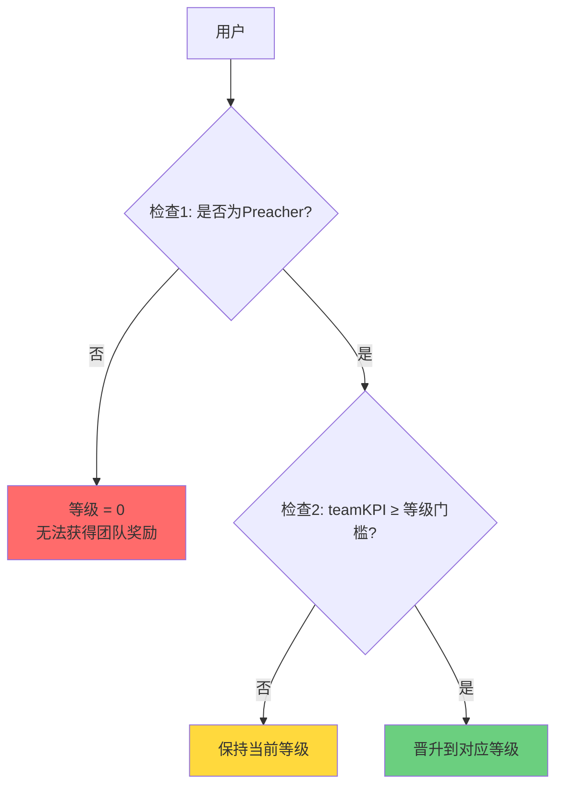
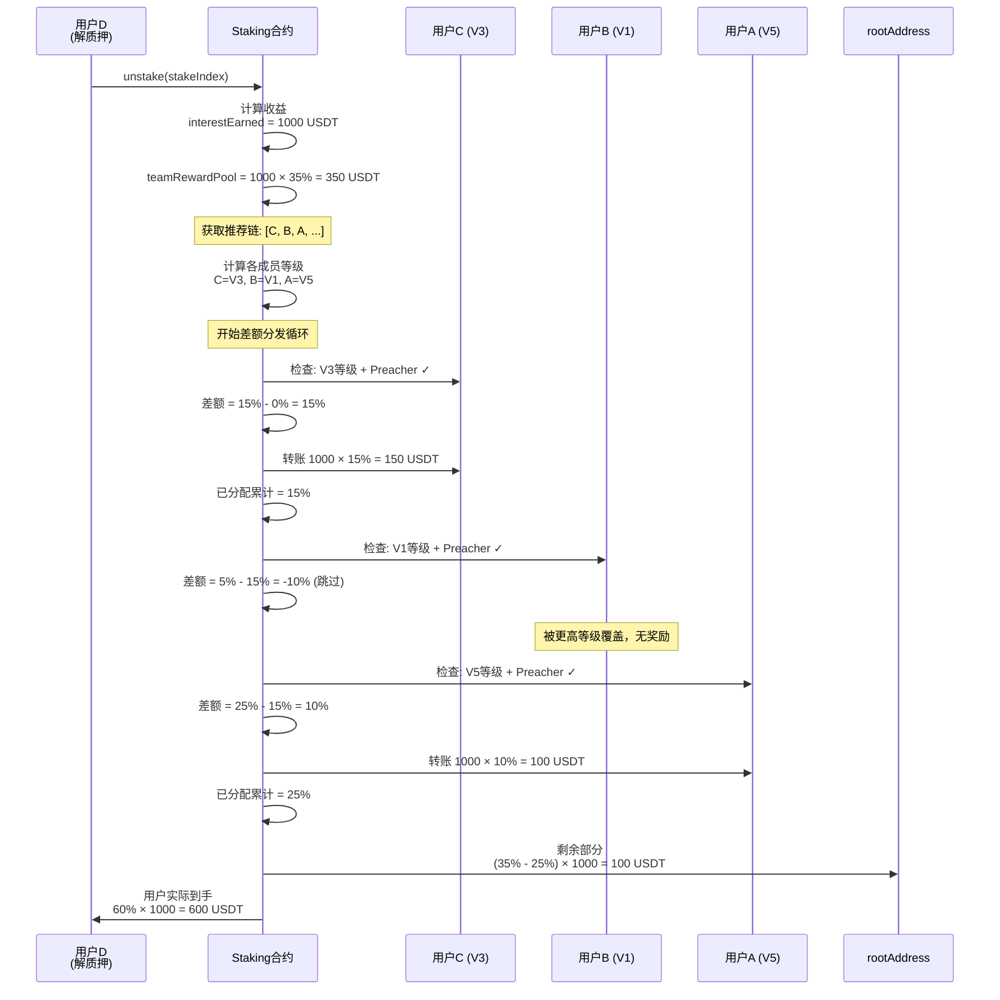

# SYI 质押系统 - 团队收益机制详解

## 目录
- [概述](#概述)
- [等级体系](#等级体系)
- [升级机制](#升级机制)
- [奖励计算](#奖励计算)
- [分发流程](#分发流程)
- [实际案例](#实际案例)
- [管理员强制提升方案](#管理员强制提升方案)

---

## 概述

SYI 质押系统采用 **7 级团队奖励机制**，基于 **严格差额制度** 分发团队收益。核心特点：

- 🎯 **总奖励池**: 用户解质押利息的 **35%** 用于团队奖励
- 📊 **7个等级**: V1 到 V7，奖励比例从 5% 递增到 35%
- 🔄 **差额分发**: 高等级用户仅获得与下一等级的差额部分
- ⚡ **Preacher门槛**: 必须质押 ≥ 200 SYI 才能获得团队奖励
- 🏆 **KPI驱动**: 基于团队总投资额（teamTotalInvestValue）升级

---

## 等级体系

### 等级配置表

| 等级 | 团队KPI门槛 | 累计奖励比例 | 差额奖励 | Preacher要求 |
|------|-------------|--------------|----------|--------------|
| **V1** | 10,000 USDT | 5% | 5% | ≥ 200 SYI |
| **V2** | 50,000 USDT | 10% | 5% (10%-5%) | ≥ 200 SYI |
| **V3** | 200,000 USDT | 15% | 5% (15%-10%) | ≥ 200 SYI |
| **V4** | 500,000 USDT | 20% | 5% (20%-15%) | ≥ 200 SYI |
| **V5** | 1,000,000 USDT | 25% | 5% (25%-20%) | ≥ 200 SYI |
| **V6** | 2,500,000 USDT | 30% | 5% (30%-25%) | ≥ 200 SYI |
| **V7** | 5,000,000 USDT | 35% | 5% (35%-30%) | ≥ 200 SYI |

### 关键代码位置

**等级门槛定义**: `contracts/SYI-Staking/mainnet/Staking.sol:65-91`
```solidity
function getTeamThresholdTier1() internal pure override returns (uint256) {
    return 10_000 ether; // V1
}
// ... V2 到 V7
```

**奖励比例定义**: `contracts/SYI-Staking/abstract/StakingBase.sol:67-73`
```solidity
uint256 internal constant TEAM_REWARD_TIER_1 = 5;  // V1: 5%
uint256 internal constant TEAM_REWARD_TIER_2 = 10; // V2: 10%
// ... 到 V7: 35%
```

---

## 升级机制

### 升级条件（同时满足）



### 1. Preacher 资格

**定义**: `StakingBase.sol:669-671`
```solidity
function isPreacher(address user) public view override returns (bool) {
    return currentStakeValue(user) >= PREACHER_THRESHOLD; // 200 SYI
}
```

- **要求**: 用户当前质押价值 ≥ 200 SYI
- **动态检查**: 每次分发奖励时实时检查
- **失去资格**: 如果质押低于 200 SYI，即使达到 KPI 也无法获得奖励

### 2. 团队 KPI 计算

**核心变量**: `teamTotalInvestValue[address]` - 记录用户团队的累计投资总额

#### KPI 累加时机（质押时）
`StakingBase.sol:804-820`
```solidity
function _updateTeamInvestmentValues(
    address user,
    uint256 amount,
    bool isIncrease
) internal {
    address[] memory referralChain = getReferrals(user, maxD);
    for (uint8 i = 0; i < referralChain.length; ) {
        unchecked {
            if (isIncrease) {
                teamTotalInvestValue[referralChain[i]] += amount;
            } else {
                teamTotalInvestValue[referralChain[i]] -= amount;
            }
            ++i;
        }
    }
}
```

**流程说明**:
1. 用户 A 质押 1000 USDT
2. 获取 A 的推荐链（最多 30 层）：`[B, C, D, ...]`
3. 将 1000 USDT **依次累加**到 B、C、D... 的 `teamTotalInvestValue`
4. 解质押时，执行**相反操作**（减去金额）

#### 等级判断逻辑
`StakingBase.sol:1255-1273`
```solidity
function _getUserTier(address user) private view returns (uint8 tier) {
    // 条件1: rootAddress 或非 Preacher，等级为 0
    if (user == rootAddress || !isPreacher(user)) {
        return 0;
    }

    // 条件2: 根据 teamKPI 匹配等级（从高到低检查）
    uint256 teamKPI = getTeamKpi(user);
    IStaking.TeamTier[7] memory tiers = _getTeamTiers();

    for (uint256 i = 0; i < tiers.length; ) {
        if (teamKPI >= tiers[i].threshold) {
            return uint8(7 - i); // 返回等级 1-7
        }
        unchecked {
            ++i;
        }
    }

    return 0; // 未达到任何门槛
}
```

---

## 奖励计算

### 奖励来源

当用户解除质押（unstake）时，产生的**利息收益**会被分成三部分：

```
总利息收益 (interestEarned)
│
├─ 5% → Friend 直推奖励
├─ 35% → 团队奖励池 (用于分发团队收益)
└─ 60% → 用户本人
```

**代码位置**: `StakingBase.sol:202-264`
```solidity
function unstake(uint256 stakeIndex) external onlyEOA returns (uint256 totalReward) {
    // 1. 计算本金和收益
    (uint256 calculatedReward, uint256 principalAmount) = _burn(stakeIndex);
    (uint256 usdtReceived, uint256 syiTokensUsed) = _swapSYIForReward(calculatedReward);

    // 2. 计算利息
    uint256 interestEarned = usdtReceived > principalAmount
        ? usdtReceived - principalAmount
        : 0;

    // 3. 分发奖励
    address[] memory referralChain = getReferrals(msg.sender, maxD);
    uint256 friendReward = _distributeFriendReward(msg.sender, interestEarned);    // 5%
    uint256 teamFee = _distributeTeamReward(referralChain, interestEarned);        // 35%

    // 4. 用户实际到手
    uint256 userPayout = usdtReceived - friendReward - teamFee;
    IERC20(USDT).transfer(msg.sender, userPayout);
}
```

### 差额制度详解

假设推荐链上有以下用户（从下到上）：

```
用户D (解质押者)
  ↓ (推荐人)
用户C: V3等级 (team KPI = 250,000 USDT)
  ↓
用户B: V1等级 (team KPI = 15,000 USDT)
  ↓
用户A: V5等级 (team KPI = 1,200,000 USDT)
```

用户D 解质押，产生利息 1000 USDT，团队奖励池 = **1000 × 35% = 350 USDT**

#### 分发计算

| 顺序 | 用户 | 等级 | 累计比例 | 已分配比例 | 差额 | 实际获得 |
|------|------|------|----------|-----------|------|----------|
| 1 | C | V3 | 15% | 0% | 15% | 1000 × 15% = 150 USDT |
| 2 | B | V1 | 5% | 15% | 0% | 0 USDT (已被C覆盖) |
| 3 | A | V5 | 25% | 15% | 10% | 1000 × 10% = 100 USDT |
| 剩余 | rootAddress | - | - | 25% | 10% | 1000 × 10% = 100 USDT |

**核心规则**:
- 推荐链**从下往上**扫描，先遇到的高等级用户优先分配
- 每个等级只能被分配**一次**
- 用户只能获得 **(自己等级比例 - 已分配比例)** 的差额部分
- 未分配的部分归 `rootAddress`（项目方）

---

## 分发流程

### 完整流程图



### 核心代码分析

**主分发函数**: `StakingBase.sol:1014-1078`
```solidity
function _distributeTeamReward(
    address[] memory referralChain,
    uint256 _interset  // 用户利息收益
) private returns (uint256 fee) {
    unchecked {
        fee = (_interset * MAX_TEAM_REWARD_RATE) / PERCENTAGE_BASE; // 35%
    }

    if (referralChain.length == 0) {
        IERC20(USDT).transfer(rootAddress, fee);
        return fee;
    }

    // 1. 获取推荐链上所有成员的等级
    uint8[] memory memberTiers = new uint8[](referralChain.length);
    for (uint256 i = 0; i < referralChain.length; ) {
        memberTiers[i] = _getUserTier(referralChain[i]);
        unchecked { ++i; }
    }

    // 2. 执行混合奖励分发（差额制）
    (
        uint256 totalDistributed,
        address[7] memory tierRecipients,
        uint256[7] memory tierAmounts,
        uint8 activeTiers
    ) = _distributeHybridRewards(referralChain, memberTiers, _interset);

    // 3. 剩余部分给 rootAddress
    uint256 marketingAmount = 0;
    if (totalDistributed < fee) {
        marketingAmount = fee - totalDistributed;
        IERC20(USDT).transfer(rootAddress, marketingAmount);
    }

    emit TeamRewardDistributionCompleted(...);
    return fee;
}
```

**差额分发逻辑**: `StakingBase.sol:1080-1165`
```solidity
function _distributeHybridRewards(
    address[] memory referralChain,
    uint8[] memory memberTiers,
    uint256 _interset
) private returns (
    uint256 totalDistributed,
    address[7] memory tierRecipients,
    uint256[7] memory tierAmounts,
    uint8 activeTiers
) {
    bool[8] memory tierAllocated;
    uint256 cumulativeAllocatedRate = 0;

    for (uint256 i = 0; i < referralChain.length; ) {
        uint8 currentTier = memberTiers[i];

        // 条件1: 等级 > 0
        // 条件2: 该等级未被分配
        // 条件3: 是 Preacher
        if (
            currentTier > 0 &&
            !tierAllocated[currentTier] &&
            isPreacher(referralChain[i])
        ) {
            uint256 tierRewardRate = _getTierRewardRate(currentTier);
            uint256 actualRewardRate;

            // 计算差额奖励
            if (tierRewardRate > cumulativeAllocatedRate) {
                actualRewardRate = tierRewardRate - cumulativeAllocatedRate;
            } else {
                actualRewardRate = 0;
            }

            if (actualRewardRate > 0) {
                uint256 memberReward = (_interset * actualRewardRate) / PERCENTAGE_BASE;

                if (memberReward > 0) {
                    IERC20(USDT).transfer(referralChain[i], memberReward);
                    totalDistributed += memberReward;

                    tierRecipients[currentTier - 1] = referralChain[i];
                    tierAmounts[currentTier - 1] = memberReward;

                    emit StrictDifferentialRewardPaid(...);
                }
            }

            tierAllocated[currentTier] = true;
            cumulativeAllocatedRate = tierRewardRate;
        }

        unchecked { ++i; }
    }
}
```

### 关键检查点

1. **Preacher 检查失败事件**:
   ```solidity
   if (currentTier > 0 && !tierAllocated[currentTier] && !isPreacher(referralChain[i])) {
       emit PreacherCheckFailed(
           referralChain[i],
           currentTier,
           "INSUFFICIENT_PREACHER_STATUS"
       );
   }
   ```
   - 如果用户达到等级门槛但不是 Preacher，会触发失败事件

2. **等级去重**: 使用 `bool[8] memory tierAllocated` 确保每个等级只分配一次

3. **累计追踪**: `cumulativeAllocatedRate` 记录已分配的累计比例

---

## 实际案例

### 案例 1: 完整分发场景

**推荐关系树**:
```
Root (V7, 8M KPI)
  ↓
Alice (V5, 1.5M KPI, 250 SYI质押)
  ↓
Bob (V2, 80K KPI, 300 SYI质押)
  ↓
Charlie (V1, 12K KPI, 500 SYI质押)
  ↓
David (0, 解质押者)
```

**David 解质押数据**:
- 本金: 10,000 USDT
- 收益: 12,000 USDT
- 利息: **2,000 USDT**

#### 分发计算

| 步骤 | 检查对象 | 等级 | Preacher | 累计比例 | 已分配 | 差额 | 实际奖励 |
|------|----------|------|----------|----------|--------|------|----------|
| 1 | Charlie | V1 | ✓ (500 SYI) | 5% | 0% | **5%** | 2000 × 5% = **100 USDT** |
| 2 | Bob | V2 | ✓ (300 SYI) | 10% | 5% | **5%** | 2000 × 5% = **100 USDT** |
| 3 | Alice | V5 | ✓ (250 SYI) | 25% | 10% | **15%** | 2000 × 15% = **300 USDT** |
| 4 | Root | V7 | - | 35% | 25% | **10%** | 2000 × 10% = **200 USDT** |

**David 实际到手**:
- Friend 奖励: 2000 × 5% = 100 USDT (假设绑定了 friend)
- 团队奖励: 2000 × 35% = 700 USDT (已分发给上级)
- **用户净收益**: 12,000 - 100 - 700 = **11,200 USDT**

---

### 案例 2: Preacher 资格失效

**推荐链**:
```
Alice (V3, 250K KPI, 150 SYI质押) ← 不是 Preacher!
  ↓
Bob (V1, 20K KPI, 500 SYI质押)
  ↓
Charlie (解质押者, 利息 1000 USDT)
```

#### 分发计算

| 步骤 | 检查对象 | 等级 | Preacher | 结果 |
|------|----------|------|----------|------|
| 1 | Bob | V1 | ✓ (500 SYI) | 获得 1000 × 5% = 50 USDT |
| 2 | Alice | V3 | ✗ (150 SYI) | **跳过**（触发 PreacherCheckFailed 事件）|
| 3 | Root | - | - | 获得 1000 × (35% - 5%) = 300 USDT |

**关键点**: Alice 虽然达到 V3 门槛（250K KPI），但因质押不足 200 SYI，无法获得团队奖励。

---

### 案例 3: 等级覆盖

**推荐链**:
```
Alice (V5, 1.2M KPI, 300 SYI)
  ↓
Bob (V1, 15K KPI, 400 SYI)
  ↓
Carol (V3, 300K KPI, 250 SYI)
  ↓
David (解质押者, 利息 1000 USDT)
```

#### 分发计算

| 步骤 | 检查对象 | 等级 | 累计比例 | 已分配 | 差额 | 实际奖励 |
|------|----------|------|----------|--------|------|----------|
| 1 | Carol | V3 | 15% | 0% | 15% | 1000 × 15% = **150 USDT** |
| 2 | Bob | V1 | 5% | 15% | -10% | **0 USDT** (被Carol覆盖) |
| 3 | Alice | V5 | 25% | 15% | 10% | 1000 × 10% = **100 USDT** |
| 4 | Root | - | - | - | 10% | 1000 × 10% = **100 USDT** |

**结论**: Bob 虽然是 V1，但因为下级 Carol 是 V3（更高等级），Bob 的 5% 奖励被 Carol 的 15% 完全覆盖。

---

## 管理员强制提升方案

### 需求分析

**目标**: 允许管理员为特定地址强制提升等级，仅限 **V1** 和 **V2**。

**应用场景**:
- 早期用户激励
- 市场推广活动奖励
- 战略合作伙伴特权
- 社区贡献者奖励

### 实现方案

#### 方案 A: 增加覆盖等级映射（推荐）

**难度**: ⭐⭐☆☆☆ (简单)

**核心思路**:
- 增加 `mapping(address => uint8) public manualTierOverride`
- 修改 `_getUserTier` 函数，优先返回手动设置的等级
- 限制只能设置为 1 或 2

**代码实现**:

```solidity
// 在 StakingBase 中添加状态变量
mapping(address => uint8) public manualTierOverride;

// 添加管理函数
function setManualTier(
    address user,
    uint8 tier
) external onlyOwner {
    require(tier >= 1 && tier <= 2, "Only tier 1 or 2 allowed");
    require(user != address(0), "Invalid address");

    manualTierOverride[user] = tier;
    emit ManualTierSet(user, tier);
}

function removeManualTier(address user) external onlyOwner {
    delete manualTierOverride[user];
    emit ManualTierRemoved(user);
}

// 修改 _getUserTier 函数
function _getUserTier(address user) private view returns (uint8 tier) {
    // 1. 检查手动设置的等级（优先级最高）
    uint8 manualTier = manualTierOverride[user];
    if (manualTier > 0) {
        // 仍然需要满足 Preacher 条件
        if (isPreacher(user)) {
            return manualTier;
        } else {
            // 如果不是 Preacher，手动等级失效
            return 0;
        }
    }

    // 2. rootAddress 或非 Preacher
    if (user == rootAddress || !isPreacher(user)) {
        return 0;
    }

    // 3. 根据 teamKPI 自动计算等级
    uint256 teamKPI = getTeamKpi(user);
    IStaking.TeamTier[7] memory tiers = _getTeamTiers();

    for (uint256 i = 0; i < tiers.length; ) {
        if (teamKPI >= tiers[i].threshold) {
            return uint8(7 - i);
        }
        unchecked {
            ++i;
        }
    }

    return 0;
}
```

**优点**:
- ✅ 简单直接，不影响现有逻辑
- ✅ 可以随时启用/禁用
- ✅ 保留 Preacher 检查（用户仍需质押 ≥ 200 SYI）
- ✅ 不影响自然晋升机制

**缺点**:
- ❌ 需要部署新合约或升级代理

---

#### 方案 B: 虚拟 KPI 加成

**难度**: ⭐⭐⭐☆☆ (中等)

**核心思路**:
- 增加 `mapping(address => uint256) public virtualKPIBonus`
- 计算等级时，将 `virtualKPIBonus` 加到实际 `teamTotalInvestValue`

**代码实现**:

```solidity
// 状态变量
mapping(address => uint256) public virtualKPIBonus;

// 管理函数
function grantVirtualKPI(
    address user,
    uint256 bonusAmount
) external onlyOwner {
    require(user != address(0), "Invalid address");

    // 限制：只能提升到 V1 或 V2
    uint256 maxBonus = getTeamThresholdTier2(); // 50,000 USDT
    require(
        virtualKPIBonus[user] + bonusAmount <= maxBonus,
        "Bonus exceeds V2 threshold"
    );

    virtualKPIBonus[user] += bonusAmount;
    emit VirtualKPIGranted(user, bonusAmount);
}

function revokeVirtualKPI(address user) external onlyOwner {
    delete virtualKPIBonus[user];
    emit VirtualKPIRevoked(user);
}

// 修改 getTeamKpi 函数
function getTeamKpi(address _user) public view returns (uint256) {
    return teamTotalInvestValue[_user] + virtualKPIBonus[_user];
}
```

**优点**:
- ✅ 与现有逻辑无缝集成
- ✅ 用户可以通过实际团队业绩继续升级
- ✅ 更符合"团队KPI"的语义

**缺点**:
- ❌ 需要精确计算加成金额
- ❌ 可能被误解为实际团队投资

---

#### 方案 C: 临时等级提升（时间限制）

**难度**: ⭐⭐⭐⭐☆ (复杂)

**核心思路**:
- 设置临时等级，带有过期时间
- 过期后自动恢复为自然等级

**代码实现**:

```solidity
struct TemporaryTier {
    uint8 tier;
    uint40 expiryTime;
}

mapping(address => TemporaryTier) public temporaryTiers;

function grantTemporaryTier(
    address user,
    uint8 tier,
    uint256 durationDays
) external onlyOwner {
    require(tier >= 1 && tier <= 2, "Only tier 1 or 2");
    require(durationDays > 0 && durationDays <= 365, "Invalid duration");

    temporaryTiers[user] = TemporaryTier({
        tier: tier,
        expiryTime: uint40(block.timestamp + durationDays * 1 days)
    });

    emit TemporaryTierGranted(user, tier, durationDays);
}

function _getUserTier(address user) private view returns (uint8 tier) {
    // 检查临时等级
    TemporaryTier memory tempTier = temporaryTiers[user];
    if (tempTier.tier > 0 && block.timestamp < tempTier.expiryTime) {
        if (isPreacher(user)) {
            return tempTier.tier;
        }
    }

    // ... 其他逻辑
}
```

**优点**:
- ✅ 自动过期，无需手动撤销
- ✅ 适合限时活动

**缺点**:
- ❌ 实现复杂
- ❌ 需要额外的过期管理

---

### 推荐方案总结

| 方案 | 难度 | 灵活性 | 实现成本 | 适用场景 |
|------|------|--------|----------|----------|
| **方案 A: 覆盖映射** | ⭐⭐ | ⭐⭐⭐⭐⭐ | **最低** | **推荐首选** |
| 方案 B: 虚拟KPI | ⭐⭐⭐ | ⭐⭐⭐ | 中等 | 长期激励 |
| 方案 C: 临时提升 | ⭐⭐⭐⭐ | ⭐⭐⭐⭐ | 较高 | 限时活动 |

**最终建议**: **选择方案 A**

**理由**:
1. **代码量最少**: 只需增加 1 个 mapping + 3 个函数（约 30 行代码）
2. **逻辑清晰**: 优先级明确（手动 > 自动）
3. **易于测试**: 不涉及时间依赖
4. **易于管理**: 可随时启用/禁用
5. **保留安全检查**: 仍需满足 Preacher 条件（防止滥用）

---

## 实现方案 A 的完整补丁

### 修改文件: `contracts/SYI-Staking/abstract/StakingBase.sol`

#### 1. 添加状态变量（第 134 行后）

```solidity
// Manual tier override system (V1-V2 only)
mapping(address => uint8) public manualTierOverride;
```

#### 2. 添加事件（第 155 行后）

```solidity
event ManualTierSet(address indexed user, uint8 tier, address indexed operator);
event ManualTierRemoved(address indexed user, address indexed operator);
```

#### 3. 添加管理函数（第 1420 行后）

```solidity
/**
 * @notice 为指定地址设置手动等级（仅限 V1-V2）
 * @param user 目标用户地址
 * @param tier 等级 (1 或 2)
 * @dev 用户仍需满足 Preacher 条件（≥ 200 SYI）才能生效
 */
function setManualTier(
    address user,
    uint8 tier
) external onlyOwner {
    require(tier >= 1 && tier <= 2, "Manual tier: only 1 or 2 allowed");
    require(user != address(0), "Manual tier: invalid address");
    require(user != rootAddress, "Manual tier: cannot set for root");

    manualTierOverride[user] = tier;
    emit ManualTierSet(user, tier, msg.sender);
}

/**
 * @notice 移除手动等级设置，恢复为自然等级
 * @param user 目标用户地址
 */
function removeManualTier(address user) external onlyOwner {
    require(manualTierOverride[user] > 0, "Manual tier: no override exists");

    delete manualTierOverride[user];
    emit ManualTierRemoved(user, msg.sender);
}

/**
 * @notice 批量设置手动等级
 * @param users 用户地址数组
 * @param tiers 对应等级数组
 */
function batchSetManualTier(
    address[] calldata users,
    uint8[] calldata tiers
) external onlyOwner {
    require(users.length == tiers.length, "Array length mismatch");
    require(users.length > 0 && users.length <= 100, "Batch size: 1-100");

    for (uint256 i = 0; i < users.length; ) {
        require(tiers[i] >= 1 && tiers[i] <= 2, "Invalid tier");
        require(users[i] != address(0), "Invalid address");

        manualTierOverride[users[i]] = tiers[i];
        emit ManualTierSet(users[i], tiers[i], msg.sender);

        unchecked { ++i; }
    }
}

/**
 * @notice 查询用户的手动等级设置
 * @param user 用户地址
 * @return hasOverride 是否有手动设置
 * @return tier 手动设置的等级
 * @return isActive 是否生效（需同时满足 Preacher 条件）
 */
function getManualTierStatus(
    address user
) external view returns (
    bool hasOverride,
    uint8 tier,
    bool isActive
) {
    tier = manualTierOverride[user];
    hasOverride = tier > 0;
    isActive = hasOverride && isPreacher(user);
}
```

#### 4. 修改 `_getUserTier` 函数（第 1255-1273 行）

```solidity
function _getUserTier(address user) private view returns (uint8 tier) {
    // 检查1: 手动设置的等级（最高优先级）
    uint8 manualTier = manualTierOverride[user];
    if (manualTier > 0) {
        // 仍需满足 Preacher 条件
        if (isPreacher(user)) {
            return manualTier;
        } else {
            // 不是 Preacher，手动等级无效
            return 0;
        }
    }

    // 检查2: rootAddress 或非 Preacher
    if (user == rootAddress || !isPreacher(user)) {
        return 0;
    }

    // 检查3: 根据 teamKPI 自动计算等级
    uint256 teamKPI = getTeamKpi(user);
    IStaking.TeamTier[7] memory tiers = _getTeamTiers();

    for (uint256 i = 0; i < tiers.length; ) {
        if (teamKPI >= tiers[i].threshold) {
            return uint8(7 - i);
        }
        unchecked {
            ++i;
        }
    }

    return 0;
}
```

---

## 测试方案

### 测试用例 1: 基本功能

```javascript
it("管理员应该能为用户设置 V1 等级", async function() {
    // 1. 用户质押 200 SYI 成为 Preacher
    await staking.connect(user1).stake(200 * 1e18, 0);

    // 2. 管理员设置为 V1
    await staking.setManualTier(user1.address, 1);

    // 3. 验证等级
    const [hasOverride, tier, isActive] = await staking.getManualTierStatus(user1.address);
    expect(hasOverride).to.be.true;
    expect(tier).to.equal(1);
    expect(isActive).to.be.true;
});
```

### 测试用例 2: Preacher 检查

```javascript
it("非 Preacher 用户手动等级应无效", async function() {
    // 1. 管理员设置 V1
    await staking.setManualTier(user1.address, 1);

    // 2. 用户未质押，不是 Preacher
    const [hasOverride, tier, isActive] = await staking.getManualTierStatus(user1.address);
    expect(hasOverride).to.be.true;
    expect(tier).to.equal(1);
    expect(isActive).to.be.false; // 未生效
});
```

### 测试用例 3: 等级限制

```javascript
it("应拒绝设置 V3 或更高等级", async function() {
    await expect(
        staking.setManualTier(user1.address, 3)
    ).to.be.revertedWith("Manual tier: only 1 or 2 allowed");
});
```

---

## 总结

### 团队收益机制核心要点

1. **7级差额制度**: 奖励比例 5%-35%，差额分发
2. **Preacher 门槛**: 必须质押 ≥ 200 SYI
3. **团队 KPI 驱动**: 基于下级累计投资自动升级
4. **推荐链扫描**: 从下往上查找，高等级优先
5. **等级去重**: 每个等级只分配一次
6. **剩余归项目方**: 未分配部分给 rootAddress

### 管理员强制提升

**推荐方案**: 方案 A - 覆盖映射
- **难度**: 低
- **代码量**: ~80 行
- **影响范围**: 仅 `_getUserTier` 函数
- **安全性**: 保留 Preacher 检查
- **可逆性**: 可随时移除

### 相关合约位置

- **等级判断**: `StakingBase.sol:1255`
- **团队奖励分发**: `StakingBase.sol:1014`
- **KPI 更新**: `StakingBase.sol:804`
- **Preacher 检查**: `StakingBase.sol:669`
