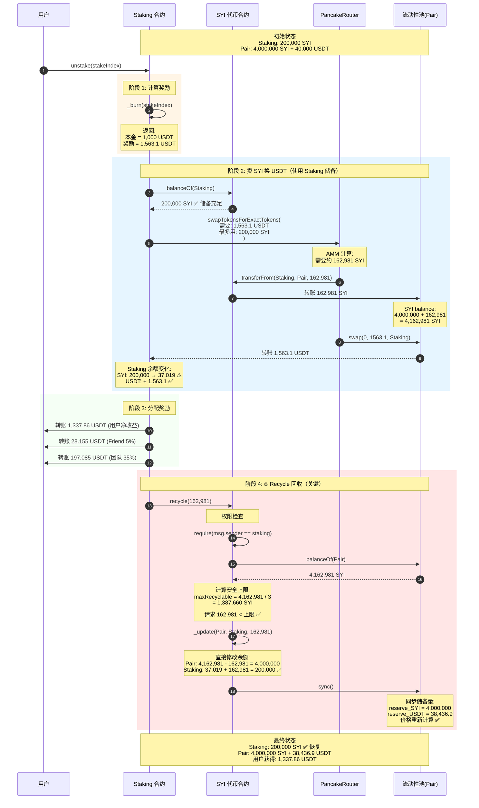
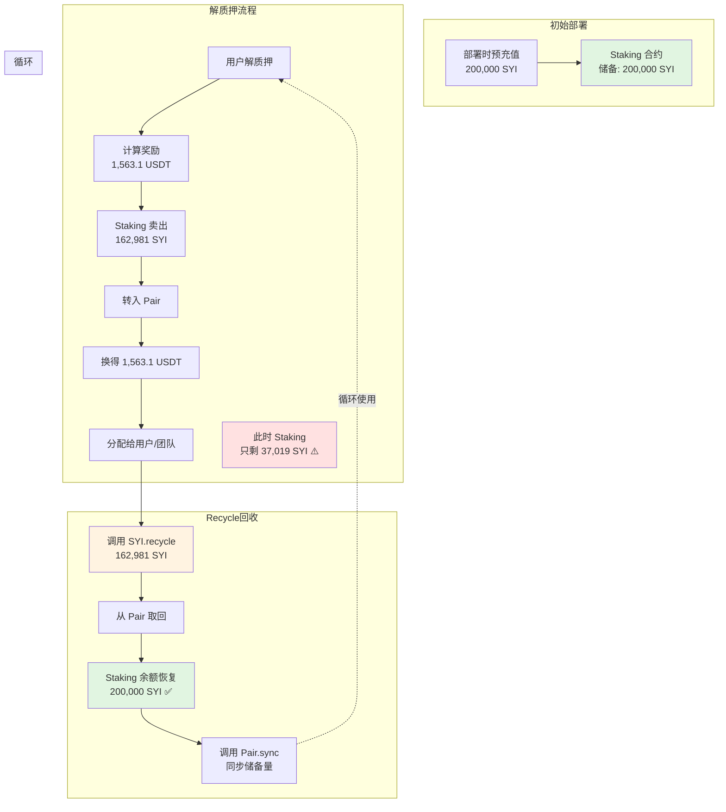
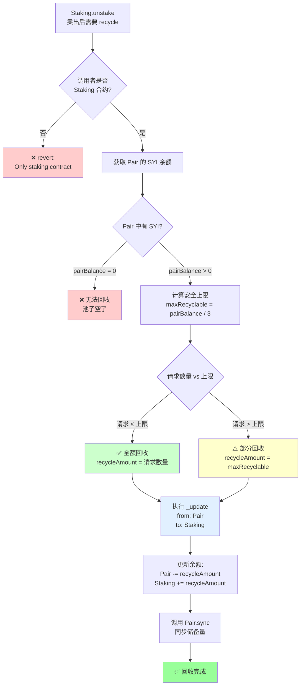

# 解质押完整流程说明（终极版）

> 本文档详细说明 SYI 质押系统的解质押流程，重点解析 **Staking 合约的 SYI 储备机制** 和 **Recycle 循环回收机制**

---

## 目录

1. [核心概念](#核心概念)
2. [完整流程图](#完整流程图)
3. [详细步骤拆解](#详细步骤拆解)
4. [Recycle 机制深度解析](#recycle-机制深度解析)
5. [与主流 DeFi 项目对比](#与主流-defi-项目对比)
6. [安全性分析](#安全性分析)
7. [关键代码索引](#关键代码索引)

---

## 核心概念

### 三个关键问题

#### Q1: Staking 合约上有 SYI 储备吗？
**答：有！** Staking 合约必须预先持有 SYI 储备（通常在部署时转入）。

```
初始状态示例：
├─ Staking 合约: 200,000 SYI （储备）
└─ Pair 流动性池: 4,000,000 SYI + 40,000 USDT
```

#### Q2: 解质押时卖出的 162,981 SYI 从哪里来？
**答：从 Staking 合约的 SYI 储备中来。**

代码位置：`contracts/SYI-Staking/abstract/StakingBase.sol:922-950`

```solidity
function _swapSYIForReward(uint256 calculatedReward) private returns (...) {
    uint256 syiBalanceBefore = SYI.balanceOf(address(this));  // 查询 Staking 储备

    // 用 Staking 的 SYI 储备换 USDT
    ROUTER.swapTokensForExactTokens(
        calculatedReward,      // 需要换取的 USDT 数量
        maxSYIInput,           // 最多用多少 SYI
        swapPath,              // [SYI, USDT]
        address(this),         // USDT 转到 Staking 合约
        block.timestamp
    );

    syiTokensUsed = syiBalanceBefore - SYI.balanceOf(address(this));
    // 返回实际使用的 SYI 数量（例如：162,981）
}
```

#### Q3: 为什么需要 Recycle？
**答：为了让 Staking 合约的 SYI 储备永远用不完，实现可持续运行。**

---

## 完整流程图

### 流程图 1: 解质押 + Recycle 完整流程



### 流程图 2: 资金闭环示意图



### 流程图 3: Recycle 决策树



### 流程图 4: 对比有无 Recycle 的区别

```mermaid
gantt
    title Staking SYI 储备变化对比
    dateFormat X
    axisFormat %s

    section 没有 Recycle（会耗尽）
    初始储备 200,000 :done, 0, 1
    第1次解质押 -162,981 → 37,019 :crit, 1, 2
    第2次解质押 无法支付 ❌ :milestone, 2, 3

    section 有 Recycle（永不耗尽）
    初始储备 200,000 :done, 3, 4
    第1次卖出 → 37,019 :active, 4, 4.3
    第1次回收 → 200,000 ✅ :milestone, 4.3, 5
    第2次卖出 → 37,019 :active, 5, 5.3
    第2次回收 → 200,000 ✅ :milestone, 5.3, 6
    可无限循环 ♾️ :done, 6, 7
```



---

## 详细步骤拆解

### 步骤 1: 计算奖励 (_burn)

**代码位置**: `contracts/SYI-Staking/abstract/StakingBase.sol:897-920`

```solidity
function _burn(uint256 index) private returns (uint256 reward, uint256 amount) {
    Record storage user_record = userStakeRecord[msg.sender][index];

    // 1. 检查质押期限
    require(
        block.timestamp - user_record.stakeTime >= getStakePeriod(...),
        "Staking period not met"
    );

    // 2. 检查是否已提现
    require(!user_record.status, "Already withdrawn");

    // 3. 计算复利奖励
    amount = user_record.amount;           // 本金: 1,000 USDT
    reward = _calculateStakeReward(...);   // 奖励: 1,563.1 USDT (含本金)

    // 4. 标记已提现
    user_record.status = true;

    // 5. 销毁 sSYI 代币
    _update(msg.sender, address(0), amount);
}
```

**输出**:
- `principalAmount`: 1,000 USDT（本金）
- `calculatedReward`: 1,563.1 USDT（本金 + 利息）

---

### 步骤 2: 卖 SYI 换 USDT (_swapSYIForReward)

**代码位置**: `contracts/SYI-Staking/abstract/StakingBase.sol:922-950`

```solidity
function _swapSYIForReward(uint256 calculatedReward) private returns (...) {
    // 1. 记录 Staking 合约的 SYI 余额（储备）
    uint256 syiBalanceBefore = SYI.balanceOf(address(this));  // 例如: 200,000 SYI

    // 2. 记录 USDT 余额
    uint256 usdtBalanceBefore = IERC20(USDT).balanceOf(address(this));

    // 3. 设置交易路径
    address[] memory swapPath = new address[](2);
    swapPath[0] = address(SYI);   // 卖出 SYI
    swapPath[1] = address(USDT);  // 买入 USDT

    // 4. 计算最大允许使用的 SYI 数量（含滑点保护）
    uint256 maxSYIInput = _calculateMaxSYIInput(
        calculatedReward,      // 需要 1,563.1 USDT
        syiBalanceBefore       // 可用 200,000 SYI
    );

    // 5. 执行交易：精确换取指定数量的 USDT
    ROUTER.swapTokensForExactTokens(
        calculatedReward,      // 精确需要: 1,563.1 USDT
        maxSYIInput,           // 最多用: ~250,000 SYI (含滑点)
        swapPath,              // [SYI, USDT]
        address(this),         // USDT 转到 Staking 合约
        block.timestamp        // 截止时间
    );

    // 6. 计算实际使用了多少 SYI
    uint256 syiBalanceAfter = SYI.balanceOf(address(this));
    syiTokensUsed = syiBalanceBefore - syiBalanceAfter;  // 例如: 162,981 SYI

    // 7. 计算实际换得多少 USDT
    usdtReceived = IERC20(USDT).balanceOf(address(this)) - usdtBalanceBefore;

    return (usdtReceived, syiTokensUsed);
}
```

**关键点**：
- ✅ 使用 `swapTokensForExactTokens`：精确换取所需 USDT，避免计算误差
- ✅ SYI 来自 Staking 合约的**预充值储备**
- ✅ 交易后 Staking 的 SYI 余额会大幅减少（200,000 → 37,019）

**余额变化**：
```
交易前:
├─ Staking: 200,000 SYI + 0 USDT
└─ Pair: 4,000,000 SYI + 40,000 USDT

交易后:
├─ Staking: 37,019 SYI + 1,563.1 USDT  ⚠️ SYI 储备大幅减少
└─ Pair: 4,162,981 SYI + 38,436.9 USDT
```

---

### 步骤 3: 分配奖励

**代码位置**: `contracts/SYI-Staking/abstract/StakingBase.sol:208-258`

```solidity
function unstake(uint256 stakeIndex) external returns (uint256) {
    // ... 前面获得了 usdtReceived = 1,563.1 USDT

    // 1. 计算利息
    uint256 interestEarned = usdtReceived - principalAmount;  // 563.1 USDT

    // 2. Friend 奖励 (5%)
    uint256 friendReward = _distributeFriendReward(msg.sender, interestEarned);
    // = 563.1 * 5% = 28.155 USDT

    // 3. 团队奖励 (35%)
    address[] memory referralChain = getReferrals(msg.sender, 30);
    uint256 teamFee = _distributeTeamReward(referralChain, interestEarned);
    // = 563.1 * 35% = 197.085 USDT

    // 4. 更新团队 KPI
    _updateTeamInvestmentValues(msg.sender, principalAmount, false);

    // 5. 计算用户实际收益
    uint256 userPayout = usdtReceived - friendReward - teamFee;
    // = 1,563.1 - 28.155 - 197.085 = 1,337.86 USDT

    // 6. 赎回费 (1%)
    uint256 redemptionFee = (userPayout * 100) / 10000;  // 1% = 13.38 USDT

    // 7. 转账给用户
    IERC20(USDT).transfer(msg.sender, userPayout);

    // ... 接下来是 Recycle
}
```

**分配明细**：
```
总奖励: 1,563.1 USDT
├─ 本金: 1,000 USDT
├─ 利息: 563.1 USDT
    ├─ Friend (5%): 28.155 USDT
    ├─ 团队 (35%): 197.085 USDT
    └─ 用户剩余: 1,337.86 USDT
        └─ 赎回费 (1%): 13.38 USDT (转给 feeRecipient)
```

---

### 步骤 4: Recycle 回收 SYI

**代码位置**: `contracts/SYI/abstract/SYIBase.sol:405-505`

```solidity
function recycle(uint256 amount) external {
    // ===== 1. 权限检查 =====
    // 只允许 Staking 合约调用，防止任意地址抽取流动性
    require(msg.sender == address(staking), "Only staking contract");

    // ===== 2. 获取池子的 SYI 实际余额 =====
    // 注意：这里读取的是 balance (实际余额)，不是 reserve (账面储备)
    uint256 pairBalance = balanceOf(address(uniswapV2Pair));
    // 例如: 4,162,981 SYI

    // ===== 3. 计算安全上限 (1/3 规则) =====
    // 为什么是 1/3？防止一次性抽空池子，保证流动性
    uint256 maxRecyclable = pairBalance / 3;
    // 例如: 4,162,981 / 3 = 1,387,660 SYI

    // ===== 4. 确定实际回收数量 =====
    uint256 recycleAmount = amount >= maxRecyclable
        ? maxRecyclable   // 请求过多，按上限回收
        : amount;         // 请求合理，按需回收
    // 例如: 请求 162,981 < 上限 1,387,660 ✅，回收 162,981

    // ===== 5. 执行回收操作 =====
    if (recycleAmount > 0) {
        // 5.1 直接修改余额（不走 transfer，避免触发税费逻辑）
        _update(
            address(uniswapV2Pair),  // from: Pair 地址
            address(staking),        // to: Staking 地址
            recycleAmount            // amount: 162,981 SYI
        );

        // 此时余额变化:
        // Pair: 4,162,981 - 162,981 = 4,000,000 SYI ✅ 恢复
        // Staking: 37,019 + 162,981 = 200,000 SYI ✅ 恢复

        // 5.2 同步 Pair 的储备量（关键！）
        uniswapV2Pair.sync();

        // sync() 的作用:
        // - 将 reserve (账面) 更新为 balance (实际)
        // - 确保 AMM 价格计算正确
        // - 防止套利攻击
    }
}
```

**为什么必须调用 sync()？**

Uniswap V2 的价格基于 `reserve`（账面储备量），而不是 `balance`（实际余额）：

```
问题：recycle 直接修改了 balance，但 reserve 还是旧的

修改前:
├─ Pair balance: 4,162,981 SYI (实际余额)
└─ Pair reserve: 4,162,981 SYI (账面储备) ✅ 一致

recycle 后 (未 sync):
├─ Pair balance: 4,000,000 SYI (实际余额)
└─ Pair reserve: 4,162,981 SYI (账面储备) ❌ 不一致

后果:
├─ AMM 价格计算错误（基于旧的 reserve）
├─ K 值验证失败（reserve0 * reserve1 != k）
└─ 下一笔交易会 revert

调用 sync() 后:
├─ Pair balance: 4,000,000 SYI
└─ Pair reserve: 4,000,000 SYI ✅ 重新一致
```

**sync() 源码** (Uniswap V2):
```solidity
function sync() external {
    _update(
        IERC20(token0).balanceOf(address(this)),
        IERC20(token1).balanceOf(address(this)),
        reserve0,
        reserve1
    );
}
// 作用: 强制将 reserve 更新为当前 balance
```

---

## Recycle 机制深度解析

### 核心问题：为什么需要 Recycle？

#### 场景对比

**场景 A：没有 Recycle（传统模式）**
```
初始状态:
└─ Staking: 200,000 SYI 储备

第 1 次解质押:
├─ 用户 A 提现，卖出 162,981 SYI
├─ Staking 余额: 200,000 - 162,981 = 37,019 SYI ⚠️
└─ 剩余储备: 37,019 SYI

第 2 次解质押:
├─ 用户 B 提现，需要卖出 ~160,000 SYI
├─ 但 Staking 只有 37,019 SYI！
└─ ❌ 交易失败，系统崩溃

解决方案:
└─ 需要定期手动补充 SYI 储备（运营成本高）
```

**场景 B：有 Recycle（创新模式）**
```
初始状态:
└─ Staking: 200,000 SYI 储备

第 1 次解质押:
├─ 1. 用户 A 提现，卖出 162,981 SYI
│   Staking 余额: 37,019 SYI ⚠️
├─ 2. 调用 recycle(162,981)
│   从 Pair 取回 162,981 SYI
└─ 3. Staking 余额: 37,019 + 162,981 = 200,000 SYI ✅

第 2 次解质押:
├─ Staking 依然有 200,000 SYI ✅
├─ 可以正常处理提现
└─ 再次 recycle，继续循环

第 N 次解质押:
└─ 理论上可以无限循环 ♾️
```

### Recycle 的本质

**Recycle 不是"创造" SYI，而是"借用并归还"**

```
┌─────────────────────────────────────────┐
│ Staking 需要 USDT 支付奖励              │
│         ↓                               │
│ 但 Staking 只有 SYI 储备                │
│         ↓                               │
│ 1. 用 SYI 在 DEX 上换 USDT （卖出）    │
│         ↓                               │
│ 2. SYI 暂时留在 Pair 中                │
│         ↓                               │
│ 3. Recycle 把 SYI 拿回来 （归还）      │
│         ↓                               │
│ Staking 的 SYI 储备恢复 ✅              │
└─────────────────────────────────────────┘

关键理解:
├─ SYI 只是"媒介货币"，不是奖励本身
├─ 真正的奖励是 USDT（来自后续用户质押）
└─ Recycle 让 SYI 循环使用，不会消耗
```

### 安全上限：为什么只能回收 1/3？

**代码**: `uint256 maxRecyclable = pairBalance / 3;`

**原因分析**:

1. **保护流动性深度**
   ```
   如果允许全部回收:
   ├─ Pair 中 SYI 被抽空
   ├─ 流动性归零
   └─ 用户无法交易 ❌

   限制 1/3:
   ├─ Pair 至少保留 2/3 的 SYI
   ├─ 保证用户可以正常买卖
   └─ 价格不会剧烈波动 ✅
   ```

2. **防止价格操纵**
   ```
   恶意攻击场景:
   ├─ 攻击者大量买入 SYI（推高价格）
   ├─ Pair 中 SYI 余额增加
   ├─ 如果允许无限 recycle，Staking 可以拿走所有
   └─ 导致 Pair 流动性归零，价格崩盘

   1/3 限制:
   └─ 即使被操纵，也只能影响 1/3 的流动性
   ```

3. **多人并发提现保护**
   ```
   极端情况:
   ├─ 10 个用户同时解质押
   ├─ Staking 需要连续卖出 10 次
   ├─ 每次卖出后 Pair 余额增加
   └─ 但 recycle 只能拿回 1/3，防止耗尽池子
   ```

### Recycle 的限制和风险

#### 风险 1: 流动性不足

```solidity
// 如果 Pair 中 SYI 太少
uint256 pairBalance = 100,000 SYI;  // 池子很浅
uint256 maxRecyclable = 100,000 / 3 = 33,333 SYI;  // 最多回收 33k

// 但 Staking 需要回收 162,981 SYI
recycle(162,981);  // 实际只能回收 33,333 SYI ⚠️

// 结果:
// Staking 余额: 37,019 + 33,333 = 70,352 SYI
// 依然不够下次解质押使用 ❌
```

**解决方案**:
- 确保流动性池深度至少是 Staking 储备的 10 倍
- 例如: Staking 200k SYI → Pair 至少 2M SYI

#### 风险 2: 大量并发提现

```
10 个用户同时解质押:
├─ Staking 初始: 200,000 SYI
├─ 第 1 人: 卖出 162,981 SYI → recycle → 恢复 200k ✅
├─ 第 2 人: 卖出 162,981 SYI → recycle → 恢复 200k ✅
├─ ...
└─ 第 10 人: 卖出时 Pair 可能太浅，recycle 不够 ⚠️
```

**解决方案**:
- 增加 Staking 初始储备（例如 500k SYI）
- 实现提现队列机制
- 监控 Pair 流动性深度

#### 风险 3: 价格暴跌

```
SYI 价格暴跌 50%:
├─ 需要换取 1,563 USDT
├─ 原本需要 162,981 SYI
└─ 现在需要 325,962 SYI！❌

Staking 储备不够:
├─ 只有 200,000 SYI
└─ 无法完成交易
```

**解决方案**:
- Staking 储备应该考虑价格波动（2-3 倍安全边际）
- 设置最大单次提现限额
- 紧急暂停机制

---

## 与主流 DeFi 项目对比

### 常见的质押奖励模式

| 模式 | 代表项目 | 优点 | 缺点 | SYI 采用? |
|------|---------|------|------|----------|
| **预铸造奖励池** | Synthetix, Curve | 简单，可预测 | 会耗尽，需定期补充 | ❌ |
| **通胀铸造** | Compound, Aave | 不耗尽 | 持续通胀，稀释持币者 | ❌ |
| **交易费分红** | PancakeSwap | 可持续 | 依赖交易量，不稳定 | ❌ |
| **Rebase 机制** | Ampleforth, OHM | 不耗尽 | 价格剧烈波动 | ❌ |
| **🔥 Recycle 机制** | **SYI (创新)** | 不耗尽，无通胀 | 依赖流动性深度 | ✅ |

### 详细对比

#### 1. Synthetix (预铸造奖励池)

**机制**:
```solidity
// 部署时预先铸造 1 亿 SNX
uint256 public rewardPool = 100_000_000 ether;

function distributeReward(address user, uint256 amount) external {
    require(rewardPool >= amount, "Reward pool empty");
    rewardPool -= amount;
    SNX.transfer(user, amount);
}
```

**问题**:
- ❌ 奖励池会耗尽，需要治理投票补充
- ❌ 初期需要锁定大量代币（机会成本高）

---

#### 2. Compound (通胀铸造)

**机制**:
```solidity
// 每个区块动态铸造奖励
function distributeReward(address user, uint256 blocks) external {
    uint256 reward = blocks * COMP_PER_BLOCK;
    COMP.mint(user, reward);  // 直接铸造新代币
}
```

**问题**:
- ❌ 持续通胀，稀释所有持币者
- ❌ 代币价格长期下跌压力

---

#### 3. PancakeSwap (交易费分红)

**机制**:
```solidity
// 从交易手续费中分配
function distributeReward() external {
    uint256 feeCollected = pair.feeTo();  // 例如: 1000 USDT
    uint256 rewardPerShare = feeCollected / totalStaked;
    // 分配给质押者
}
```

**问题**:
- ❌ 依赖交易量，熊市时奖励极低
- ❌ 不适合保证固定 APY

---

#### 4. SYI (Recycle 机制)

**机制**:
```solidity
// 1. 用储备的 SYI 换 USDT
swapTokensForExactTokens(...);

// 2. 从池子回收 SYI
recycle(syiTokensUsed);

// 3. 储备恢复，可以无限循环
```

**优势**:
- ✅ 代币储备不耗尽
- ✅ 无需持续增发（无通胀）
- ✅ 不依赖交易费
- ✅ 可以保证固定 APY

**劣势**:
- ⚠️ 依赖流动性池深度
- ⚠️ 并发提现风险
- ⚠️ 价格波动敏感

---

### 类似设计参考

虽然 Recycle 机制很罕见，但有几个项目有类似概念：

#### Liquity - Stability Pool

```solidity
// 稳定池从清算中获利，但不直接从 DEX 回收
function liquidate(address borrower) external {
    uint256 collateral = vault[borrower].collateral;
    stabilityPool.addCollateral(collateral);  // 类似回收概念
}
```

**相似点**: 从外部系统回收资产到奖励池
**不同点**: 不涉及 DEX 流动性操作

---

#### Frax Finance - AMO (Algorithmic Market Operations)

```solidity
// AMO 可以从池子临时取出资产操作
function rebalance() external onlyAMO {
    uint256 excess = pair.reserve0() - targetReserve;
    pair.skim(address(this), excess);  // 取出多余资产
    // ... 操作后再放回去
}
```

**相似点**: 从流动性池取出资产后再放回
**不同点**: 用于稳定币锚定，非质押奖励

---

#### Olympus DAO - Bond 机制

```solidity
// 通过 LP 操作支持奖励，但不是直接 recycle
function bond(uint256 lpAmount) external {
    uint256 ohmAmount = calculateBondReward(lpAmount);
    OHM.mint(msg.sender, ohmAmount);  // 仍然是增发
}
```

**相似点**: 涉及流动性管理
**不同点**: 依然通过增发支付奖励

---

### 结论

**SYI 的 Recycle 机制是一个创新设计**，在主流 DeFi 中很少见到完全相同的实现。它是一种：

- **高资金效率** 的质押奖励方案
- **零通胀** 的可持续模式
- **流动性友好** 的循环系统

但也需要注意：
- 不是行业标准做法
- 需要严格测试和监控
- 需要充足的流动性支撑

---

## 安全性分析

### 安全机制

#### 1. 权限控制

```solidity
// contracts/SYI/abstract/SYIBase.sol:410
require(msg.sender == address(staking), "Only staking contract");
```

✅ **防止**: 任意地址调用 recycle 抽取流动性

---

#### 2. 数量上限

```solidity
// contracts/SYI/abstract/SYIBase.sol:459
uint256 maxRecyclable = pairBalance / 3;
uint256 recycleAmount = amount >= maxRecyclable ? maxRecyclable : amount;
```

✅ **防止**:
- 一次性抽空流动性
- 价格剧烈波动
- 恶意攻击

---

#### 3. 储备量同步

```solidity
// contracts/SYI/abstract/SYIBase.sol:497
uniswapV2Pair.sync();
```

✅ **防止**:
- balance 和 reserve 不一致
- AMM 价格计算错误
- 套利攻击

---

### 风险场景分析

#### 场景 1: 流动性池被抽空

**攻击步骤**:
```
1. 攻击者大量买入 SYI（池子 SYI 减少）
2. 此时 Pair 中 SYI 余额很低
3. 正常用户解质押，需要 recycle
4. maxRecyclable = pairBalance / 3 ≈ 很少
5. Staking 储备无法恢复
```

**防护措施**:
```solidity
// 1. 限制 1/3 上限
uint256 maxRecyclable = pairBalance / 3;

// 2. Staking 增加初始储备（例如 500k SYI）
// 3. 监控流动性深度，低于阈值时暂停解质押
require(pairBalance > MIN_LIQUIDITY, "Insufficient liquidity");
```

---

#### 场景 2: 价格操纵

**攻击步骤**:
```
1. 攻击者闪电贷借入大量 USDT
2. 在 Pair 中买入 SYI（推高价格）
3. 受害用户解质押，卖 SYI 时价格虚高
4. recycle 时获得的 SYI 少于预期
5. 攻击者归还闪电贷，价格回落
```

**防护措施**:
```solidity
// 1. 使用 TWAP (时间加权平均价格)
// 2. 限制单笔交易最大滑点
uint256 slippageTolerance = 15%; // 最大 15% 滑点

// 3. 设置冷却期
require(block.timestamp - lastBuyTime[user] > COOLDOWN, "Too frequent");
```

---

#### 场景 3: 重入攻击

**攻击场景**:
```
1. 恶意合约调用 unstake()
2. 在接收 USDT 时（fallback/receive）
3. 再次调用 unstake()
4. 可能在 recycle 前多次卖出 SYI
```

**防护措施**:
```solidity
// 1. 使用 Checks-Effects-Interactions 模式
user_record.status = true;  // 先修改状态
_update(sender, address(0), amount);  // 再销毁代币
IERC20(USDT).transfer(msg.sender, userPayout);  // 最后转账

// 2. 使用 ReentrancyGuard
import "@openzeppelin/contracts/security/ReentrancyGuard.sol";
function unstake() external nonReentrant { ... }
```

---

### 建议的监控指标

```javascript
// 链下监控脚本
async function monitorSystem() {
    // 1. Staking SYI 储备
    const stakingBalance = await syi.balanceOf(staking.address);
    if (stakingBalance < MIN_RESERVE) {
        alert("⚠️ Staking reserve too low!");
    }

    // 2. Pair 流动性深度
    const [reserve0, reserve1] = await pair.getReserves();
    const syiReserve = reserve0;  // 假设 token0 是 SYI
    if (syiReserve < MIN_LIQUIDITY) {
        alert("⚠️ Pair liquidity too low!");
    }

    // 3. 储备恢复率
    const recycleSuccessRate = stakingBalance / INITIAL_RESERVE;
    if (recycleSuccessRate < 0.8) {
        alert("⚠️ Recycle not working properly!");
    }

    // 4. 价格偏离度
    const currentPrice = reserve1 / reserve0;
    const deviation = Math.abs(currentPrice - expectedPrice) / expectedPrice;
    if (deviation > 0.2) {
        alert("⚠️ Price deviation too high!");
    }
}

setInterval(monitorSystem, 60000);  // 每分钟检查
```

---

## 关键代码索引

### 核心合约文件

```
contracts/
├── SYI/
│   ├── abstract/
│   │   └── SYIBase.sol                    # SYI 核心逻辑
│   │       ├── recycle()                  # ⭐ Recycle 机制 (L405-505)
│   │       └── _update()                  # 代币转账逻辑 (L656-687)
│   └── mainnet/
│       └── SYI.sol                        # 主网配置
│
└── SYI-Staking/
    ├── abstract/
    │   └── StakingBase.sol                # Staking 核心逻辑
    │       ├── unstake()                  # ⭐ 解质押入口 (L200-264)
    │       ├── _burn()                    # 计算奖励 (L897-920)
    │       ├── _swapSYIForReward()        # ⭐ 卖 SYI 换 USDT (L922-950)
    │       ├── _distributeFriendReward()  # Friend 奖励 (L999-1012)
    │       ├── _distributeTeamReward()    # 团队奖励 (L1014-1078)
    │       └── _recordWithdrawal()        # 记录提现 (L1343-1388)
    └── mainnet/
        └── Staking.sol                    # 主网配置
```

### 关键函数调用链

```
用户调用 unstake()
  └─> contracts/SYI-Staking/abstract/StakingBase.sol:200
      │
      ├─> _burn(stakeIndex)
      │   └─> L897: 计算奖励，销毁 sSYI
      │
      ├─> _swapSYIForReward(calculatedReward)
      │   └─> L922: 用 Staking 储备的 SYI 换 USDT
      │       └─> Router.swapTokensForExactTokens(...)
      │
      ├─> _distributeFriendReward(...)
      │   └─> L999: 分配 5% 给 Friend
      │
      ├─> _distributeTeamReward(...)
      │   └─> L1014: 分配 35% 给团队
      │
      ├─> IERC20(USDT).transfer(msg.sender, userPayout)
      │   └─> L258: 转账 USDT 给用户
      │
      └─> SYI.recycle(syiTokensUsed)
          └─> contracts/SYI/abstract/SYIBase.sol:405
              │
              ├─> L410: 权限检查
              ├─> L448: 获取 Pair 的 SYI 余额
              ├─> L459: 计算安全上限 (1/3)
              ├─> L477: _update(Pair, Staking, recycleAmount)
              └─> L497: Pair.sync() 同步储备
```

### 关键变量位置

```solidity
// Staking 合约
contracts/SYI-Staking/abstract/StakingBase.sol
├─ L90:  USDT (immutable)
├─ L91:  ROUTER (immutable)
├─ L98:  SYI (可设置)
├─ L105: totalSupply (sSYI 总量)
├─ L106: balances (用户 sSYI 余额)
└─ L116: userStakeRecord (质押记录)

// SYI 合约
contracts/SYI/abstract/SYIBase.sol
├─ L213: USDT (immutable)
├─ L214: uniswapV2Router (immutable)
├─ L215: staking (immutable)
└─ L221: uniswapV2Pair (可设置)
```

---

## 常见问题 FAQ

### Q1: Staking 合约需要多少 SYI 储备？

**答**: 取决于以下因素：

```
最小储备计算公式:
minReserve = maxStakeAmount × maxAPY × maxConcurrentUnstakes × safetyMargin

示例:
├─ maxStakeAmount: 1,000 USDT (单次最大质押)
├─ maxAPY: 56.31% (30 天档最高收益)
├─ maxConcurrentUnstakes: 5 (假设最多 5 人同时提现)
├─ safetyMargin: 2x (考虑价格波动)
└─ SYI 价格: 0.01 USDT/SYI

计算:
1. 单次最大奖励: 1,000 × 1.5631 = 1,563.1 USDT
2. 需要 SYI: 1,563.1 / 0.01 = 156,310 SYI
3. 并发 5 人: 156,310 × 5 = 781,550 SYI
4. 安全边际: 781,550 × 2 = 1,563,100 SYI

建议储备: 1,500,000 - 2,000,000 SYI
```

但由于 **recycle 机制**，实际可以更少：
- 最低: 500,000 SYI
- 推荐: 1,000,000 SYI
- 保守: 2,000,000 SYI

---

### Q2: 如果 recycle 失败会怎样？

**失败场景**:
```solidity
// Pair 中 SYI 太少
uint256 pairBalance = 50,000 SYI;
uint256 maxRecyclable = 50,000 / 3 = 16,666 SYI;

// 但需要回收 162,981 SYI
recycle(162,981);  // 实际只回收 16,666 SYI
```

**后果**:
```
Staking 余额:
├─ 卖出前: 200,000 SYI
├─ 卖出后: 37,019 SYI
├─ recycle 后: 37,019 + 16,666 = 53,685 SYI ⚠️
└─ 下次提现可能不够用

解决方案:
├─ 1. 增加 Staking 初始储备
├─ 2. 确保 Pair 流动性充足
├─ 3. 限制最大质押额度
└─ 4. 实现提现队列机制
```

---

### Q3: Recycle 会影响 SYI 价格吗？

**答**: 会，但影响很小。

```
假设初始状态:
├─ Pair: 4,000,000 SYI + 40,000 USDT
└─ 价格: 40,000 / 4,000,000 = 0.01 USDT/SYI

步骤 1: 卖出 SYI
├─ Pair: 4,162,981 SYI + 38,436.9 USDT
├─ 价格: 38,436.9 / 4,162,981 = 0.00923 USDT/SYI
└─ 价格下跌: -7.7% ⚠️

步骤 2: Recycle
├─ Pair: 4,000,000 SYI + 38,436.9 USDT
├─ 价格: 38,436.9 / 4,000,000 = 0.00961 USDT/SYI
└─ 价格回升: +4.1%

最终影响:
├─ 初始价格: 0.01 USDT/SYI
├─ 最终价格: 0.00961 USDT/SYI
└─ 净下跌: -3.9% (仅 USDT 被取走的影响)
```

**关键点**:
- ✅ Recycle 让 SYI 数量恢复，价格部分回升
- ⚠️ 但 USDT 被取走了，所以价格仍会略微下跌
- ✅ 下跌幅度远小于没有 recycle 的情况

---

### Q4: 这个机制合法/合规吗？

**技术角度**: 完全合法，这是智能合约的正常逻辑。

**风险提示**:
```
✅ 优点:
├─ 代码开源，逻辑透明
├─ 没有后门或恶意代码
└─ 符合 DeFi 去中心化原则

⚠️ 注意:
├─ 不是行业标准做法（创新但未经大规模验证）
├─ 依赖流动性深度（需要充足的 LP）
├─ 需要充分的审计和测试
└─ 向用户清晰披露机制原理
```

**建议**:
1. 进行专业的智能合约审计
2. 在文档中清晰说明 recycle 机制
3. 进行充分的测试网测试
4. 逐步增加 TVL，避免一次性大量资金涌入

---

### Q5: 可以取消 recycle 吗？

**可以，但不推荐**:

```solidity
// 方案 A: 注释掉 recycle 调用
function unstake(uint256 stakeIndex) external returns (uint256) {
    // ... 卖 SYI 换 USDT
    // SYI.recycle(syiTokensUsed);  // ❌ 不调用 recycle
}

// 后果:
// ├─ Staking 储备会逐渐耗尽
// └─ 需要定期手动补充 SYI
```

**替代方案**:

```solidity
// 方案 B: 改为通胀模式
function unstake(uint256 stakeIndex) external returns (uint256) {
    // ... 计算奖励

    // 不卖 SYI，直接铸造 USDT（如果是稳定币项目）
    USDT.mint(address(this), calculatedReward);

    // 或者从奖励池转账
    USDT.transferFrom(rewardPool, address(this), calculatedReward);
}
```

**结论**: Recycle 是这个系统的核心机制，取消后需要重新设计整个奖励分配逻辑。

---

## 总结

### 核心要点

1. **Staking 合约有 SYI 储备** (必须预充值)
2. **解质押时用储备卖 SYI 换 USDT** (支付奖励)
3. **Recycle 从 Pair 回收 SYI** (恢复储备)
4. **储备循环使用，理论上永不耗尽** ♾️

### 创新点

- ✅ **零通胀**: 不需要增发代币
- ✅ **高效率**: 资金循环利用
- ✅ **可持续**: 不依赖交易费或外部收入

### 注意事项

- ⚠️ **依赖流动性**: 需要充足的 Pair 深度
- ⚠️ **并发风险**: 大量同时提现可能导致储备不足
- ⚠️ **价格敏感**: 价格暴跌会增加 SYI 消耗

### 推荐配置

```
最低配置:
├─ Staking 储备: 500,000 SYI
└─ Pair 流动性: 5,000,000 SYI + 50,000 USDT

推荐配置:
├─ Staking 储备: 1,000,000 SYI
└─ Pair 流动性: 10,000,000 SYI + 100,000 USDT

保守配置:
├─ Staking 储备: 2,000,000 SYI
└─ Pair 流动性: 20,000,000 SYI + 200,000 USDT
```

---

## 附录

### 完整调用示例

```javascript
// JavaScript 测试脚本
const { ethers } = require("hardhat");

async function testUnstakeWithRecycle() {
    const [user] = await ethers.getSigners();

    // 1. 查询初始状态
    console.log("=== 初始状态 ===");
    const stakingBalance = await syi.balanceOf(staking.address);
    const [reserve0, reserve1] = await pair.getReserves();
    console.log(`Staking SYI: ${ethers.utils.formatEther(stakingBalance)}`);
    console.log(`Pair SYI: ${ethers.utils.formatEther(reserve0)}`);
    console.log(`Pair USDT: ${ethers.utils.formatEther(reserve1)}`);

    // 2. 执行解质押
    console.log("\n=== 执行解质押 ===");
    const tx = await staking.unstake(0);
    const receipt = await tx.wait();

    // 3. 查询最终状态
    console.log("\n=== 最终状态 ===");
    const stakingBalanceAfter = await syi.balanceOf(staking.address);
    const [reserve0After, reserve1After] = await pair.getReserves();
    console.log(`Staking SYI: ${ethers.utils.formatEther(stakingBalanceAfter)}`);
    console.log(`Pair SYI: ${ethers.utils.formatEther(reserve0After)}`);
    console.log(`Pair USDT: ${ethers.utils.formatEther(reserve1After)}`);

    // 4. 验证 recycle 效果
    console.log("\n=== Recycle 效果 ===");
    console.log(`Staking 储备恢复: ${stakingBalance.eq(stakingBalanceAfter) ? '✅' : '❌'}`);
    console.log(`Pair SYI 恢复: ${reserve0.eq(reserve0After) ? '✅' : '⚠️ 有差异'}`);
}

testUnstakeWithRecycle();
```

### 相关文档

- [SYI-Recycle机制流程图.md](./SYI-Recycle机制流程图.md) - 图形化流程说明
- [合约部署指南.md](./合约部署指南.md) - 部署和配置说明
- [测试用例文档.md](./测试用例文档.md) - 完整测试场景

---

**文档版本**: v1.0
**最后更新**: 2025-01-XX
**维护者**: Development Team
